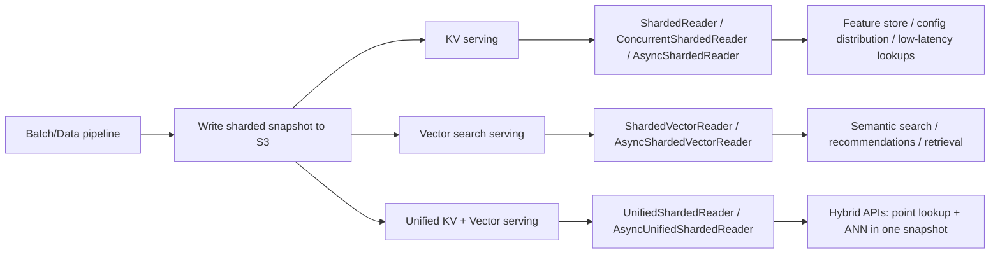
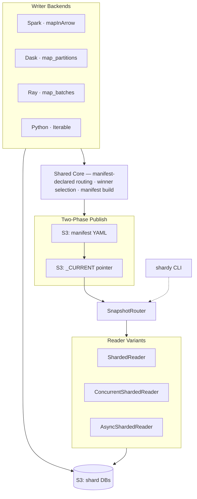

# shardyfusion

[](https://github.com/elkin/shardyfusion/actions/workflows/ci.yml)
[](https://codecov.io/gh/elkin/shardyfusion)
[](https://pypi.org/project/shardyfusion/)
[](https://elkin.github.io/shardyfusion/)
[](LICENSE)

Build and read sharded snapshots on S3 for both **key-value** and **vector search** workloads, with a default [SlateDB](https://slatedb.io) backend plus optional SQLite, LanceDB, and sqlite-vec integrations.

Write millions of key-value pairs across N independent shard databases using Spark, Dask, Ray, or plain Python. Read them back from any Python service with consistent routing — the reader always finds the right shard.

Add ANN search without throwing away your existing sharded architecture: run vector-only indexes (`ShardedVectorReader`) or unified KV+vector snapshots (`UnifiedShardedReader`) with the same publish protocol and refresh semantics.

Current Python support is 3.11 through 3.13. Python 3.14 is intentionally not supported until every reader, writer, and backend dependency used by the project is compatible and covered by the test matrix.

## Main use-cases



## Docs quick links

- [Use cases overview](https://elkin.github.io/shardyfusion/use-cases/)
- [KV Storage use case](https://elkin.github.io/shardyfusion/use-cases/kv-storage/overview/)
- [Vector Search use case](https://elkin.github.io/shardyfusion/use-cases/vector/overview/)
- [KV + Vector use case](https://elkin.github.io/shardyfusion/use-cases/kv-vector/overview/)
- [Architecture overview](https://elkin.github.io/shardyfusion/architecture/)

## Core properties

- **Snapshot correctness model** — immutable shard artifacts, two-phase publish, and atomic reader refresh.
- **Multiple writer runtimes, one routing contract** — Spark, Dask, Ray, and pure Python all produce snapshots readable through the same manifest/routing semantics.
- **Reader coverage for service shapes** — sync, concurrent, async, vector-only, and unified KV+vector readers with shared lifecycle behavior.
- **Backend choices matched to workload** — SlateDB for KV durability, SQLite for simpler distribution, LanceDB for scalable ANN, sqlite-vec for single-file KV+vector shards.
- **Operational controls built in** — deterministic winner selection, rollback via `_CURRENT`, and metrics/tracing integration points.

## Good fit / not the best fit

**Good fit** when you need immutable, refreshable snapshots on object storage and want one operational model for batch writes + online reads (KV, vector, or both).

**Likely not the best fit** when you need frequent in-place updates, per-record transactional semantics, or highly dynamic low-latency writes (an OLTP system is usually a better match).

## When to use shardyfusion

**Daily feature store refresh** — A Spark job writes feature vectors overnight across 64 shards. Your serving fleet opens a `ShardedReader` and serves lookups all day. When the next snapshot lands, call `refresh()` for an atomic swap with zero downtime.

**Embedding snapshot for search** — A Ray pipeline encodes embeddings into sharded vector indices. An async API serves nearest-neighbor queries via `AsyncShardedVectorReader` with rate limiting and concurrency control.

**Config/rule distribution** — A Python script packs business rules into a small snapshot. Microservices load the latest version on startup and periodically refresh, all reading from the same S3 prefix.

## Architecture



## Writer backends

| Backend | Best for | Requires | Install extra |
|---|---|---|---|
| **Spark** | Large-scale batch ETL, existing Spark pipelines | Java 17+ | `writer-spark` |
| **Dask** | Medium-scale batch, Python-native distributed computing | — | `writer-dask` |
| **Ray** | ML pipelines, Ray ecosystem integration | — | `writer-ray` |
| **Python** | Small datasets, scripts, testing, custom pipelines | — | `writer-python` |

## Reader variants

| Variant | Use case | Thread safety |
|---|---|---|
| `ShardedReader` | Single-threaded services, scripts | Not thread-safe |
| `ConcurrentShardedReader` | Multi-threaded services (Flask, Django) | Lock or pool mode |
| `AsyncShardedReader` | Asyncio services (FastAPI, aiohttp) | Async-native |

## Vector search at a glance

- **Vector-only mode**: write vectors with `write_vector_sharded(...)`, query with `ShardedVectorReader.search(...)`.
- **Unified KV+vector mode**: write `WriteConfig(vector_spec=...)`, then use `UnifiedShardedReader` for both `.get()` and `.search()`.
- **Sharding strategies**: `CLUSTER` (default), `LSH`, `CEL`, and `EXPLICIT`.
- **Distance metrics**:
  - LanceDB backend: `cosine`, `l2`, `dot_product`
  - sqlite-vec backend: `cosine`, `l2`
- **Search execution model**: routed scatter-gather fan-out + global top-k merge across shards.

## Quick start

```bash
pip install "shardyfusion[writer-python]"         # write, default SlateDB backend
pip install "shardyfusion[writer-python-sqlite]"  # write, SQLite backend
pip install "shardyfusion[read]"                  # read, default SlateDB backend
pip install "shardyfusion[read-sqlite-range]"     # read, SQLite range-read backend
pip install "shardyfusion[vector]"                # vector-only search (LanceDB)
pip install "shardyfusion[vector-sqlite]"         # vector-only search (sqlite-vec)
pip install "shardyfusion[unified-vector]"        # unified KV+vector (LanceDB composite)
pip install "shardyfusion[unified-vector-sqlite]" # unified KV+vector (sqlite-vec)
```

<details>
<summary>All available extras</summary>

`read`, `read-async`, `read-sqlite`, `read-sqlite-range`, `sqlite-async`, `writer-spark`, `writer-spark-sqlite`, `writer-dask`, `writer-dask-sqlite`, `writer-ray`, `writer-ray-sqlite`, `writer-python`, `writer-python-sqlite`, `cli`, `cel`, `metrics-prometheus`, `metrics-otel`, `vector-lancedb`, `vector`, `vector-sqlite`, `unified-vector`, `unified-vector-sqlite`

See the [use-case docs](https://elkin.github.io/shardyfusion/use-cases/) for backend-specific setup and [local development](https://elkin.github.io/shardyfusion/contributing/local-development/) for contributor setup.
</details>

**Write** a sharded snapshot (Python writer — simplest, no Java):

```python
from shardyfusion import WriteConfig
from shardyfusion.writer.python import write_sharded

config = WriteConfig(num_dbs=8, s3_prefix="s3://bucket/prefix")

result = write_sharded(
    records, config,
    key_fn=lambda r: r["id"],
    value_fn=lambda r: r["payload"],
)
```

**Read** it back from any service:

```python
from shardyfusion import ShardedReader

with ShardedReader(
    s3_prefix="s3://bucket/prefix",
    local_root="/tmp/shardyfusion-reader",
) as reader:
    value = reader.get(123)
    batch = reader.multi_get([1, 2, 3])
    reader.refresh()  # atomic swap to latest snapshot
```

See the [build docs](https://elkin.github.io/shardyfusion/use-cases/kv-storage/build/) and [read docs](https://elkin.github.io/shardyfusion/use-cases/kv-storage/read/) for all KV backends and configuration options.
For vector-specific flows, see [Vector Search](https://elkin.github.io/shardyfusion/use-cases/vector/overview/) and [KV + Vector](https://elkin.github.io/shardyfusion/use-cases/kv-vector/overview/).

## Key design decisions

- **Two-phase publish** — Manifest is written first, then `_CURRENT` pointer is updated. Readers never see a half-written snapshot.
- **Deterministic winner selection** — Speculative execution (Spark task retries, Dask/Ray restarts) can produce duplicate shard writes. Winners are selected deterministically, so results are reproducible.
- **Routing parity** — All writers and readers share the same manifest-declared routing implementation — never reimplemented per framework. The only hash algorithm today is `xxh3_64`, and sharding is also configurable with expression-based strategies for custom partitioning schemes.
- **Sparse manifests** — Only shards with data appear in the manifest. The router pads missing IDs with null readers that return `None` instantly.
- **Atomic refresh** — `refresh()` loads the new manifest, opens new shard handles, and swaps state atomically. In-flight reads complete against the old state.

## CLI

The `shardy` CLI provides interactive and batch access to published snapshots:

```bash
pip install "shardyfusion[cli]"

shardy --current-url s3://bucket/prefix/_CURRENT get 42
shardy --current-url s3://bucket/prefix/_CURRENT info
SHARDY_CURRENT=s3://bucket/prefix/_CURRENT shardy  # interactive REPL
```

See the [CLI docs](https://elkin.github.io/shardyfusion/operate/cli/) for all commands including `multiget`, `history`, `rollback`, `cleanup`, and vector `search`.

## Future directions

- **Cleanup automation** — Richer stale-run policies and operational reporting for large S3 prefixes
- **Global rate limiting** — Cross-worker coordination for distributed write pipelines
- **Additional framework integrations** — DuckDB, Polars writer backends
- **Enhanced observability** — Richer metrics, tracing spans, dashboard templates

## Documentation

| Page | Description |
|---|---|
| [Use cases](https://elkin.github.io/shardyfusion/use-cases/) | Task-oriented guides for KV, vector, and KV+vector snapshots |
| [KV storage](https://elkin.github.io/shardyfusion/use-cases/kv-storage/overview/) | Sharded key-value snapshot model |
| [Build snapshots](https://elkin.github.io/shardyfusion/use-cases/kv-storage/build/) | Python, Spark, Dask, and Ray writers |
| [Read snapshots](https://elkin.github.io/shardyfusion/use-cases/kv-storage/read/) | Sync, concurrent, and async readers |
| [Vector Search](https://elkin.github.io/shardyfusion/use-cases/vector/overview/) | Vector-only build/read flows |
| [KV + Vector](https://elkin.github.io/shardyfusion/use-cases/kv-vector/overview/) | Unified point lookup + ANN snapshots |
| [Operate](https://elkin.github.io/shardyfusion/operate/) | CLI, rollback, cleanup, and metrics |
| [CLI](https://elkin.github.io/shardyfusion/operate/cli/) | Commands, REPL, batch mode, vector search |
| [Architecture](https://elkin.github.io/shardyfusion/architecture/) | Internals, sharding, routing, publish protocol |
| [Manifest Stores](https://elkin.github.io/shardyfusion/architecture/manifest-stores/) | S3, DB-backed, custom stores |
| [Observability](https://elkin.github.io/shardyfusion/architecture/observability/) | Metrics, logging, Prometheus, OTel |
| [Error Handling](https://elkin.github.io/shardyfusion/architecture/error-model/) | Error hierarchy, retry behavior |
| [Operations](https://elkin.github.io/shardyfusion/operations/) | Cloud testing and tox matrix |
| [Cloud Testing](https://elkin.github.io/shardyfusion/operations/cloud-testing/) | AWS integration tests |
| [Glossary](https://elkin.github.io/shardyfusion/reference/glossary/) | Terms and concepts |
| [API Reference](https://elkin.github.io/shardyfusion/reference/api/) | Full API docs |

## Contributing

```bash
just setup    # bootstrap environment
just doctor   # verify everything works
just ci       # quality + unit + integration tests
```

See [local development](https://elkin.github.io/shardyfusion/contributing/local-development/) for the full development workflow.
