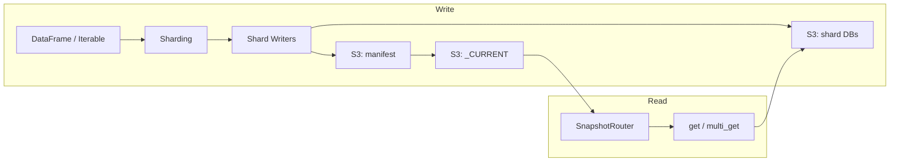

# shardyfusion

[](https://github.com/slatedb/shardyfusion/actions/workflows/ci.yml)
[](https://pypi.org/project/shardyfusion/)
[](LICENSE)

## What is shardyfusion?

shardyfusion solves the problem of building and reading sharded key-value snapshots on S3-compatible storage. It lets you write millions of key-value pairs across N independent [SlateDB](https://slatedb.io) shard databases using your preferred compute framework, then read them back with consistent routing from any Python service.

**When to use it:** You have a batch pipeline that produces key-value data (features, embeddings, precomputed results) and a serving layer that needs fast key lookups. shardyfusion handles the sharding, publishing, and routing so your serving code just calls `reader.get(key)`.

## Features

- Writer-side APIs to build `num_dbs` independent SlateDB shard databases
  - **Spark** (`writer-spark`) — PySpark DataFrame-based, requires Java
  - **Dask** (`writer-dask`) — Dask DataFrame-based, no Java required
  - **Ray** (`writer-ray`) — Ray Data Dataset-based, no Java required
  - **Python** (`writer-python`) — pure-Python iterator-based, no Java required
- Manifest + `_CURRENT` publishing protocol (default S3, pluggable interfaces)
- Reader-side routing helpers for service-side `get` and `multi_get`
- `slate-reader` CLI for interactive and batch lookups
- Token-bucket rate limiting for all writer paths
- Pluggable interfaces for manifest building, publishing, and reading

### When to use each writer backend

| Backend | Best for | Requires |
|---|---|---|
| **Spark** | Large-scale batch ETL, existing Spark pipelines | Java 17+ |
| **Dask** | Medium-scale batch, Python-native distributed computing | — |
| **Ray** | ML pipelines, Ray ecosystem integration | — |
| **Python** | Small datasets, scripts, testing, custom pipelines | — |

## Architecture



[Full documentation](https://slatedb.github.io/shardyfusion/) | [Architecture details](docs/how-it-works.md)

## Runtime Prerequisites

- Reader-only, Python writer, Dask writer, and Ray writer usage do not require Java.
- Spark writer requires a local Java runtime (JRE/JDK) available on `PATH`
  or via `JAVA_HOME`.
- Running Spark-based tests also requires Java.

## Installation

```bash
# Reader-side dependencies only (no Spark)
uv sync --extra read

# Spark writer (includes PySpark, requires Java)
uv sync --extra writer-spark

# Python writer (no Spark/Java required)
uv sync --extra writer-python

# Dask writer (no Spark/Java required)
uv sync --extra writer-dask

# Ray writer (no Spark/Java required)
uv sync --extra writer-ray

# Full install
uv sync --all-extras
```

For development:

```bash
uv sync --all-extras --dev
```

## Minimal Writer Usage

### Spark

```python
from shardyfusion import WriteConfig, ValueSpec
from shardyfusion.writer.spark import write_sharded

config = WriteConfig(num_dbs=8, s3_prefix="s3://bucket/prefix")

result = write_sharded(
    df, config,
    key_col="id",
    value_spec=ValueSpec.binary_col("payload"),
)
```

### Dask

```python
from shardyfusion import WriteConfig, ValueSpec
from shardyfusion.writer.dask import write_sharded

config = WriteConfig(num_dbs=8, s3_prefix="s3://bucket/prefix")

result = write_sharded(
    ddf, config,
    key_col="id",
    value_spec=ValueSpec.binary_col("payload"),
)
```

### Ray

```python
import ray
from shardyfusion import WriteConfig, ValueSpec
from shardyfusion.writer.ray import write_sharded

config = WriteConfig(num_dbs=8, s3_prefix="s3://bucket/prefix")
ds = ray.data.from_items([{"id": i, "payload": b"..."} for i in range(1000)])

result = write_sharded(
    ds, config,
    key_col="id",
    value_spec=ValueSpec.binary_col("payload"),
)
```

### Python

```python
from shardyfusion import WriteConfig
from shardyfusion.writer.python import write_sharded

config = WriteConfig(num_dbs=8, s3_prefix="s3://bucket/prefix")

result = write_sharded(
    records, config,
    key_fn=lambda r: r["id"],
    value_fn=lambda r: r["payload"],
)
```

## Minimal Reader Usage

```python
from shardyfusion import ShardedReader

reader = ShardedReader(
    s3_prefix="s3://bucket/prefix",
    local_root="/tmp/shardyfusion-reader",
)

value = reader.get(123)
batch = reader.multi_get([1, 2, 3])
reader.refresh()
reader.close()
```

For multi-threaded services, use `ConcurrentShardedReader` — see the [reader docs](https://slatedb.github.io/shardyfusion/reader/).

## Development Workflow

### Lint and style

```bash
uv run ruff check .
uv run ruff format --check .
```

### Type checking

```bash
uv run pyright shardyfusion
```

### Tests

```bash
# Direct pytest run
uv run pytest -q

# Tox quality/stage targets
uv run tox -e lint,format,type
uv run tox -e py311-all-spark35-unit
uv run tox -e py311-read-integration,py311-sparkwriter-spark4-integration
```

Parallel tox environments (cap env-level parallelism to avoid OOM):

```bash
uv run tox p -p 2
```

Containerized local development run (Podman):

```bash
podman build -f docker/ci.Dockerfile -t shardyfusion-ci .
podman run --rm -v "$PWD:/workspace" -w /workspace shardyfusion-ci \
  /bin/bash -lc "uv sync --all-extras --dev && uv run tox -m quality && uv run tox -m unit && uv run tox -m integration"
```

The image includes Python 3.11 and later so tox `py311-*` and above
environments execute instead of being skipped.

Short container prefix via `just`:

```bash
just d-build
just d uv run tox -m quality
just d uv run tox -m unit
just d uv run tox -m integration
```

`just d ...` runs the same command shape as local usage, but inside the container.
It uses container-only uv state and a container-only project venv path
(`UV_PROJECT_ENVIRONMENT=/opt/shardyfusion-venv`), so it does not reuse host `.venv`.

Container runtime defaults to `podman`; switch to Docker with:

```bash
CONTAINER_ENGINE=docker just d-build
CONTAINER_ENGINE=docker just d uv run tox -m quality
```

Dev Container (VS Code):

1. Install the VS Code `Dev Containers` extension.
2. Open this repository in VS Code.
3. Run `Dev Containers: Reopen in Container`.

The Dev Container reuses `docker/ci.Dockerfile` and runs
`uv sync --all-extras --dev` automatically after container creation.

If you use Podman as the backend, expose a Docker-compatible socket
(`podman system service`) and point VS Code Dev Containers to it.

### Build package artifacts

```bash
uv build
```

## Release Process

1. Bump version:

```bash
uv version X.Y.Z
```

2. Commit + merge to `main`.
3. Tag and push:

```bash
git tag vX.Y.Z
git push origin vX.Y.Z
```

4. GitHub Actions `Release` workflow validates and publishes to PyPI via trusted publishing.

## Documentation

MkDocs site is published from `main` to GitHub Pages.

- docs build check runs on pull requests
- docs publish runs on pushes to `main`

Local docs build:

```bash
uv run mkdocs build --strict
```

See `docs/` and `docs/how-it-works.md` for architecture and operational details.
