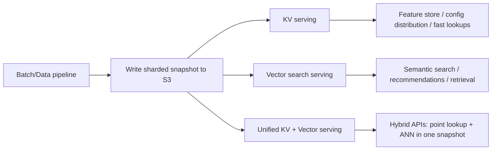

# shardyfusion

[](https://github.com/elkin/shardyfusion/actions/workflows/ci.yml)
[](https://codecov.io/gh/elkin/shardyfusion)
[](https://pypi.org/project/shardyfusion/)
[](https://elkin.github.io/shardyfusion/)
[](LICENSE)

Build and read sharded snapshots on S3 for **key-value** and **vector search** workloads, with a default [SlateDB](https://slatedb.io) backend plus optional SQLite, LanceDB, and sqlite-vec integrations.

Write millions of key-value pairs across N independent shard databases using Spark, Dask, Ray, or plain Python. Read them back from any Python service with consistent routing — the reader always finds the right shard.

## Use cases



- **Immutable snapshots** — two-phase publish with atomic reader refresh; readers never see half-written data
- **Multiple writers, one contract** — Spark, Dask, Ray, and pure Python all produce the same manifest format
- **Readers for every service shape** — sync, concurrent, async, vector-only, and unified KV+vector
- **Pluggable backends** — SlateDB, SQLite, LanceDB, or sqlite-vec matched to your workload

Current Python support is 3.11 through 3.13.

## Good fit / not the best fit

**Good fit** when you need immutable, refreshable snapshots on object storage and want one operational model for batch writes + online reads (KV, vector, or both).

**Likely not the best fit** when you need frequent in-place updates, per-record transactional semantics, or highly dynamic low-latency writes (an OLTP system is usually a better match).

## Quick start

```bash
pip install "shardyfusion[writer-python,read]"
```

**Write** a sharded snapshot:

```python
from shardyfusion import WriteConfig
from shardyfusion.writer.python import write_sharded

config = WriteConfig(num_dbs=8, s3_prefix="s3://bucket/prefix")

result = write_sharded(
    records,
    config,
    key_fn=lambda r: r["id"],
    value_fn=lambda r: r["payload"],
)
```

**Read** it back:

```python
from shardyfusion import ShardedReader

with ShardedReader(
    s3_prefix="s3://bucket/prefix",
    local_root="/tmp/shardyfusion-reader",
) as reader:
    value = reader.get(123)
    reader.refresh()  # atomic swap to latest snapshot
```

See the [build docs](https://elkin.github.io/shardyfusion/use-cases/kv-storage/build/) and [read docs](https://elkin.github.io/shardyfusion/use-cases/kv-storage/read/) for all backends and configuration options.

## CLI

```bash
pip install "shardyfusion[cli]"

shardy --current-url s3://bucket/prefix/_CURRENT get 42
shardy --current-url s3://bucket/prefix/_CURRENT info
```

See the [CLI docs](https://elkin.github.io/shardyfusion/operate/cli/) for all commands.

## Documentation

Full guides, architecture notes, and API reference are at **[elkin.github.io/shardyfusion](https://elkin.github.io/shardyfusion/)**.

## Contributing

```bash
just setup    # bootstrap environment
just doctor   # verify everything works
just ci       # quality + unit + integration tests
```

See [local development](https://elkin.github.io/shardyfusion/contributing/local-development/) for the full development workflow.
