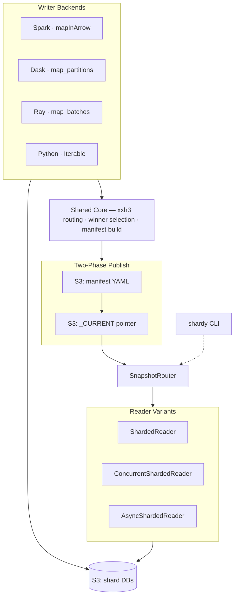

# shardyfusion

[](https://github.com/slatedb/shardyfusion/actions/workflows/ci.yml)
[](https://pypi.org/project/shardyfusion/)
[](https://elkin.github.io/shardyfusion/)
[](LICENSE)

Build and read sharded key-value snapshots on S3, powered by [SlateDB](https://slatedb.io).

Write millions of key-value pairs across N independent shard databases using Spark, Dask, Ray, or plain Python. Read them back from any Python service with consistent routing — the reader always finds the right shard.

## When to use shardyfusion

**Daily feature store refresh** — A Spark job writes feature vectors overnight across 64 shards. Your serving fleet opens a `ShardedReader` and serves lookups all day. When the next snapshot lands, call `refresh()` for an atomic swap with zero downtime.

**Embedding snapshot for search** — A Ray pipeline encodes embeddings into sharded SlateDB databases. An async API serves lookups via `AsyncShardedReader` with rate limiting and concurrency control.

**Config/rule distribution** — A Python script packs business rules into a small snapshot. Microservices load the latest version on startup and periodically refresh, all reading from the same S3 prefix.

## Architecture



## Writer backends

| Backend | Best for | Requires | Install extra |
|---|---|---|---|
| **Spark** | Large-scale batch ETL, existing Spark pipelines | Java 17+ | `writer-spark` |
| **Dask** | Medium-scale batch, Python-native distributed computing | — | `writer-dask` |
| **Ray** | ML pipelines, Ray ecosystem integration | — | `writer-ray` |
| **Python** | Small datasets, scripts, testing, custom pipelines | — | `writer-python` |

## Reader variants

| Variant | Use case | Thread safety |
|---|---|---|
| `ShardedReader` | Single-threaded services, scripts | Not thread-safe |
| `ConcurrentShardedReader` | Multi-threaded services (Flask, Django) | Lock or pool mode |
| `AsyncShardedReader` | Asyncio services (FastAPI, aiohttp) | Async-native |

## Quick start

```bash
pip install "shardyfusion[writer-python]"         # write, default SlateDB backend
pip install "shardyfusion[writer-python-sqlite]"  # write, SQLite backend
pip install "shardyfusion[read]"                  # read, default SlateDB backend
pip install "shardyfusion[read-sqlite-range]"     # read, SQLite range-read backend
```

<details>
<summary>All available extras</summary>

`read`, `read-async`, `read-sqlite`, `read-sqlite-range`, `sqlite-async`, `writer-spark`, `writer-spark-sqlite`, `writer-dask`, `writer-dask-sqlite`, `writer-ray`, `writer-ray-sqlite`, `writer-python`, `writer-python-sqlite`, `cli`, `cel`, `metrics-prometheus`, `metrics-otel`

See [Getting Started](https://elkin.github.io/shardyfusion/getting-started/) for full installation and dev setup.
</details>

**Write** a sharded snapshot (Python writer — simplest, no Java):

```python
from shardyfusion import WriteConfig
from shardyfusion.writer.python import write_sharded

config = WriteConfig(num_dbs=8, s3_prefix="s3://bucket/prefix")

result = write_sharded(
    records, config,
    key_fn=lambda r: r["id"],
    value_fn=lambda r: r["payload"],
)
```

**Read** it back from any service:

```python
from shardyfusion import ShardedReader

with ShardedReader(
    s3_prefix="s3://bucket/prefix",
    local_root="/tmp/shardyfusion-reader",
) as reader:
    value = reader.get(123)
    batch = reader.multi_get([1, 2, 3])
    reader.refresh()  # atomic swap to latest snapshot
```

See the [Writer docs](https://elkin.github.io/shardyfusion/writer/) and [Reader docs](https://elkin.github.io/shardyfusion/reader/) for all backends and configuration options.

## Key design decisions

- **Two-phase publish** — Manifest is written first, then `_CURRENT` pointer is updated. Readers never see a half-written snapshot.
- **Deterministic winner selection** — Speculative execution (Spark task retries, Dask/Ray restarts) can produce duplicate shard writes. Winners are selected deterministically, so results are reproducible.
- **Routing parity** — All writers and readers share the same routing implementation — never reimplemented per framework. The default is `xxh3_64` hash-based, but sharding is configurable with expression-based strategies for custom partitioning schemes.
- **Sparse manifests** — Only shards with data appear in the manifest. The router pads missing IDs with null readers that return `None` instantly.
- **Atomic refresh** — `refresh()` loads the new manifest, opens new shard handles, and swaps state atomically. In-flight reads complete against the old state.

## CLI

The `shardy` CLI provides interactive and batch access to published snapshots:

```bash
pip install "shardyfusion[cli]"

shardy --s3-prefix s3://bucket/prefix get 42
shardy --s3-prefix s3://bucket/prefix info
shardy --s3-prefix s3://bucket/prefix       # interactive REPL
```

See the [CLI docs](https://elkin.github.io/shardyfusion/cli/) for all commands including `multiget`, `history`, `rollback`, and `cleanup`.

## Future directions

- **Reliable cleanup** — Deferred retry for cleaning stale write attempts and old snapshot runs
- **Global rate limiting** — Cross-worker coordination for distributed write pipelines
- **Additional framework integrations** — DuckDB, Polars writer backends
- **Enhanced observability** — Richer metrics, tracing spans, dashboard templates

## Documentation

| Page | Description |
|---|---|
| [Getting Started](https://elkin.github.io/shardyfusion/getting-started/) | Installation, dev setup, container workflow |
| [Architecture](https://elkin.github.io/shardyfusion/how-it-works/) | Internals, sharding, publish protocol |
| [Writer Side](https://elkin.github.io/shardyfusion/writer/) | All 4 backends, config, rate limiting |
| [Reader Side](https://elkin.github.io/shardyfusion/reader/) | Sync, concurrent, async readers |
| [Manifest Stores](https://elkin.github.io/shardyfusion/manifest-stores/) | S3, DB-backed, custom stores |
| [CLI](https://elkin.github.io/shardyfusion/cli/) | Commands, REPL, batch mode |
| [Observability](https://elkin.github.io/shardyfusion/observability/) | Metrics, logging, Prometheus, OTel |
| [Error Handling](https://elkin.github.io/shardyfusion/error-handling/) | Error hierarchy, retry behavior |
| [Operations](https://elkin.github.io/shardyfusion/operations/) | Cleanup, rollback, history |
| [Cloud Testing](https://elkin.github.io/shardyfusion/cloud-testing/) | AWS integration tests |
| [Release Process](https://elkin.github.io/shardyfusion/release/) | Versioning, PyPI publishing |
| [Glossary](https://elkin.github.io/shardyfusion/glossary/) | Terms and concepts |
| [API Reference](https://elkin.github.io/shardyfusion/api/) | Full API docs |

## Contributing

```bash
just setup    # bootstrap environment
just doctor   # verify everything works
just ci       # quality + unit + integration tests
```

See [Getting Started](https://elkin.github.io/shardyfusion/getting-started/) for the full development workflow.
