# Error Handling

## Error Hierarchy

All shardyfusion errors inherit from `ShardyfusionError`, which carries a `retryable` flag:

```mermaid
graph TD
    SE[ShardyfusionError<br/>retryable: bool]

    SE --> CVE[ConfigValidationError<br/>retryable=False]
    SE --> SAE[ShardAssignmentError<br/>retryable=False]
    SE --> SCE[ShardCoverageError<br/>retryable=False]
    SE --> SWE[ShardWriteError<br/>retryable=True]
    SE --> SDAE[SlateDbApiError<br/>retryable=False]
    SE --> MBE[ManifestBuildError<br/>retryable=False]
    SE --> PME[PublishManifestError<br/>retryable=True]
    SE --> PCE[PublishCurrentError<br/>retryable=True]
    SE --> MPE[ManifestParseError<br/>retryable=False]
    SE --> RSE[ReaderStateError<br/>retryable=False]
    SE --> STE[S3TransientError<br/>retryable=True]
    SE --> PEE[PoolExhaustedError<br/>retryable=True]
    SE --> MSTE[ManifestStoreError<br/>retryable=True]
```



## Classification

| Error | Retryable | When raised |
|---|---|---|
| `ConfigValidationError` | No | Invalid `WriteConfig` parameters (bad `s3_prefix`, `num_dbs <= 0`, unsupported sharding strategy) |
| `ShardAssignmentError` | No | Routing verification detects mismatch between framework-assigned and Python-computed shard IDs |
| `ShardCoverageError` | No | After shard writes, results don't cover all expected `range(num_dbs)` |
| `ShardWriteError` | Yes | Adapter operations (write_batch, flush, checkpoint) failed with a potentially transient error |
| `SlateDbApiError` | No | SlateDB package missing, reader close failures, API-level errors |
| `ManifestBuildError` | No | Manifest artifact creation failed during `SqliteManifestBuilder.build()` |
| `PublishManifestError` | Yes | Manifest upload to S3 fails (transient) |
| `PublishCurrentError` | Yes | CURRENT pointer upload fails after manifest is already published |
| `ManifestParseError` | No | Malformed manifest JSON, missing required fields, structural violations |
| `ReaderStateError` | No | Operations on a closed reader, missing CURRENT pointer |
| `S3TransientError` | Yes | Throttling, HTTP 500/503, timeout during S3 operations |
| `PoolExhaustedError` | Yes | All readers in the pool are checked out and checkout timed out |
| `ManifestStoreError` | Yes | Transient manifest store failure (DB connection, query timeout) |

## Retryable vs Non-Retryable

```python
from shardyfusion.errors import ShardyfusionError

try:
    result = write_sharded(...)
except ShardyfusionError as exc:
    if exc.retryable:
        # Safe to retry — transient infrastructure failure
        retry_with_backoff(write_sharded, ...)
    else:
        # Programmer/data error — fix before retrying
        raise
```

## PublishCurrentError Recovery

The most nuanced error scenario: the manifest has been successfully published to S3, but the CURRENT pointer update fails. The data is written and the manifest exists — only the pointer is missing.

```python
from shardyfusion.errors import PublishCurrentError

try:
    result = write_sharded(...)
except PublishCurrentError as exc:
    # The manifest is already published — recover by retrying just the CURRENT update
    manifest_ref = exc.manifest_ref
    if manifest_ref:
        log.warning(f"CURRENT update failed, manifest at: {manifest_ref}")
        # Option 1: Retry CURRENT update via the store
        # Option 2: Log manifest_ref for manual recovery
        # Option 3: Re-run the entire pipeline (idempotent with same run_id)
```

> **Note:** As of the latest version, `publish_to_store()` automatically retries `PublishCurrentError` up to 3 times with exponential backoff (1s → 2s → 4s) before raising. Manual retry is only needed if the automatic retries are also exhausted.

## S3 Retry Behavior

The storage layer uses exponential backoff for transient S3 errors:

- **Attempts:** 3 (initial + 2 retries)
- **Backoff:** 1s → 2s → 4s
- **Retried conditions:** HTTP 500, 503, throttling, connection timeouts
- **Not retried:** HTTP 400, 403, 404, other client errors

If all retries are exhausted, `S3TransientError` is raised to the caller.

## Best Practices

1. **Catch `ShardyfusionError`**, not `Exception`, for shardyfusion-specific handling.

2. **Check `retryable`** before implementing retry logic — non-retryable errors indicate bugs that retrying won't fix.

3. **Log `PublishCurrentError.manifest_ref`** in production — this is your recovery handle when the CURRENT pointer fails to update.

4. **Use `MetricsCollector`** to monitor `S3_RETRY` and `S3_RETRY_EXHAUSTED` events for infrastructure health.

5. **Don't suppress errors during cleanup** — reader `close()` now raises `SlateDbApiError` if any shard handle fails to close. Catch this at the application level if you need graceful degradation.
