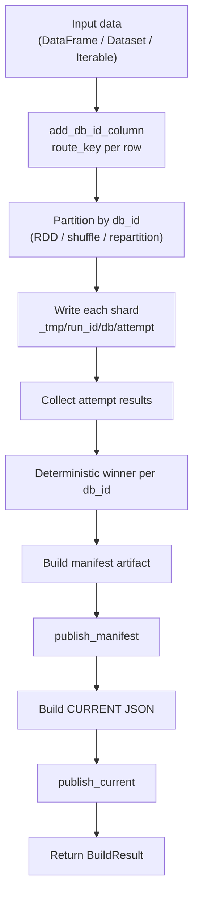
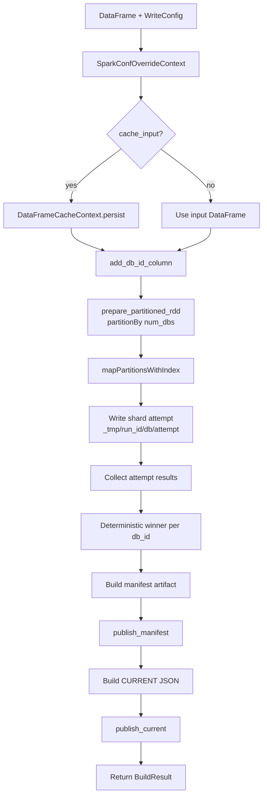
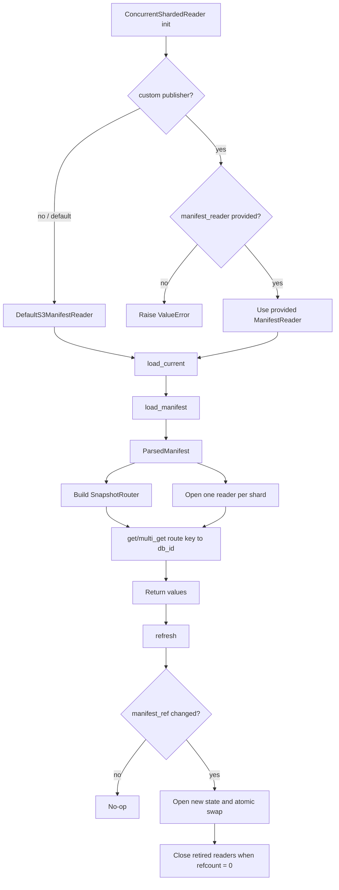

# shardyfusion: How It Works

## Overview

`shardyfusion` builds a sharded snapshot into multiple independent SlateDB databases, writes metadata (manifest + CURRENT pointer), and provides service-side readers that route keys to the correct shard. Four writer backends are supported: Spark, Dask, Ray, and pure Python.

Core behavior:

- One logical snapshot write creates exactly `num_dbs` shard outputs.
- Writes are retry/speculation-safe with attempt-isolated paths.
- A deterministic winner is selected per shard (`db_id`) on the driver.
- Reader side loads CURRENT -> manifest -> opens per-shard readers -> routes lookups.

## Write Side (Snapshot Build)

All four backends follow the same three-phase pipeline:

1. **Sharding** — assign each row a `_slatedb_db_id` column
2. **Write** — partition data by `db_id`, write each shard to S3
3. **Publish** — build manifest, publish manifest, publish `_CURRENT` pointer

The backends differ in how they distribute work, but share all core logic from
`_writer_core.py` (routing, winner selection, manifest building, publishing).

### Spark write pipeline

Entrypoint: `shardyfusion.writer.spark.write_sharded`

1. Optional Spark conf overrides are applied during the call.
2. Optional input persistence (`persist`) is applied if `cache_input=True`.
3. `add_db_id_column` computes shard assignment using `ShardingSpec`:
   - `hash`: `pmod(xxhash64(cast(key_col as long)), num_dbs)`
   - `range`: explicit boundaries or boundaries from `approxQuantile`
   - `custom_expr`: Spark SQL expression or column builder
4. `prepare_partitioned_rdd` enforces `num_dbs` writer partitions:
   - data is converted to pair RDD `(db_id, row)`
   - `partitionBy(num_dbs, ...)`
   - then `mapPartitionsWithIndex` where partition index is shard `db_id`
5. Each partition writes one attempt-isolated shard location on S3-compatible storage.
6. Driver collects partition results (attempt metadata), picks deterministic winners per `db_id`.
7. Manifest artifact is built, published, then CURRENT pointer is published.
8. `BuildResult` is returned with winners, artifact, refs, and typed stats.

### Dask write pipeline

Entrypoint: `shardyfusion.writer.dask.write_sharded`

1. `add_db_id_column` computes shard assignment via Python `route_key()` per partition.
   Range boundaries are computed via Dask quantiles. `CUSTOM_EXPR` is rejected.
2. Dask DataFrame is shuffled by `_slatedb_db_id`, then `map_partitions` writes each shard.
3. Empty shards get zero-row placeholder results.
4. Optional rate limiting and routing verification.
5. Same `_writer_core.py` functions for winner selection, manifest building, and publishing.

### Ray write pipeline

Entrypoint: `shardyfusion.writer.ray.write_sharded`

1. `add_db_id_column` computes shard assignment via `map_batches` with Arrow batch format
   (`batch_format="pyarrow"`, `zero_copy_batch=True`) to avoid Arrow→pandas→Arrow overhead.
   Range boundaries are computed via sampling. `CUSTOM_EXPR` is rejected.
2. Dataset is repartitioned by `_slatedb_db_id` using hash shuffle
   (`repartition(num_dbs, shuffle=True, keys=[DB_ID_COL])`).
   `DataContext.shuffle_strategy` is saved/restored in a `try/finally` block.
3. `map_batches` with `batch_format="pandas"` writes each shard.
   Empty shards get zero-row placeholder results.
4. Optional rate limiting and routing verification.
5. Same `_writer_core.py` functions for winner selection, manifest building, and publishing.

### Python write pipeline

Entrypoint: `shardyfusion.writer.python.write_sharded`

1. Accepts `Iterable[T]` with `key_fn`/`value_fn` callables.
2. Routes each item via `route_key()`, writes to the appropriate shard adapter.
3. Supports single-process (all adapters open simultaneously) or multi-process
   (`parallel=True`, one worker per shard via `multiprocessing.spawn`).
4. Same `_writer_core.py` functions for winner selection, manifest building, and publishing.

### Retry/speculation safety

- Partition writer output URL includes `attempt=<NN>`.
- Multiple attempts can exist for the same `db_id`.
- Winner selection is deterministic:
  - lowest attempt number,
  - then lowest `task_attempt_id`,
  - then stable tie-break on URL.

## S3/Object Layout

Assume:

- `s3_prefix = s3://bucket/prefix`
- `run_id = 9f...`
- `manifest_name = manifest`
- `current_name = _CURRENT`

Write artifacts:

- Shard attempt data (temporary attempt-isolated paths):
  - `s3://bucket/prefix/_tmp/run_id=9f.../db=00000/attempt=00/...`
  - `s3://bucket/prefix/_tmp/run_id=9f.../db=00001/attempt=00/...`
  - ...
- Manifest object:
  - `s3://bucket/prefix/manifests/run_id=9f.../manifest`
- CURRENT pointer object (JSON):
  - `s3://bucket/prefix/_CURRENT`

Notes:

- Manifest stores winner shard URLs (`db_url`) and required routing/build metadata.
- Non-winning attempt paths are not automatically cleaned by the library.

## Configuration

Top-level writer config model: `WriteConfig`

Required fields:

- `num_dbs`
- `s3_prefix`

Direct fields:

- `key_encoding` (default `u64be`)
- `batch_size` (default 50,000)
- `adapter_factory` (default `SlateDbFactory()`)

Grouped options:

- `sharding: ShardingSpec`
  - `strategy`, `boundaries`, `approx_quantile_rel_error`, `custom_expr`, `custom_column_builder`
- `output: OutputOptions`
  - `run_id`
  - `db_path_template`
  - `tmp_prefix`
  - `local_root`
- `manifest: ManifestOptions`
  - `manifest_name`
  - `current_name`
  - `manifest_builder`
  - `publisher`
  - `custom_manifest_fields`
  - `s3_client_config`
    - `endpoint_url`
    - `region_name`
    - `access_key_id`
    - `secret_access_key`
    - `session_token`

Extra runtime controls on `write_sharded` (vary by backend):

- `key_col`: name of the key column (Spark, Dask, Ray)
- `value_spec`: how to serialize row values (Spark, Dask, Ray)
- `sort_within_partitions`: sort rows within each partition before writing (Spark, Dask, Ray)
- `max_writes_per_second`: rate-limit writes (all backends; see [Rate Limiting](writer.md#rate-limiting))
- `verify_routing`: runtime routing spot-check (Spark, Dask, Ray; default `True`)
- `spark_conf_overrides`: temporary Spark settings (Spark only)
- `cache_input` / `storage_level`: persist input DataFrame (Spark only)
- `key_fn` / `value_fn`: key/value extraction callables (Python only)
- `parallel`: multi-process mode (Python only)

### Sharding strategy support

| Strategy | Spark | Dask | Ray | Python |
|----------|-------|------|-----|--------|
| `HASH` | Yes | Yes | Yes | Yes |
| `RANGE` | Yes | Yes | Yes | Yes |
| `CUSTOM_EXPR` | Yes | No | No | No |

## Reader Side

Primary class:

- `ConcurrentShardedReader(...)`

### Reader initialization flow

1. Select manifest reader implementation:
   - default mode: uses `DefaultS3ManifestReader`
   - custom mode: caller may provide `manifest_reader`
2. Load CURRENT pointer.
3. Load manifest from CURRENT’s `manifest_ref`.
4. Build `SnapshotRouter`.
5. Open one SlateDB reader handle per shard (lock mode or pool mode).

### Lookup flow

- `get(key)`:
  - route key to `db_id`
  - encode key bytes using manifest `key_encoding`
  - read from selected shard reader
- `multi_get(keys)`:
  - group keys by shard
  - optional parallel shard fetch with `ThreadPoolExecutor`
  - return mapping for input keys

### Routing semantics

- `hash`:
  - Spark writer: `xxhash64(cast(key_col as long))` (Spark SQL)
  - Dask/Ray/Python writers: `route_key()` from `_writer_core.py` (same xxhash64 algorithm)
  - reader: Python `xxhash` implementation aligned with Spark semantics for this contract
- `range`:
  - route by shard min/max intervals when present
  - fallback to manifest boundaries using right-biased boundary handling
- `custom_expr`:
  - Spark expression is not evaluated at read time
  - requires manifest routing hints (boundaries or shard ranges)
  - only supported by Spark writer

### Refresh and concurrency model

- `refresh()` loads CURRENT again.
- If `manifest_ref` unchanged: no-op.
- If changed:
  - open new shard readers/router
  - atomically swap active state
  - close retired readers when no in-flight operations are using them

## Mermaid Diagram: Write Side (Generic)

## Mermaid Diagram: Write Side (Spark Detail)

## Mermaid Diagram: Reader Side

