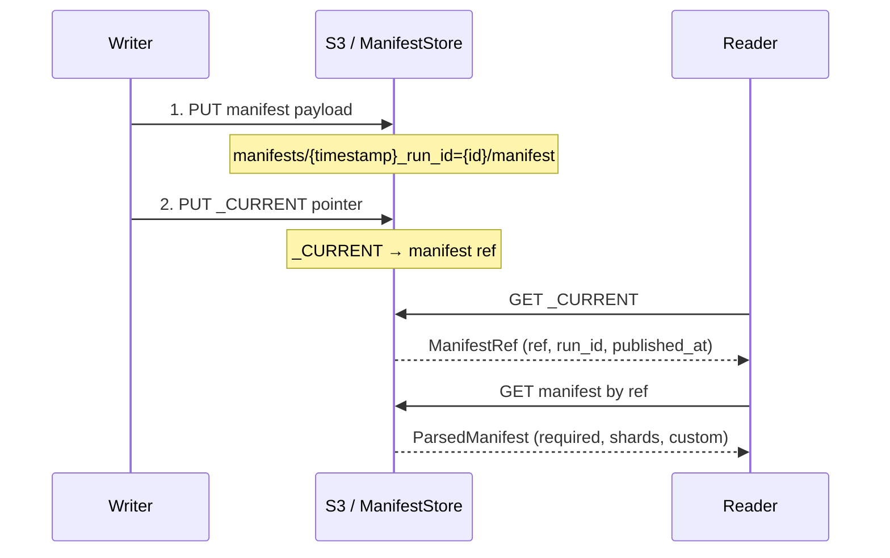
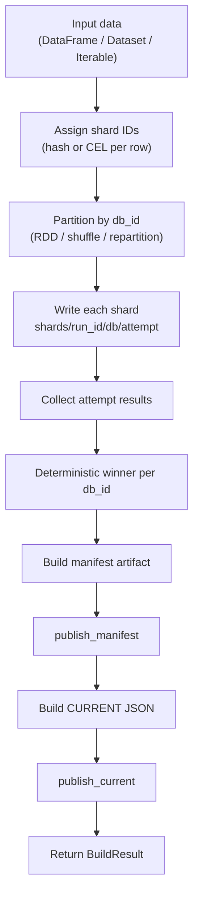
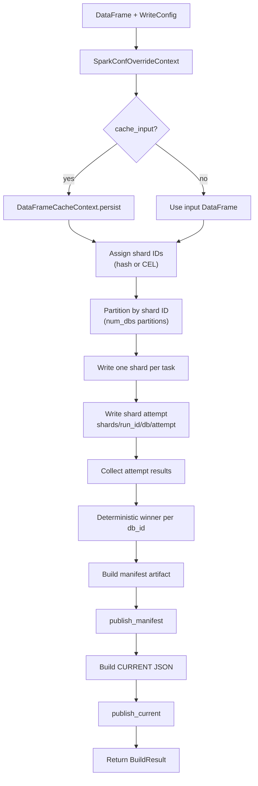
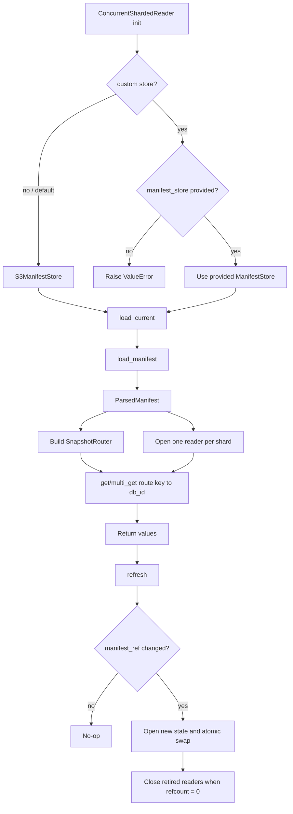

# shardyfusion: How It Works

## Overview

`shardyfusion` builds a sharded snapshot into multiple independent SlateDB databases, writes metadata (manifest + CURRENT pointer), and provides service-side readers that route keys to the correct shard. Four writer backends are supported: Spark, Dask, Ray, and pure Python.

Core behavior:

- One logical snapshot write produces up to `num_dbs` shards. The shard count can be set explicitly, computed from `max_keys_per_shard`, or determined by the CEL expression (`num_dbs` must be 0). Only shards that receive data are written to storage and appear in the manifest.
- Writes are retry/speculation-safe with attempt-isolated paths.
- A deterministic winner is selected per shard (`db_id`) on the driver.
- Reader side loads CURRENT -> manifest -> opens per-shard readers -> routes lookups.

## Why Sharding Matters Beyond Data Partitioning

Each shard is an independent SlateDB database on its own S3 prefix. This design has infrastructure-level benefits beyond simple data partitioning:

**S3 throughput multiplication** — S3 rate limits are per-prefix (~3,500 PUT/sec and ~5,500 GET/sec per prefix). Each shard sits at its own prefix (`shards/run_id=.../db=XXXXX/`), so N shards effectively multiply aggregate S3 throughput by N. A 64-shard snapshot can sustain ~350K GET/sec instead of ~5.5K for a single database.

**Tenant and team isolation** — With CEL sharding, the shard expression can route by a tenant column (e.g., `shard_hash(company_id) % 100u`). Each tenant's data lands in its own shard, giving you:

- **Independent failure domains** — a corrupted shard only affects one tenant. Other shards continue serving normally.
- **Selective loading** — a service that only serves one tenant can open just that shard via `reader_for_key()`, reducing memory footprint and startup time.
- **Independent compaction** — SlateDB compaction happens per-shard, so one hot tenant's write activity doesn't block others.

**Parallel I/O** — `multi_get()` fans out reads across shards in parallel (via thread pool or `asyncio.TaskGroup`). More shards = more parallelism for batch lookups, since each shard read is an independent I/O operation.

**Atomic refresh** — When a new snapshot is published, `refresh()` opens new shard readers and atomically swaps state. The shard readers are independent — there's no global index or cross-shard coordination to rebuild.

## Write Side (Snapshot Build)

All four backends follow the same three-phase pipeline:

1. **Sharding** — assign each row a `_slatedb_db_id` column
2. **Write** — partition data by `db_id`, write each shard to S3
3. **Publish** — build manifest, publish manifest, publish `_CURRENT` pointer

The backends differ in how they distribute work, but share all core logic for routing, winner selection, manifest building, and publishing.

### Sharding Strategies

shardyfusion supports two sharding strategies that control how rows are assigned to shard IDs at write time and how keys are routed to shards at read time.

#### HASH (default)

Uniform distribution using xxHash:

```
xxh3_64(canonical_bytes(key), seed=0) % num_dbs
```

- Supports int, str, and bytes keys uniformly via `canonical_bytes()` (int → 8-byte signed LE, str → UTF-8, bytes → passthrough)
- All four writer backends use the same Python implementation — no JVM-side hashing
- `num_dbs` can be set explicitly or computed from `max_keys_per_shard` (= `ceil(count / max_keys_per_shard)`)

```python
from shardyfusion import WriteConfig, ShardingSpec

# Explicit shard count
config = WriteConfig(num_dbs=8, s3_prefix="s3://bucket/prefix")

# Auto-computed from target shard size
config = WriteConfig(
    num_dbs=0,
    s3_prefix="s3://bucket/prefix",
    sharding=ShardingSpec(max_keys_per_shard=50_000),
)
```

#### CEL (Common Expression Language)

User-provided CEL expression evaluated at write time (shard assignment) and read time (routing). Requires the `cel` extra (`pip install shardyfusion[cel]`). Does not run on Python 3.14.

Key properties:

- Expression must produce **consecutive 0-based integer shard IDs** (e.g., `shard_hash(key) % 100u` produces IDs 0–99)
- Built-in `shard_hash()` function wraps xxh3_64 for use within CEL expressions
- `num_dbs` is always **discovered from data** (`max(db_id) + 1`) — it must not be provided explicitly
- Optional `boundaries` field enables `bisect_right`-based routing for range-like patterns
- Supports multi-column routing via `cel_columns` — non-key columns are available in the expression

**Two routing modes:**

1. **Direct** — expression returns the shard ID directly:

    ```python
    # Simple modulo
    ShardingSpec(cel_expr="key % 4", cel_columns={"key": "int"})

    # Hash-based with controlled shard count
    ShardingSpec(cel_expr="shard_hash(key) % 100u", cel_columns={"key": "int"})
    ```

2. **Boundary** — expression returns a routing key, `bisect_right(boundaries, key)` determines the shard:

    ```python
    # Range sharding: 3 shards (key < 10, 10 <= key < 20, key >= 20)
    ShardingSpec(cel_expr="key", cel_columns={"key": "int"}, boundaries=[10, 20])

    # Multi-column: route by region
    ShardingSpec(
        cel_expr="region",
        cel_columns={"region": "string"},
        boundaries=["eu", "us"],
    )
    ```

#### Comparison

| | HASH | CEL |
|---|---|---|
| Shard assignment | `xxh3_64(key) % num_dbs` | User-defined expression |
| `num_dbs` | Explicit or auto-computed | Discovered from data |
| Multi-column routing | No | Yes (via `routing_context`) |
| Range-based sharding | No | Yes (via `boundaries`) |
| Extra dependency | None | `cel` extra |

### Spark write pipeline

Entrypoint: `shardyfusion.writer.spark.write_sharded`

1. Optional Spark conf overrides are applied during the call.
2. Optional input persistence is applied if `cache_input=True`.
3. Shard IDs are assigned via Arrow-native processing on executors — hash or CEL (see [Sharding Strategies](#sharding-strategies)).
4. Data is converted to a pair RDD partitioned so that partition index equals `db_id`, enforcing exactly `num_dbs` partitions.
5. Each partition writes one attempt-isolated shard location on S3-compatible storage.
6. Driver collects partition results (attempt metadata), picks deterministic winners per `db_id`.
7. Manifest artifact is built, published, then CURRENT pointer is published.
8. `BuildResult` is returned with winners, artifact, refs, and typed stats.

See [Spark Writer Deep Dive](writers/spark.md) for data flow diagrams and Spark-specific behavior.

### Dask write pipeline

Entrypoint: `shardyfusion.writer.dask.write_sharded`

1. Shard IDs are assigned per partition via the routing function — hash or CEL (see [Sharding Strategies](#sharding-strategies)).
2. Dask DataFrame is shuffled by shard ID, then each partition writes its shards.
3. Empty shards (partitions with no rows) are omitted from the manifest — no S3 I/O is performed.
4. Optional rate limiting and routing verification.
5. Same core logic for winner selection, manifest building, and publishing.

See [Dask Writer Deep Dive](writers/dask.md) for data flow diagrams and Dask-specific behavior.

### Ray write pipeline

Entrypoint: `shardyfusion.writer.ray.write_sharded`

1. Shard IDs are assigned via Arrow-native batch processing — hash or CEL (see [Sharding Strategies](#sharding-strategies)). Zero-copy Arrow batches avoid the Arrow→pandas→Arrow overhead.
2. Dataset is repartitioned by shard ID using hash shuffle. The shuffle strategy is saved/restored in a lock-guarded block to handle concurrent calls.
3. Each partition writes its shards. Empty shards (no rows) are omitted from the manifest — no S3 I/O is performed.
4. Optional rate limiting and routing verification.
5. Same core logic for winner selection, manifest building, and publishing.

See [Ray Writer Deep Dive](writers/ray.md) for data flow diagrams and Ray-specific behavior.

### Python write pipeline

Entrypoint: `shardyfusion.writer.python.write_sharded`

1. Accepts `Iterable[T]` with `key_fn`/`value_fn` callables.
2. Routes each item to a shard ID — hash or CEL (see [Sharding Strategies](#sharding-strategies)).
3. Supports single-process (all adapters open simultaneously) or multi-process
   (`parallel=True`, one worker per shard via `multiprocessing.spawn`).
4. Same core logic for winner selection, manifest building, and publishing.

See [Python Writer Deep Dive](writers/python.md) for data flow diagrams and Python-specific behavior.

### Retry/speculation safety

- Partition writer output URL includes `attempt=<NN>`.
- Multiple attempts can exist for the same `db_id`.
- Winner selection is deterministic:
  - lowest attempt number,
  - then lowest `task_attempt_id`,
  - then stable tie-break on URL.

## Manifest Lifecycle

Every write ends with a two-phase publish. This guarantees that the manifest payload exists before the current pointer references it — readers never dereference a dangling pointer.



### Manifest Format

The manifest is a JSON object with three top-level keys:

- **`required`** — library-owned build metadata (`RequiredBuildMeta`): run_id, num_dbs, s3_prefix, sharding strategy, key_encoding, etc.
- **`shards`** — list of winner shard metadata (`RequiredShardMeta`): db_id, db_url, row_count, min/max key, checkpoint_id
- **`custom`** — user-defined fields passed via `ManifestOptions.custom_manifest_fields`

### CURRENT Pointer Format

A small JSON object pointing to the current manifest:

```json
{
  "manifest_ref": "s3://bucket/prefix/manifests/2026-03-14T10:30:00.000000Z_run_id=abc123/manifest",
  "manifest_content_type": "application/json",
  "run_id": "abc123",
  "updated_at": "2026-03-14T10:30:01Z",
  "format_version": 1
}
```

### ManifestRef

`ManifestRef` is the backend-agnostic handle that abstracts away whether the manifest lives in S3 or a database. Returned by `load_current()` and `list_manifests()`, it carries `ref` (the backend-specific reference), `run_id`, and `published_at`.

See [Manifest Stores](manifest-stores.md) for details on S3, database, and in-memory backends.

## S3/Object Layout

Assume:

- `s3_prefix = s3://bucket/prefix`
- `run_id = 9f...`
- `manifest_name = manifest`
- `current_name = _CURRENT`

Write artifacts:

- Shard attempt data (attempt-isolated paths):
  - `s3://bucket/prefix/shards/run_id=9f.../db=00000/attempt=00/...`
  - `s3://bucket/prefix/shards/run_id=9f.../db=00001/attempt=00/...`
  - ...
- Manifest object (timestamp-prefixed for chronological listing):
  - `s3://bucket/prefix/manifests/2026-03-14T10:30:00.000000Z_run_id=9f.../manifest`
- CURRENT pointer object (JSON):
  - `s3://bucket/prefix/_CURRENT`

Notes:

- Manifest S3 keys are timestamp-prefixed (e.g., `2026-03-14T10:30:00.000000Z_run_id=abc123/manifest`) so that `list_manifests()` can use S3 `CommonPrefixes` for chronological ordering.
- Manifest stores winner shard URLs (`db_url`) and required routing/build metadata.
- Non-winning attempt paths are automatically cleaned up after publish via `cleanup_losers()` (best-effort).

## Configuration

Top-level writer config model: `WriteConfig`

Required fields:

- `num_dbs`
- `s3_prefix`

Direct fields:

- `key_encoding` (default `u64be`)
- `batch_size` (default 50,000)
- `adapter_factory` (default `SlateDbFactory()`)

Grouped options:

- `sharding: ShardingSpec`
  - `strategy`, `boundaries`, `cel_expr`, `cel_columns`, `max_keys_per_shard`
- `output: OutputOptions`
  - `run_id`
  - `db_path_template`
  - `shard_prefix`
  - `local_root`
- `manifest: ManifestOptions`
  - `manifest_builder`
  - `store`
  - `custom_manifest_fields`
  - `credential_provider`
  - `s3_connection_options`
- `credential_provider` (top-level, inherited by manifest store if not set per-store)
- `s3_connection_options` (top-level, inherited by manifest store if not set per-store)

Extra runtime controls on `write_sharded` (vary by backend):

- `key_col`: name of the key column (Spark, Dask, Ray)
- `value_spec`: how to serialize row values (Spark, Dask, Ray)
- `sort_within_partitions`: sort rows within each partition before writing (Spark, Dask, Ray)
- `max_writes_per_second`: rate-limit writes (all backends; see [Rate Limiting](writer.md#rate-limiting))
- `verify_routing`: runtime routing spot-check (Spark, Dask, Ray; default `True`)
- `spark_conf_overrides`: temporary Spark settings (Spark only)
- `cache_input` / `storage_level`: persist input DataFrame (Spark only)
- `key_fn` / `value_fn`: key/value extraction callables (Python only)
- `parallel`: multi-process mode (Python only)

### Sharding strategy support

| Strategy | Spark | Dask | Ray | Python |
|----------|-------|------|-----|--------|
| `HASH` | Yes | Yes | Yes | Yes |
| `CEL` | Yes | Yes | Yes | Yes |

## Reader Side

Primary classes: `ShardedReader`, `ConcurrentShardedReader`, `AsyncShardedReader`. See [Reader Side](reader.md) for full usage docs.

### Reader initialization flow

1. Select manifest store implementation:
   - default mode: uses `S3ManifestStore`
   - custom mode: caller may provide `manifest_store`
2. Load CURRENT pointer.
3. Load manifest from CURRENT’s `manifest_ref`. If the manifest is malformed, [cold-start fallback](reader.md#cold-start-fallback) attempts previous manifests.
4. Build `SnapshotRouter`.
5. Open one SlateDB reader handle per shard (lock mode or pool mode).

### Lookup flow

- `get(key)`:
  - route key to `db_id`
  - encode key bytes using manifest `key_encoding`
  - read from selected shard reader
- `multi_get(keys)`:
  - group keys by shard
  - optional parallel shard fetch with `ThreadPoolExecutor`
  - return mapping for input keys

### Routing semantics

- **HASH**: `xxh3_64(canonical_bytes(key), seed=0) % num_dbs` — all writers and the reader use the same Python implementation. Supports int, str, and bytes keys.
- **CEL**: The same CEL expression is evaluated at both write time and read time. Must produce consecutive 0-based shard IDs. Optional `boundaries` for `bisect_right`-based routing.

For CEL routing that uses non-key columns, pass a `routing_context` at read time:

```python
# Write-time: rows have both "user_id" and "region" columns
# CEL expr uses region for shard assignment

# Read-time: provide the routing context explicitly
value = reader.get(user_id, routing_context={"region": "eu"})

values = reader.multi_get(
    [user_id_1, user_id_2],
    routing_context={"region": "eu"},
)
```

See [Sharding Strategies](#sharding-strategies) for full configuration details.

### Refresh and concurrency model

- `refresh()` loads CURRENT again.
- If `manifest_ref` unchanged: no-op.
- If changed:
  - open new shard readers/router
  - atomically swap active state
  - close retired readers when no in-flight operations are using them

## Mermaid Diagram: Write Side (Generic)



## Mermaid Diagram: Write Side (Spark Detail)



## Mermaid Diagram: Reader Side


