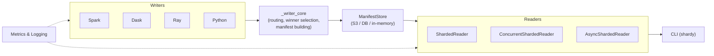
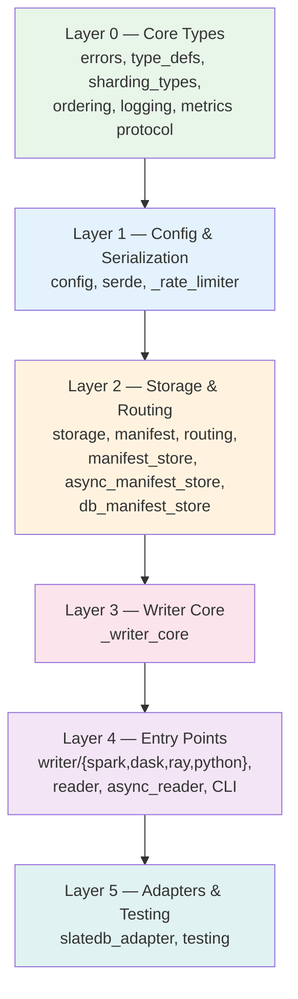

# shardyfusion

`shardyfusion` builds and reads sharded [SlateDB](https://slatedb.io) snapshots. It lets you partition large datasets into independent shard databases during a write pipeline, then route point lookups to the correct shard at read time.

## How the Pieces Fit Together

Writers ingest data (from Spark, Dask, Ray, or plain Python), assign each row to a shard, write the shards to S3-compatible storage, and publish a manifest describing the result. Readers load the manifest, build a routing table, and serve key lookups by directing each key to its shard. The CLI wraps a reader for interactive and batch use.

All four writer backends share the same core logic (`_writer_core.py`) for routing, winner selection, manifest building, and two-phase publishing. This guarantees that any backend produces a manifest readable by any reader variant.

## Dependency Layers

The codebase is organized into layers with strict dependency direction — lower layers never import higher ones:

## Writer Backends

Four backends produce identical manifest formats. They differ in how they distribute work but share all core logic:

| Feature | Spark | Dask | Ray | Python |
|---|---|---|---|---|
| Input type | PySpark `DataFrame` | Dask `DataFrame` | Ray `Dataset` | `Iterable[T]` |
| Requires Java | Yes | No | No | No |
| Sharded write | `write_sharded` | `write_sharded` | `write_sharded` | `write_sharded` |
| Single-shard write | `write_single_db` | `write_single_db` | `write_single_db` | — |
| Hash sharding | Yes | Yes | Yes | Yes |
| Range sharding | Yes | Yes | Yes | Yes |
| Custom expr sharding | Yes | No | No | No |
| Rate limiting (ops/sec) | Yes | Yes | Yes | Yes |
| Rate limiting (bytes/sec) | Yes | Yes | Yes | Yes |
| Parallel mode | Built-in (RDD) | Built-in (Dask) | Built-in (Ray) | `parallel=True` |

## Reader Variants

| Variant | Thread-safe | Async | Best for |
|---|---|---|---|
| `ShardedReader` | No | No | Single-threaded scripts |
| `ConcurrentShardedReader` | Yes | No | Multi-threaded web servers |
| `AsyncShardedReader` | N/A | Yes | asyncio services (FastAPI, etc.) |

All readers support [health checks](reader.md#reader-health), [cold-start fallback](reader.md#cold-start-fallback), [refresh](reader.md#refresh-semantics), and optional [rate limiting](reader.md#reader-side-rate-limiting).

## Quick Links

| Page | Description |
|---|---|
| [Getting Started](getting-started.md) | Installation, extras, and dev setup |
| [Architecture](how-it-works.md) | Write/read pipeline deep dive and S3 layout |
| [Writer Side](writer.md) | All writer backends, single-shard writers, rate limiting |
| [Reader Side](reader.md) | Sync, concurrent, and async readers with health and fallback |
| [Manifest Stores](manifest-stores.md) | S3, database, async, and in-memory manifest storage |
| [CLI (shardy)](cli.md) | Interactive lookups, batch scripts, history, and rollback |
| [Observability](observability.md) | Prometheus, OpenTelemetry, and structured logging |
| [Error Handling](error-handling.md) | Error hierarchy and retry semantics |
| [Operations](operations.md) | CI, rollback procedures, health monitoring, troubleshooting |
| [API Reference](api.md) | Auto-generated API docs from docstrings |
