# shardyfusion

A library for **building, publishing, and reading sharded SlateDB/SQLite snapshots** — with optional vector search.

The docs are organized by **what you want to do**. Pick a node below.

## Use-case map

Click any leaf node to jump to its use-case page. (See the [full index](use-cases/index.md) for a flat list.)

```mermaid
%%{init: {'flowchart': {'nodeSpacing': 35, 'rankSpacing': 55, 'htmlLabels': true}, 'themeVariables': {'fontSize': '16px'}}}%%
flowchart TD
  ROOT([What do you want to do?])

  ROOT --> BUILD[Build a snapshot]
  ROOT --> READ[Read a snapshot]
  ROOT --> OP[Operate snapshots]

  BUILD --> KV[KV only]
  BUILD --> VEC[Vector only]
  BUILD --> KVV[KV + Vector]

  KV --> KV_PY[Python]
  KV --> KV_SP[Spark]
  KV --> KV_DK[Dask]
  KV --> KV_RY[Ray]

  KV_PY --> KV_PY_SL[SlateDB]
  KV_PY --> KV_PY_SQ[SQLite]
  KV_SP --> KV_SP_SL[SlateDB]
  KV_SP --> KV_SP_SQ[SQLite]
  KV_DK --> KV_DK_SL[SlateDB]
  KV_DK --> KV_DK_SQ[SQLite]
  KV_RY --> KV_RY_SL[SlateDB]
  KV_RY --> KV_RY_SQ[SQLite]

  VEC --> VEC_LN[LanceDB]
  VEC --> VEC_SV[sqlite-vec]

  KVV --> KVV_CO[Composite SlateDB+LanceDB]
  KVV --> KVV_UN[Unified sqlite-vec]

  READ --> RD_SY[Sync]
  READ --> RD_AS[Async]
  RD_SY --> RD_SY_SL[SlateDB]
  RD_SY --> RD_SY_SQ[SQLite]
  RD_AS --> RD_AS_SL[SlateDB]
  RD_AS --> RD_AS_SQ[SQLite]

  OP --> OP_CLI[CLI]
  OP --> OP_HIST[History & rollback]
  OP --> OP_PROM[Prometheus metrics]
  OP --> OP_OTEL[OTel metrics]

  classDef leaf fill:#e3f2fd,stroke:#1565c0,stroke-width:2px,color:#0d47a1,cursor:pointer;
  class KV_PY_SL,KV_PY_SQ,KV_SP_SL,KV_SP_SQ,KV_DK_SL,KV_DK_SQ,KV_RY_SL,KV_RY_SQ,VEC_LN,VEC_SV,KVV_CO,KVV_UN,RD_SY_SL,RD_SY_SQ,RD_AS_SL,RD_AS_SQ,OP_CLI,OP_HIST,OP_PROM,OP_OTEL leaf;

  click KV_PY_SL "use-cases/build-python-slatedb/"
  click KV_PY_SQ "use-cases/build-python-sqlite/"
  click KV_SP_SL "use-cases/build-spark-slatedb/"
  click KV_SP_SQ "use-cases/build-spark-sqlite/"
  click KV_DK_SL "use-cases/build-dask-slatedb/"
  click KV_DK_SQ "use-cases/build-dask-sqlite/"
  click KV_RY_SL "use-cases/build-ray-slatedb/"
  click KV_RY_SQ "use-cases/build-ray-sqlite/"
  click VEC_LN "use-cases/build-vector-lancedb-standalone/"
  click VEC_SV "use-cases/build-vector-sqlite-vec-standalone/"
  click KVV_CO "use-cases/build-python-slatedb-lancedb/"
  click KVV_UN "use-cases/build-python-sqlite-vec/"
  click RD_SY_SL "use-cases/read-sync-slatedb/"
  click RD_SY_SQ "use-cases/read-sync-sqlite/"
  click RD_AS_SL "use-cases/read-async-slatedb/"
  click RD_AS_SQ "use-cases/read-async-sqlite/"
  click OP_CLI "use-cases/operate-cli/"
  click OP_HIST "use-cases/operate-manifest-history-and-rollback/"
  click OP_PROM "use-cases/operate-prometheus-metrics/"
  click OP_OTEL "use-cases/operate-otel-metrics/"
```

## Sections

- **[Use cases](use-cases/index.md)** — task-oriented guides. Each follows a fixed template (when to use / install / minimal example / config / properties / guarantees / weaknesses / failure modes).
- **[Architecture](architecture/writer-core.md)** — internal design: writer core, sharding, routing, manifest, run registry, adapters, observability, error model.
- **[Reference](reference/api.md)** — public API, configuration objects, CLI, glossary.
- **[Operations](operations/index.md)** — running shardyfusion in production, cloud testing, tox & dependency matrix.
- **[Contributing](contributing/index.md)** — local development, testing, adding adapters/writers/use-cases, documentation policy.
- **[History](history/index.md)** — ADRs, open plans, original engineering notes.

## Quick orientation

- Default storage backend: **SlateDB**.
- Snapshot layout: per-shard databases under `s3_prefix/`, plus an immutable manifest under `manifests/<timestamp>_run_id=<run_id>/manifest`, plus a single mutable pointer `_CURRENT`.
- Publish is **two-phase**: write manifest, swap `_CURRENT`. See [ADR-001](history/design-decisions/adr-001-two-phase-publish.md).
- Python `>=3.11,<3.14`.
