---
hide:
  - navigation
---

# shardyfusion

A library for **sharded SlateDB/SQLite snapshots** and **sharded vector search** — use either independently or together.

The docs are organized by **what you want to do**. Pick a branch below.

## Use-case map

Click any node to jump to its page. (See the [full index](use-cases/index.md) for a navigational tree.)

```mermaid
flowchart TD
  ROOT([What do you want to do?])

  ROOT --> SHARED[Shared snapshot workflow]
  ROOT --> KV[Sharded KV storage]
  ROOT --> KVV[Sharded KV + Vector]
  ROOT --> VEC[Sharded Vector search]
  ROOT --> OP[Operations]

  KV --> KV_OV[Overview]
  KV --> KV_BUILD[Build]
  KV --> KV_READ[Read]

  KV_BUILD --> KV_PY[Python]
  KV_BUILD --> KV_SP[Spark]
  KV_BUILD --> KV_DK[Dask]
  KV_BUILD --> KV_RY[Ray]

  KV_READ --> KV_RD_SY[Sync]
  KV_READ --> KV_RD_AS[Async]
  KV_RD_SY --> KV_RD_SY_SL[SlateDB]
  KV_RD_SY --> KV_RD_SY_SQ[SQLite]
  KV_RD_AS --> KV_RD_AS_SL[SlateDB]
  KV_RD_AS --> KV_RD_AS_SQ[SQLite]

  KVV --> KVV_OV[Overview]
  KVV --> KVV_BUILD[Build]
  KVV --> KVV_READ[Read]

  KVV_BUILD --> KVV_CO[Composite<br/>SlateDB+LanceDB]
  KVV_BUILD --> KVV_UN[Unified<br/>sqlite-vec]

  KVV_READ --> KVV_RD_SY[Sync]
  KVV_READ --> KVV_RD_AS[Async]

  VEC --> VEC_OV[Overview]
  VEC --> VEC_BUILD[Build]
  VEC --> VEC_READ[Read]

  VEC_BUILD --> VEC_LN[LanceDB]
  VEC_BUILD --> VEC_SV[sqlite-vec]

  VEC_READ --> VEC_RD_SY[Sync]
  VEC_READ --> VEC_RD_AS[Async]

  OP --> OP_CLI[CLI]
  OP --> OP_HIST[History &amp; rollback]
  OP --> OP_PROM[Prometheus metrics]
  OP --> OP_OTEL[OTel metrics]
  OP --> OP_PROD[Production guide]
  OP --> OP_CLOUD[Cloud testing]
  OP --> OP_TOX[Tox matrix]

  click KV_OV href "use-cases/kv-storage/overview/"
  click SHARED href "use-cases/shared-snapshot-workflow/"
  click KV_PY href "use-cases/kv-storage/build/python/"
  click KV_SP href "use-cases/kv-storage/build/spark/"
  click KV_DK href "use-cases/kv-storage/build/dask/"
  click KV_RY href "use-cases/kv-storage/build/ray/"
  click KV_RD_SY_SL href "use-cases/kv-storage/read/sync/slatedb/"
  click KV_RD_SY_SQ href "use-cases/kv-storage/read/sync/sqlite/"
  click KV_RD_AS_SL href "use-cases/kv-storage/read/async/slatedb/"
  click KV_RD_AS_SQ href "use-cases/kv-storage/read/async/sqlite/"

  click KVV_OV href "use-cases/kv-vector/overview/"
  click KVV_CO href "use-cases/kv-vector/build/composite/"
  click KVV_UN href "use-cases/kv-vector/build/unified/"
  click KVV_RD_SY href "use-cases/kv-vector/read/sync/"
  click KVV_RD_AS href "use-cases/kv-vector/read/async/"

  click VEC_OV href "use-cases/vector/overview/"
  click VEC_LN href "use-cases/vector/build/lancedb/"
  click VEC_SV href "use-cases/vector/build/sqlite-vec/"
  click VEC_RD_SY href "use-cases/vector/read/sync/"
  click VEC_RD_AS href "use-cases/vector/read/async/"

  click OP_CLI href "operate/cli/"
  click OP_HIST href "operate/history-rollback/"
  click OP_PROM href "operate/prometheus-metrics/"
  click OP_OTEL href "operate/otel-metrics/"
  click OP_PROD href "operate/production/"
  click OP_CLOUD href "operate/cloud-testing/"
  click OP_TOX href "operate/tox-matrix/"
```

## Sections

- **[Use cases](use-cases/index.md)** — task-oriented guides organized by use-case type (KV, KV+Vector, Vector), plus the shared snapshot workflow behind all of them.
- **[Operations](operate/index.md)** — CLI, history & rollback, metrics, production checks, cloud testing, and tox matrix.
- **[Architecture](architecture/writer-core.md)** — internal design: writer core, sharding, routing, manifest, run registry, adapters, observability, error model.
- **[Reference](reference/api.md)** — public API, configuration objects, CLI, glossary.
- **[Contributing](contributing/index.md)** — local development, testing, adding adapters/writers/use-cases, documentation policy.
- **[History](history/index.md)** — ADRs, open plans, original engineering notes.

## Quick orientation

- Default storage backend: **SlateDB**.
- Snapshot layout: per-shard databases under `s3_prefix/`, plus an immutable manifest under `manifests/<timestamp>_run_id=<run_id>/manifest`, plus a single mutable pointer `_CURRENT`.
- Publish is **two-phase**: write manifest, swap `_CURRENT`. See [ADR-001](history/design-decisions/adr-001-two-phase-publish.md).
- Python `>=3.11,<3.14`.
