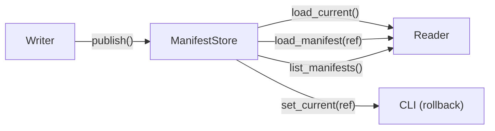
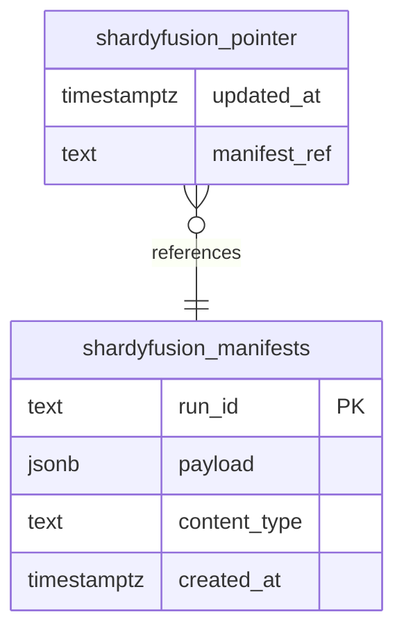

# Manifest Stores

Manifest stores handle the persistence and retrieval of snapshot manifests — the JSON metadata that describes which shards exist, where they live, and how to route keys to them.

## Overview

Every write pipeline ends with two publish steps: (1) persist the manifest payload, (2) update the current pointer. Every reader starts by loading the current pointer and dereferencing the manifest it points to. The `ManifestStore` protocol abstracts this lifecycle so you can swap between S3, a relational database, or an in-memory store for testing.



## ManifestStore Protocol

The full read/write protocol used by writers and the CLI:

```python
class ManifestStore(Protocol):
    def publish(
        self,
        *,
        run_id: str,
        required_build: RequiredBuildMeta,
        shards: list[RequiredShardMeta],
        custom: dict[str, Any],
    ) -> str:
        """Persist manifest + update current pointer. Returns a manifest reference."""

    def load_current(self) -> ManifestRef | None:
        """Return the current manifest pointer, or None if not published."""

    def load_manifest(self, ref: str) -> ParsedManifest:
        """Load and parse a manifest by reference."""

    def list_manifests(self, *, limit: int = 10) -> list[ManifestRef]:
        """Return up to *limit* manifests in reverse chronological order."""

    def set_current(self, ref: str) -> None:
        """Update the current pointer to the given manifest reference."""
```

`ManifestRef` is the backend-agnostic handle returned by `load_current()` and `list_manifests()`:

```python
@dataclass(slots=True, frozen=True)
class ManifestRef:
    ref: str              # backend-specific reference (S3 key, DB row ID, etc.)
    run_id: str           # the run_id that produced this manifest
    published_at: datetime
```

## AsyncManifestStore Protocol

A read-only async subset for use with `AsyncShardedReader`:

```python
class AsyncManifestStore(Protocol):
    async def load_current(self) -> ManifestRef | None: ...
    async def load_manifest(self, ref: str) -> ParsedManifest: ...
    async def list_manifests(self, *, limit: int = 10) -> list[ManifestRef]: ...
```

No `publish()` or `set_current()` — manifest publishing is always a writer-side (synchronous) operation.

## S3ManifestStore

The default implementation. Manifests are stored as JSON objects in S3; the current pointer is a separate `_CURRENT` JSON object.

### S3 Object Layout

```
s3://bucket/prefix/
├── manifests/
│   ├── 2026-03-14T10:30:00.000000Z_run_id=abc123/
│   │   └── manifest          ← manifest JSON payload
│   ├── 2026-03-13T08:00:00.000000Z_run_id=def456/
│   │   └── manifest
│   └── ...
└── _CURRENT                   ← current pointer JSON
```

Manifest S3 keys are timestamp-prefixed for chronological listing via S3 `CommonPrefixes`.

### Constructor

```python
from shardyfusion import S3ManifestStore, RetryConfig

store = S3ManifestStore(
    s3_prefix="s3://bucket/prefix",
    manifest_name="manifest",              # default
    current_name="_CURRENT",               # default
    manifest_builder=None,                 # default: JsonManifestBuilder
    credential_provider=None,              # optional CredentialProvider
    s3_connection_options=None,            # optional S3ConnectionOptions
    metrics_collector=None,                # optional MetricsCollector
    retry_config=RetryConfig(              # optional, controls S3 retries
        max_retries=3,                     # default
        initial_backoff_s=1.0,             # default
        backoff_multiplier=2.0,            # default
    ),
)
```

### Retry Behavior

S3 operations use exponential backoff for transient errors. The default retry sequence is 1s → 2s → 4s (3 attempts). Customize via `RetryConfig`:

```python
store = S3ManifestStore(
    s3_prefix="s3://bucket/prefix",
    retry_config=RetryConfig(max_retries=5, initial_backoff_s=0.5),
)
```

### Manifest Format

```json
{
  "required": {
    "run_id": "abc123",
    "created_at": "2026-03-14T10:30:00Z",
    "num_dbs": 8,
    "s3_prefix": "s3://bucket/prefix",
    "key_col": "id",
    "sharding": {"strategy": "HASH"},
    "db_path_template": "db={db_id:05d}",
    "tmp_prefix": "_tmp",
    "format_version": 1,
    "key_encoding": "u64be"
  },
  "shards": [
    {
      "db_id": 0,
      "db_url": "s3://bucket/prefix/db=00000",
      "attempt": 0,
      "row_count": 125000,
      "min_key": 3,
      "max_key": 999997
    }
  ],
  "custom": {}
}
```

### CURRENT Pointer Format

```json
{
  "manifest_ref": "s3://bucket/prefix/manifests/2026-03-14T10:30:00.000000Z_run_id=abc123/manifest",
  "manifest_content_type": "application/json",
  "run_id": "abc123",
  "updated_at": "2026-03-14T10:30:01Z",
  "format_version": 1
}
```

## AsyncS3ManifestStore

Native async S3 loading via `aiobotocore`. Used automatically by `AsyncShardedReader` when the `read-async` extra is installed.

```python
from shardyfusion import AsyncS3ManifestStore

store = AsyncS3ManifestStore(
    s3_prefix="s3://bucket/prefix",
    manifest_name="manifest",           # default
    current_name="_CURRENT",            # default
    credential_provider=None,           # optional CredentialProvider
    s3_connection_options=None,         # optional S3ConnectionOptions
    metrics_collector=None,             # optional MetricsCollector
    retry_config=None,                  # optional RetryConfig
)
```

Creates a short-lived S3 client per operation (via aiobotocore session context manager). This is appropriate because manifest operations are infrequent — only at initialization and refresh.

```python
from shardyfusion import AsyncShardedReader

# AsyncShardedReader uses AsyncS3ManifestStore by default
reader = await AsyncShardedReader.open(
    s3_prefix="s3://bucket/prefix",
    local_root="/tmp/reader",
)

# Or provide a custom async store
reader = await AsyncShardedReader.open(
    s3_prefix="s3://bucket/prefix",
    local_root="/tmp/reader",
    manifest_store=my_async_store,  # must implement AsyncManifestStore
)
```

!!! note
    `AsyncShardedReader` only accepts `AsyncManifestStore` — not the sync `ManifestStore`. When `manifest_store=None` (default), it creates an `AsyncS3ManifestStore` internally.

## Database Manifest Stores

For environments where S3 is not the primary metadata store, two database-backed implementations are available: `PostgresManifestStore` and `Comdb2ManifestStore`.

### How They Work

Both use two tables:



- **`shardyfusion_manifests`** — stores manifest JSON payloads, one row per write
- **`shardyfusion_pointer`** — append-only current-pointer tracking (one INSERT per `publish()` or `set_current()` call)

`load_current()` reads the newest pointer row. If the pointer table is empty, it falls back to the newest manifest row.

### PostgresManifestStore

```python
import psycopg2
from shardyfusion.db_manifest_store import PostgresManifestStore

store = PostgresManifestStore(
    connection_factory=lambda: psycopg2.connect("dbname=mydb"),
    table_name="shardyfusion_manifests",        # default
    pointer_table_name="shardyfusion_pointer",   # default
    ensure_table=True,                           # default: auto-create tables
)
```

When `ensure_table=True` (the default), tables are created on construction using this DDL:

```sql
-- Manifest table
CREATE TABLE IF NOT EXISTS shardyfusion_manifests (
    run_id TEXT PRIMARY KEY,
    payload JSONB NOT NULL,
    content_type TEXT NOT NULL,
    created_at TIMESTAMPTZ DEFAULT NOW()
);

-- Pointer table (append-only)
CREATE TABLE IF NOT EXISTS shardyfusion_pointer (
    updated_at TIMESTAMPTZ DEFAULT NOW(),
    manifest_ref TEXT NOT NULL
);

CREATE INDEX IF NOT EXISTS idx_shardyfusion_pointer_updated_at
    ON shardyfusion_pointer (updated_at DESC);
```

### Comdb2ManifestStore

Same interface, adapted for Comdb2's SQL dialect (uses `TEXT` instead of `JSONB`, `CURRENT_TIMESTAMP` instead of `NOW()`):

```python
from shardyfusion.db_manifest_store import Comdb2ManifestStore

store = Comdb2ManifestStore(
    connection_factory=lambda: comdb2_connect("mydb"),
    ensure_table=True,
)
```

### Usage with Writers and Readers

Pass a DB manifest store via `ManifestOptions`:

```python
from shardyfusion import WriteConfig, ManifestOptions

config = WriteConfig(
    num_dbs=8,
    s3_prefix="s3://bucket/prefix",
    manifest=ManifestOptions(store=store),
)

# Reader
from shardyfusion import ConcurrentShardedReader

reader = ConcurrentShardedReader(
    s3_prefix="s3://bucket/prefix",
    local_root="/tmp/reader",
    manifest_store=store,
)
```

## InMemoryManifestStore

A simple in-memory implementation for testing. No S3 or database required.

```python
from shardyfusion import InMemoryManifestStore

store = InMemoryManifestStore()

# Use in tests
reader = ShardedReader(
    s3_prefix="s3://test/prefix",
    local_root="/tmp/test-reader",
    manifest_store=store,
)
```

## Choosing a Backend

| Feature | S3ManifestStore | DB (Postgres/Comdb2) | InMemoryManifestStore |
|---|---|---|---|
| Production-ready | Yes | Yes | No (testing only) |
| Async variant | `AsyncS3ManifestStore` | — | — |
| Transactional writes | No (eventual consistency) | Yes (ACID) | N/A |
| History/rollback | Via S3 key listing | Via pointer table queries | Via in-memory list |
| Auto-DDL | N/A | `ensure_table=True` | N/A |
| Retry support | `RetryConfig` | Connection-level | N/A |
| Best for | Most deployments | Environments needing ACID metadata | Unit tests |
