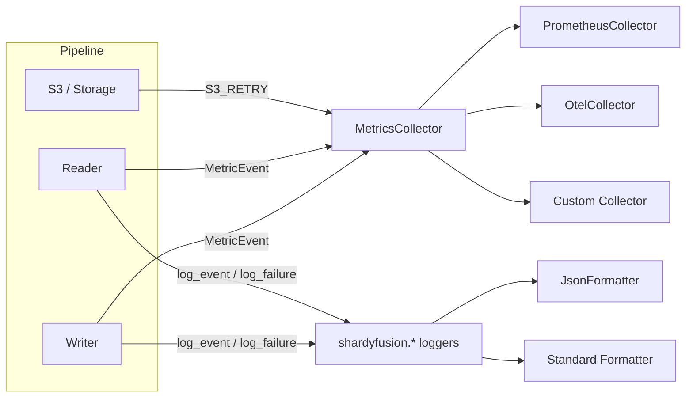

# Observability

shardyfusion provides two observability channels: **metrics** (structured events emitted at lifecycle milestones) and **structured logging** (JSON-formatted log lines with contextual fields).



## MetricsCollector Protocol

Implement the `MetricsCollector` protocol to receive structured metric events:

```python
from shardyfusion.metrics import MetricEvent, MetricsCollector

class MyCollector:
    def emit(self, event: MetricEvent, payload: dict) -> None:
        ...  # handle the event
```

Pass the collector to writers or readers:

```python
# Writer — via config or parameter
config = WriteConfig(num_dbs=8, s3_prefix="...", metrics_collector=collector)

# Reader
reader = ShardedReader(
    s3_prefix="...", local_root="/tmp/reader",
    metrics_collector=collector,
)
```

**Implementation requirements:**

- Must be thread-safe (called from multiple threads in concurrent reader)
- Called synchronously — buffer internally if blocking is a concern
- Should silently ignore unknown events for forward compatibility

## MetricEvent Catalog

### Writer Lifecycle

| Event | Payload | Description |
|---|---|---|
| `WRITE_STARTED` | `elapsed_ms` | Write pipeline initiated |
| `SHARDING_COMPLETED` | `elapsed_ms`, `duration_ms` | Shard assignment phase complete |
| `SHARD_WRITE_STARTED` | `elapsed_ms`, `db_id` | Individual shard write begins |
| `SHARD_WRITE_COMPLETED` | `elapsed_ms`, `db_id`, `row_count`, `duration_ms` | Individual shard write finishes |
| `SHARD_WRITES_COMPLETED` | `elapsed_ms`, `duration_ms`, `rows_written` | All shards written |
| `BATCH_WRITTEN` | `elapsed_ms`, `db_id`, `batch_size` | Single batch flushed to adapter |
| `MANIFEST_PUBLISHED` | `elapsed_ms` | Manifest uploaded |
| `CURRENT_PUBLISHED` | `elapsed_ms` | CURRENT pointer updated |
| `WRITE_COMPLETED` | `elapsed_ms`, `rows_written` | Entire write pipeline done |

### Reader Lifecycle

| Event | Payload | Description |
|---|---|---|
| `READER_INITIALIZED` | _(empty)_ | Reader constructed and state loaded |
| `READER_GET` | `duration_ms`, `found` | Single key lookup completed |
| `READER_MULTI_GET` | `duration_ms`, `num_keys` | Multi-key lookup completed |
| `READER_REFRESHED` | `changed` | Refresh attempt (`changed=True` if new snapshot loaded) |
| `READER_CLOSED` | `num_handles` | Reader closed |

### Infrastructure

| Event | Payload | Description |
|---|---|---|
| `S3_RETRY` | `attempt`, `max_retries`, `delay_s` | S3 operation being retried |
| `S3_RETRY_EXHAUSTED` | `attempts` | All S3 retry attempts failed |
| `RATE_LIMITER_THROTTLED` | `wait_seconds` | Rate limiter imposed a wait before acquiring tokens |
| `RATE_LIMITER_DENIED` | `tokens_requested` | Non-blocking `try_acquire()` could not satisfy the request |

## Built-in Collectors

### PrometheusCollector

Maps `MetricEvent`s to Prometheus counters and histograms.

**Install:**

```bash
pip install shardyfusion[metrics-prometheus]
# or: uv sync --extra metrics-prometheus
```

**Usage:**

```python
from shardyfusion.metrics.prometheus import PrometheusCollector

# Uses the default global registry
collector = PrometheusCollector()

# Or use a custom registry (recommended for tests)
from prometheus_client import CollectorRegistry

registry = CollectorRegistry()
collector = PrometheusCollector(registry=registry, prefix="shardyfusion_")
```

**Constructor parameters:**

| Parameter | Type | Default | Description |
|---|---|---|---|
| `registry` | `CollectorRegistry \| None` | `None` (global `REGISTRY`) | Prometheus registry to register instruments with |
| `prefix` | `str` | `"shardyfusion_"` | Prefix for all metric names |

**Instruments:**

| Prometheus Name | Type | Source Event | Description |
|---|---|---|---|
| `shardyfusion_writes_started_total` | Counter | `WRITE_STARTED` | Write pipelines initiated |
| `shardyfusion_writes_completed_total` | Counter | `WRITE_COMPLETED` | Write pipelines completed |
| `shardyfusion_write_duration_seconds` | Histogram | `WRITE_COMPLETED` | Total write pipeline duration |
| `shardyfusion_shard_writes_completed_total` | Counter | `SHARD_WRITE_COMPLETED` | Individual shard writes completed |
| `shardyfusion_shard_write_duration_seconds` | Histogram | `SHARD_WRITE_COMPLETED` | Per-shard write duration |
| `shardyfusion_batches_written_total` | Counter | `BATCH_WRITTEN` | Batches flushed to adapters |
| `shardyfusion_reader_gets_total` | Counter | `READER_GET` | Single key lookups |
| `shardyfusion_reader_get_duration_seconds` | Histogram | `READER_GET` | Single key lookup duration |
| `shardyfusion_reader_multi_gets_total` | Counter | `READER_MULTI_GET` | Multi-key lookups |
| `shardyfusion_reader_multi_get_duration_seconds` | Histogram | `READER_MULTI_GET` | Multi-key lookup duration |
| `shardyfusion_s3_retries_total` | Counter | `S3_RETRY` | S3 retries |
| `shardyfusion_s3_retries_exhausted_total` | Counter | `S3_RETRY_EXHAUSTED` | S3 retry exhaustions |
| `shardyfusion_rate_limiter_throttled_total` | Counter | `RATE_LIMITER_THROTTLED` | Rate limiter throttle events |
| `shardyfusion_rate_limiter_wait_seconds` | Histogram | `RATE_LIMITER_THROTTLED` | Rate limiter wait duration |
| `shardyfusion_rate_limiter_denied_total` | Counter | `RATE_LIMITER_DENIED` | Non-blocking acquire denials |

Duration payloads are converted from milliseconds to seconds (`ms / 1000.0`).

!!! tip "Test Isolation"
    Always pass a dedicated `CollectorRegistry` in tests to avoid polluting the global registry and causing `Duplicated timeseries` errors across test runs.

### OtelCollector

Maps `MetricEvent`s to OpenTelemetry counters and histograms.

**Install:**

```bash
pip install shardyfusion[metrics-otel]
# or: uv sync --extra metrics-otel
```

**Usage:**

```python
from shardyfusion.metrics.otel import OtelCollector

# Uses the global MeterProvider
collector = OtelCollector()

# Or use a custom MeterProvider (recommended for tests)
from opentelemetry.sdk.metrics import MeterProvider

provider = MeterProvider()
collector = OtelCollector(meter_provider=provider, meter_name="shardyfusion")
```

**Constructor parameters:**

| Parameter | Type | Default | Description |
|---|---|---|---|
| `meter_provider` | `MeterProvider \| None` | `None` (global provider) | OTel MeterProvider for instrument creation |
| `meter_name` | `str` | `"shardyfusion"` | Meter name for instrument grouping |

**Instruments:**

| OTel Name | Type | Unit | Source Event |
|---|---|---|---|
| `shardyfusion.writes_started` | Counter | — | `WRITE_STARTED` |
| `shardyfusion.writes_completed` | Counter | — | `WRITE_COMPLETED` |
| `shardyfusion.write_duration` | Histogram | `s` | `WRITE_COMPLETED` |
| `shardyfusion.shard_writes_completed` | Counter | — | `SHARD_WRITE_COMPLETED` |
| `shardyfusion.shard_write_duration` | Histogram | `s` | `SHARD_WRITE_COMPLETED` |
| `shardyfusion.batches_written` | Counter | — | `BATCH_WRITTEN` |
| `shardyfusion.reader_gets` | Counter | — | `READER_GET` |
| `shardyfusion.reader_get_duration` | Histogram | `s` | `READER_GET` |
| `shardyfusion.reader_multi_gets` | Counter | — | `READER_MULTI_GET` |
| `shardyfusion.reader_multi_get_duration` | Histogram | `s` | `READER_MULTI_GET` |
| `shardyfusion.s3_retries` | Counter | — | `S3_RETRY` |
| `shardyfusion.s3_retries_exhausted` | Counter | — | `S3_RETRY_EXHAUSTED` |
| `shardyfusion.rate_limiter_throttled` | Counter | — | `RATE_LIMITER_THROTTLED` |
| `shardyfusion.rate_limiter_wait` | Histogram | `s` | `RATE_LIMITER_THROTTLED` |
| `shardyfusion.rate_limiter_denied` | Counter | — | `RATE_LIMITER_DENIED` |

OTel uses `.add()` for counters and `.record()` for histograms. Duration payloads are converted from milliseconds to seconds.

!!! tip "Test Isolation"
    Pass a custom `MeterProvider` in tests to avoid polluting the global meter and to enable metric assertion via `InMemoryMetricReader`.

## Structured Logging

shardyfusion uses Python's `logging` module with the `shardyfusion` logger namespace. A set of helpers provide structured, machine-parseable log output.

### Logger Hierarchy

```python
from shardyfusion.logging import get_logger

logger = get_logger("mymodule")  # → logging.getLogger("shardyfusion.mymodule")
```

All shardyfusion loggers live under the `shardyfusion.*` hierarchy, so you can control verbosity at the root:

```python
import logging
logging.getLogger("shardyfusion").setLevel(logging.DEBUG)
```

### Structured Event Emission

Two functions emit structured log lines with contextual fields attached via `extra={"slatedb": fields}`:

```python
from shardyfusion.logging import log_event, log_failure, FailureSeverity

# Informational event
log_event("manifest_published", run_id="abc123", num_shards=8)

# Failure with severity-based log level
log_failure(
    "s3_put_failed",
    severity=FailureSeverity.TRANSIENT,  # → WARNING level
    error=exc,
    attempt=2,
    max_retries=3,
)
```

### FailureSeverity

Controls the log level used by `log_failure()`:

| Severity | Log Level | Use Case |
|---|---|---|
| `TRANSIENT` | `WARNING` | Retryable errors (S3 timeouts, rate limits) |
| `ERROR` | `ERROR` | Non-retryable errors (bad config, parse failures) |
| `CRITICAL` | `CRITICAL` | Unrecoverable errors (data corruption) |

### LogContext

A context manager that binds fields to all `log_event()` / `log_failure()` calls within its scope. Uses `contextvars` — works correctly with both threading and `asyncio.create_task()`.

```python
from shardyfusion.logging import LogContext, log_event

with LogContext(run_id="abc123", pipeline="daily"):
    log_event("write_started")          # includes run_id and pipeline
    with LogContext(db_id=3):
        log_event("shard_write_started")  # includes run_id, pipeline, and db_id
    log_event("write_completed")        # includes run_id and pipeline (db_id gone)
```

Nesting is supported — inner contexts merge with outer ones. Fields from inner contexts take precedence on key collision.

### JsonFormatter

Formats log records as single-line JSON, suitable for log aggregation systems (ELK, Datadog, CloudWatch):

```python
from shardyfusion.logging import JsonFormatter, configure_logging

configure_logging(json_format=True)
```

Output format:

```json
{"timestamp": "2026-03-14 10:30:00,000", "level": "INFO", "logger": "shardyfusion.writer", "event": "manifest_published", "run_id": "abc123", "num_shards": 8}
```

The formatter flattens `extra["slatedb"]` fields into the top-level JSON object alongside standard fields (`timestamp`, `level`, `logger`, `event`).

### configure_logging

Convenience function to set up the `shardyfusion` logger hierarchy:

```python
from shardyfusion.logging import configure_logging

# Standard text format
configure_logging(level=logging.DEBUG)

# JSON format for production
configure_logging(level=logging.INFO, json_format=True)

# Custom stream
configure_logging(level=logging.INFO, json_format=True, stream=sys.stderr)
```

| Parameter | Type | Default | Description |
|---|---|---|---|
| `level` | `int` | `logging.INFO` | Log level for the `shardyfusion` hierarchy |
| `json_format` | `bool` | `False` | Use `JsonFormatter` instead of standard format |
| `stream` | stream | `None` (stderr) | Output stream for the handler |

### Full Example: Production Service

```python
import logging
from shardyfusion import ConcurrentShardedReader
from shardyfusion.logging import configure_logging, LogContext
from shardyfusion.metrics.prometheus import PrometheusCollector

# Set up structured JSON logging
configure_logging(level=logging.INFO, json_format=True)

# Set up Prometheus metrics
collector = PrometheusCollector()

# Create reader with metrics
reader = ConcurrentShardedReader(
    s3_prefix="s3://bucket/prefix",
    local_root="/tmp/reader",
    metrics_collector=collector,
)

# Use LogContext to tag all log lines with request context
def handle_request(request_id: str, key: int):
    with LogContext(request_id=request_id):
        value = reader.get(key)
        return value
```
