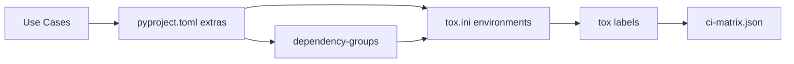
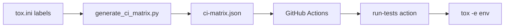
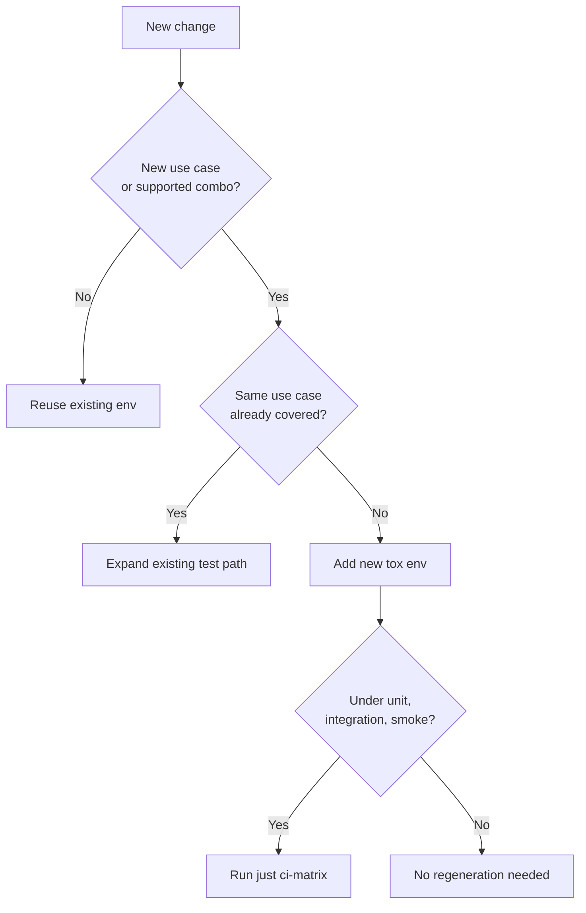

# Tox and Dependency Matrix

`shardyfusion` is a sharded snapshot writer/reader library that can be used in many different ways. This rich set of use cases is the root cause of the size and complexity in `pyproject.toml` and `tox.ini`.

This page explains:
1. the use cases the project supports
2. how use cases drive the package extras
3. how extras drive the tox matrix
4. how to add new tox environments responsibly

## Use Cases the Project Supports

`shardyfusion` can be used for different scenarios in production pipelines:

### Writer Side

| Use case | Input | Requires |
|---|---|---|
| PySpark DataFrame | DataFrame with custom sharding | Java 17, PySpark |
| Dask DataFrame | Dask DataFrame | Dask |
| Ray Dataset | Ray Dataset | Ray |
| Pure Python | Iterable of records | nothing extra |

### Reader Side

| Use case | API | Requires |
|---|---|---|
| Sync reader | `ShardedReader` | none |
| Concurrent reader | `ConcurrentShardedReader` | none |
| Async reader | `AsyncShardedReader` | aiobotocore |

### Storage Backends

| Use case | Backend | Requires |
|---|---|---|
| Default shard storage | SlateDB | slatedb, boto3 |
| SQLite shards | SQLite-on-S3 | boto3 |
| Range reads | SQLite with APSW VFS | apsw, boto3 |

### Optional Features

| Use case | Feature | Requires |
|---|---|---|
| CLI tool | `shardy` CLI | click |
| Expression routing | CEL sharding | cel-expr-python |
| Observability | Prometheus metrics | prometheus-client |
| Observability | OpenTelemetry | opentelemetry-api |
| Vector search | LanceDB | lancedb, numpy |
| Vector search | sqlite-vec | sqlite-vec, numpy |

### Python Versions

Current support: Python 3.11, 3.12, 3.13. Python 3.14 is excluded until all dependencies consistently support it.

---

## How Use Cases Drive Package Extras

Every distinct use case above becomes a public extra in `pyproject.toml`. Users install exactly what they need:

```bash
# Reader only (default SlateDB backend)
uv sync --extra read

# Async reader
uv sync --extra read-async

# SQLite shards instead of SlateDB
uv sync --extra read-sqlite

# Adaptive SQLite reader (download + range, auto-picked per snapshot)
uv sync --extra read-sqlite-adaptive

# Spark writer (requires Java)
uv sync --extra writer-spark

# Dask writer
uv sync --extra writer-dask

# Ray writer
uv sync --extra writer-ray

# CLI tool — kitchen-sink (every read backend bundled)
uv sync --extra cli

# CLI tool — slim (bring your own backend)
uv sync --extra cli-minimal --extra read-sqlite-adaptive

# Full install (all use cases)
uv sync --all-extras
```

The public extras are intentionally user-shaped. They answer: "How do I use this library for X?"

### Why So Many Extras?

Because every use case has different dependencies. Users should not install:

- PySpark if they use Dask
- aiobotocore if they only need sync reads
- lancedb if they only need key-value lookups

The matrix is large because the option set is large.

---

## How Extras Drive the Tox Matrix

The tox matrix tests every supported combination of use cases, Python versions, backends, and verification stages.



| From | To | What it adds |
|---|---|---|
| use case | public extra | user install target |
| use case | dependency group | reusable slice for tox |
| extra + Python + stage | tox env | concrete verification job |
| tox env family | label | group for workflows |
| label | CI job matrix | GitHub Actions parallelization |

---

## The Layers

| Layer | Defined in | Purpose |
|---|---|---|
| Public optional extras | `pyproject.toml` | User-facing install shapes |
| Dependency groups | `pyproject.toml` | Internal reusable slices |
| Tox environments | `tox.ini` | Concrete verification targets |
| Tox labels | `tox.ini` | Workflow entry points |
| CI matrix | `.github/ci-matrix.json` | Generated CI jobs |

---

## Tox Factorization

The tox config is compact because one base `[testenv]` describes many environments through factors.

| Piece | What it does |
|---|---|
| `package = editable` | Test working tree directly |
| `extras = test` | Add pytest and fixtures |
| `dependency_groups = ...` | Add only the slice needed |
| `deps = ...` | Runtime version pins (e.g., Spark 3.5 vs 4) |
| `commands = ...` | Test path per env family |
| `labels = ...` | Group by stage for workflows |

### Example: `py311-sparkwriter-spark4-slatedb-unit`

| Piece | Means |
|---|---|
| `py311` | Python 3.11 |
| `sparkwriter` | adds `cap-writer-spark` + `mod-cel` |
| `spark4` | adds `pyspark>=4,<5` |
| `slatedb` | adds `backend-slatedb` |
| `unit` | runs Spark unit tests |

This checks: Spark writer unit tests on Python 3.11 with Spark 4 against SlateDB backend.

---

## Why the Structure Exists

### 1. Honest support boundaries

Each tox env encodes exactly what combinations are supported. There is no ambiguity about what works on what Python version with what backend.

### 2. Fast, focused installs

Most envs install only what they need. `py312-read-slatedb-unit` never pulls PySpark.

### 3. Clear failure isolation

When `py313-vector-lancedb-unit` fails, the failure tells you the issue is in Python 3.13 + vector + LanceDB. Not "some dependency problem".

### 4. CI parallelization

Each tox env maps to one CI job. The repo can run many combinations in parallel.

---

## Quality Envs

The quality label handles non-test checks separately:

- `lint` / `format` — code style
- `type-*` — per-path type checking (not one env installing everything)
- `package` — build validation separately from editable installs
- `docs-check` — site build

Type checking is split because each type path needs different dependencies and pyright configs.

---

## Labels

| Label | What | Why separate |
|---|---|---|
| `quality` | lint, format, type, package, docs | not test-path-based |
| `unit` | fast slices | quick feedback |
| `integration` | cross-component | moto S3, framework stacks |
| `smoke` | broad "all" on scheduled matrix | catch interactions without PR cost |
| `e2e` | Garage container | needs setup |

---

## How CI Uses Tox

For `unit`, `integration`, `smoke`: tox is the source of truth.



1. tox labels define env groups
2. `just ci-matrix` regenerates `.github/ci-matrix.json`
3. CI loads and runs each tox env as its own job
4. quality job checks matrix is up to date

---

## When To Add A New Tox Environment

Add a new tox env when the change creates a **new use case** or **new supported combination**.

### Usually needs a new env

| Change | Reason |
|---|---|
| New writer implementation | new use case |
| New backend | new storage option |
| New Python version | expands support matrix |
| New Spark major version | different runtime |
| New vector backend | different search option |

### Usually does NOT need a new env

| Change | Reason |
|---|---|
| More tests in existing directory | same use case |
| More CLI tests | already covered |
| Refactor without behavior change | no new boundary |

### Decision flow



---

## How To Add A New Tox Environment

### 1. Add the extra or dependency group

If user-facing: add to `[project.optional-dependencies]`
If internal only: add to `[dependency-groups]`

### 2. Add to tox env_list

Follow the naming pattern: `py<version>-<capability>-<backend>-<stage>`

### 3. Add to the right label

- `quality` for lint/format/type/package/docs
- `unit` for fast slices
- `integration` for cross-component
- `smoke` for broad scheduled coverage
- `e2e` for container-based tests

### 4. Wire dependencies

Use the factor pattern in the base `[testenv]`:

```ini
[testenv]
dependency_groups =
    foo: cap-foo
    slatedb: backend-slatedb
commands =
    foo-unit: pytest -q tests/unit/foo {posargs}
```

### 5. Regenerate CI matrix (if needed)

```bash
just ci-matrix
git add .github/ci-matrix.json
git commit -m "chore: regenerate ci-matrix"
```

### 6. Verify

Run the specific env:

```bash
uv run tox -e py312-foo-slatedb-unit
```

Then run the label:

```bash
uv run tox -m unit
```

---

## Maintenance Rule

Keep the source of truth in order:

1. **use cases** define what the project does
2. **extras** let users install use cases
3. **tox** verifies use cases work
4. **ci-matrix.json** is generated from tox

When use cases are added, the chain flows naturally. Do not add tox complexity without a corresponding use case.

---

## Project-Specific Settings

| Setting | Why |
|---|---|
| `skip_missing_interpreters = false` | Missing Python versions fail loudly |
| `package = editable` | Fast edit-test cycle |
| separate `package` env | Verify built wheel, not editable |
| `SPARK_LOCAL_IP=127.0.0.1` | Avoid Spark hostname issues |
| `RAY_ENABLE_UV_RUN_RUNTIME_ENV=0` | Ray detects `uv run` and creates fresh envs |