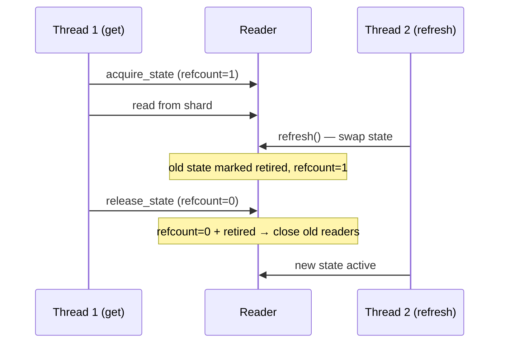

# Reader Side

## Overview

The reader side provides two classes for looking up keys across sharded SlateDB snapshots:

- **`ShardedReader`** — non-thread-safe, for single-threaded services
- **`ConcurrentShardedReader`** — thread-safe with lock or pool concurrency modes

Both readers follow the same lifecycle:

1. Load the `_CURRENT` pointer from S3
2. Dereference the manifest JSON it points to
3. Open one shard reader per `db_id`
4. Build a `SnapshotRouter` that maps keys to shard IDs (mirroring write-time sharding)

## ShardedReader vs ConcurrentShardedReader

| Feature | ShardedReader | ConcurrentShardedReader |
|---|---|---|
| Thread-safe | No | Yes |
| Locking overhead | None | Per-shard lock or pool checkout |
| Reference counting | No | Yes (safe refresh under load) |
| Best for | Single-threaded services, scripts | Multi-threaded web servers, gRPC services, CLI |

Use `ShardedReader` when your application is single-threaded or you manage concurrency externally. Use `ConcurrentShardedReader` when multiple threads may call `get()` / `multi_get()` concurrently.

## Basic Usage

```python
from shardyfusion import ShardedReader

reader = ShardedReader(
    s3_prefix="s3://bucket/prefix",
    local_root="/tmp/shardyfusion-reader",
)

value = reader.get(123)
values = reader.multi_get([1, 2, 3])

changed = reader.refresh()
reader.close()
```

Both readers support the context manager protocol:

```python
with ShardedReader(
    s3_prefix="s3://bucket/prefix",
    local_root="/tmp/shardyfusion-reader",
) as reader:
    value = reader.get(123)
```

## Thread-Safety Modes

`ConcurrentShardedReader` supports two concurrency modes via the `thread_safety` parameter:

### Lock Mode (default)

One reader instance per shard, protected by a `threading.Lock`. Concurrent threads serialize on the lock for each shard.

```python
from shardyfusion import ConcurrentShardedReader

reader = ConcurrentShardedReader(
    s3_prefix="s3://bucket/prefix",
    local_root="/tmp/shardyfusion-reader",
    thread_safety="lock",
    max_workers=4,  # for multi_get parallelism
)
```

Best for: moderate concurrency where read latency is low relative to lock contention.

### Pool Mode

Multiple reader instances per shard (`max_workers` copies), managed via a checkout pool. Concurrent threads get their own reader — no lock contention.

```python
reader = ConcurrentShardedReader(
    s3_prefix="s3://bucket/prefix",
    local_root="/tmp/shardyfusion-reader",
    thread_safety="pool",
    max_workers=8,              # 8 reader copies per shard
    pool_checkout_timeout=30.0, # seconds to wait for an available reader
)
```

Best for: high concurrency or when individual reads have non-trivial latency. Trades memory for throughput.

When all `max_workers` reader copies for a shard are checked out, the next thread blocks for up to `pool_checkout_timeout` seconds (default 30). If the timeout expires, `SlateDbApiError` is raised. Tune this value based on your expected read latency and concurrency level.

**Guidance on `max_workers`:** In lock mode, `max_workers` controls the `ThreadPoolExecutor` used by `multi_get` to read from multiple shards in parallel. In pool mode, it also controls how many reader copies are created per shard. Start with 4 and tune based on observed contention.

### Parameter constraints

Both reader classes validate their parameters at construction time:

- `max_workers` must be a positive integer (`>= 1`), or `None` (default)
- `pool_checkout_timeout` must be `> 0` (only used in pool mode)

Invalid values raise `ValueError` immediately.

## Refresh Semantics

Both readers support `refresh()` to pick up new snapshots without restarting:

```python
changed = reader.refresh()  # True if a newer snapshot was loaded
```

### How refresh works

1. Load the `_CURRENT` pointer from S3
2. Compare the `manifest_ref` to the current state
3. If unchanged, return `False` (no-op)
4. Load the new manifest and open new shard readers
5. Swap in the new state and close old readers

### Concurrent refresh safety

`ConcurrentShardedReader` uses reference counting to ensure safe refresh under concurrent reads:



In-flight reads always complete against the state they acquired. Old readers are only closed when the last reference is released (refcount drops to 0).

## Custom Reader Factory

By default, readers use `SlateDbReaderFactory` which creates `SlateDBReader` instances. You can provide a custom factory for testing or alternative storage:

```python
from pathlib import Path
from shardyfusion import ShardedReader

def my_factory(*, db_url: str, local_dir: Path, checkpoint_id: str | None):
    return MyCustomReader(db_url, local_dir, checkpoint_id)

reader = ShardedReader(
    s3_prefix="s3://bucket/prefix",
    local_root="/tmp/reader",
    reader_factory=my_factory,
)
```

The factory must conform to the `ShardReaderFactory` protocol — a callable accepting `db_url`, `local_dir`, and `checkpoint_id` keyword arguments, returning an object with `get(key: bytes) -> bytes | None` and `close()` methods.

## Custom Manifest Store

For manifests not stored in the default S3 JSON format, provide a `ManifestStore`:

```python
reader = ShardedReader(
    s3_prefix="s3://bucket/prefix",
    local_root="/tmp/reader",
    manifest_store=my_custom_store,  # implements ManifestStore protocol
)
```

## Snapshot Info

Both readers expose metadata about the current snapshot:

```python
info = reader.snapshot_info()
print(info.run_id, info.num_dbs, info.sharding, info.manifest_ref)
```

## Shard Metadata and Routing

Both readers provide methods to inspect shard metadata and routing without performing database reads:

```python
# Per-shard summary (returns list[ShardDetail])
for shard in reader.shard_details():
    print(shard.db_id, shard.row_count, shard.min_key, shard.max_key, shard.db_url)

# Which shard does a key route to?
db_id = reader.route_key(42)

# Full shard metadata for a key (returns RequiredShardMeta)
meta = reader.shard_for_key(42)
print(meta.db_id, meta.db_url, meta.row_count)

# Batch: mapping of keys to their shard metadata
mapping = reader.shards_for_keys([1, 42, 100])
```

## Direct Shard Access

For advanced use cases, you can borrow a raw read handle for a specific shard.
The returned `ShardReaderHandle` delegates to the underlying shard database
but does **not** close the database when you call `close()` — it only releases
the borrow (and decrements the refcount / borrow count).

`ShardReaderHandle` supports the context manager protocol for automatic cleanup:

```python
with reader.reader_for_key(42) as handle:
    raw = handle.get(key_bytes)           # single raw bytes lookup
    batch = handle.multi_get([k1, k2])    # batch lookup on one shard

# Batch variant: one handle per unique key
handles = reader.readers_for_keys([1, 42, 100])
try:
    for key, h in handles.items():
        print(key, h.get(encode(key)))
finally:
    for h in handles.values():
        h.close()
```

!!! warning
    Always close borrowed handles (or use `with`). For both reader variants,
    each handle holds a borrow/refcount increment — unclosed handles prevent
    cleanup of old state after `refresh()`.

## Metrics

Pass a `MetricsCollector` to observe reader lifecycle events:

```python
reader = ShardedReader(
    s3_prefix="s3://bucket/prefix",
    local_root="/tmp/reader",
    metrics_collector=my_collector,
)
```

Events emitted: `READER_INITIALIZED`, `READER_GET`, `READER_MULTI_GET`, `READER_REFRESHED`, `READER_CLOSED`.
