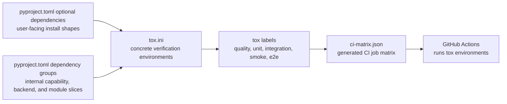
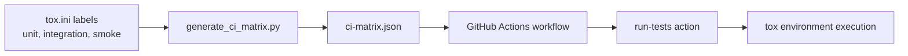
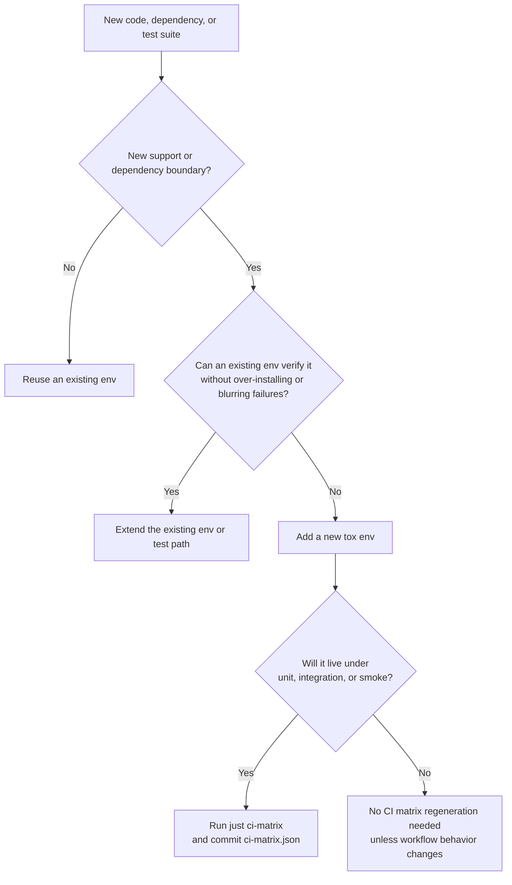

# Tox and Dependency Matrix

`shardyfusion` supports multiple writer runtimes, multiple storage backends, optional async and CLI features, optional metrics and vector features, and several Python versions. The tox matrix looks dense because it is encoding those support boundaries explicitly instead of hiding them inside one large "install everything" environment.

This page explains what each layer is for, why the project is structured this way, how it helps day-to-day work, and when a new tox environment should or should not be added.

## At a Glance



## What Problem This Structure Solves

The project has several independent axes:

- Python `3.11` to `3.13`
- writer runtimes: Python, Spark, Dask, Ray
- reader runtimes: sync and async
- storage backends: SlateDB, SQLite, SQLite range reads
- optional modules: CLI, CEL, Prometheus, OpenTelemetry, vector backends
- Spark major versions: `3.5` and `4`

Not every combination is valid or worth testing in the same way. Examples:

- async reader support needs `aiobotocore`, but most environments do not
- Spark environments need Java and version-specific `pyspark`
- SQLite range-read tests need `apsw`, while plain SQLite writer tests do not
- vector environments need either `usearch` or `sqlite-vec`
- the broad `all` install is useful for smoke coverage, but too expensive to use for every single test target

If the repo used only one environment, it would be slower, harder to debug, and less honest about which combinations are actually supported.

## The Layers

| Layer | Defined in | Primary audience | Purpose | Examples |
|---|---|---|---|---|
| Public optional extras | `pyproject.toml` under `[project.optional-dependencies]` | Users and contributors | Provide clear install targets for real usage | `read`, `writer-spark`, `cli`, `vector`, `all` |
| Internal dependency groups | `pyproject.toml` under `[dependency-groups]` | Maintainers and CI | Provide small reusable slices for tox environments | `cap-writer-spark`, `backend-slatedb`, `backend-sqlite-range`, `mod-cel` |
| Concrete tox environments | `tox.ini` | Maintainers and CI | Verify one exact contract at a time | `py312-read-slatedb-unit`, `py311-sparkwriter-spark35-slatedb-integration` |
| Tox labels | `tox.ini` | Local workflows and CI generation | Group related envs behind stable entry points | `quality`, `unit`, `integration`, `smoke`, `e2e` |
| CI matrix | `.github/ci-matrix.json` | GitHub Actions | Fan tox labels out into CI jobs | `py311 / core / unit`, `py313 / read / slatedb / integration` |

The important part is that these layers are related, but they are not interchangeable.

## Why Extras and Dependency Groups Are Separate

The public extras are intentionally user-shaped. They answer questions like:

- "How do I install the async reader?"
- "How do I install the Spark writer?"
- "How do I install the CLI?"

The dependency groups are intentionally maintainer-shaped. They answer questions like:

- "What is the smallest dependency slice this tox env really needs?"
- "How do I share backend dependencies across several envs without creating public extras for every internal combination?"
- "How do I keep CI environments focused and cheap?"

That separation keeps the public package interface clean while still letting tox compose smaller, more precise environments.

### Why not use only public extras in tox?

Because the test matrix is more fine-grained than the public install surface.

Examples from this repo:

- `backend-sqlite-range` is an internal slice used where `apsw` is required, but it is not itself a user-facing feature name
- `mod-cel` is a cross-cutting internal slice that several writer and vector envs need
- the broad `e2e` envs intentionally install several backend groups together because end-to-end coverage needs more than one narrow user extra

## Why Tox Looks Factorized

The tox config is designed so one base `[testenv]` can describe many environments through factors.

The main pieces are:

- `package = editable`: test the current working tree directly without rebuilding a wheel for every env
- `extras = ...`: stage-oriented dependencies such as `test`, `quality`, `docs`, or `all`
- `dependency_groups = ...`: capability, backend, and module slices that match env factors
- `deps = ...`: version axes that belong in tox, such as Spark `3.5` versus Spark `4`
- `commands = ...`: one test path or check per factorized env family
- `labels = ...`: stable entry points for local workflows and CI generation

This makes the matrix compact without making the behavior implicit.

### Tox factor syntax matters

In `tox.ini`, the left side of a conditional entry is a factor expression matched against the environment name.

Examples:

- `sparkwriter: cap-writer-spark` means any env containing the `sparkwriter` factor gets the Spark capability slice
- `pythonwriter-sqlite,sparkwriter-sqlite,daskwriter-sqlite,raywriter-sqlite: backend-sqlite` means envs that contain both the runtime factor and `sqlite` get the plain SQLite backend slice
- `backend-sqlite,sqliterange: backend-sqlite-range` means both `py311-backend-sqlite-unit` and `py311-read-sqliterange-unit` get `apsw`

So `backend-sqlite` on the left is not a dependency group name. It is a factor combination meaning "both `backend` and `sqlite` are present in the env name".

## A Concrete Example

Take `py311-sparkwriter-spark4-slatedb-unit`.

| Piece | Meaning | Effect |
|---|---|---|
| `py311` | Python version | CI and tox run this env on Python `3.11` |
| `sparkwriter` | capability/runtime family | adds `cap-writer-spark` and `mod-cel` |
| `spark4` | Spark version axis | adds `pyspark>=4,<5` |
| `slatedb` | backend slice | adds `backend-slatedb` |
| `unit` | verification stage | installs the `test` extra and runs the Spark unit test command |

The result is a small environment that checks one real support contract: Spark writer unit tests on Python `3.11`, using Spark `4`, against the default SlateDB backend, with the optional CEL dependency available.

That is much more actionable than a failure inside one giant all-extras test env.

## Why The Current Shape Was Chosen

This structure was chosen to optimize for four things at once:

### 1. Honest support boundaries

If a capability is only supported on certain Python versions or with certain runtimes, the matrix can encode that directly instead of pretending every feature supports every interpreter.

Examples already present in the repo:

- Python support is currently `3.11` to `3.13`
- Spark `3.5` coverage is intentionally narrower than Spark `4`
- the smoke envs use `py311-all-spark35-*` instead of trying to run an expensive "all" job everywhere

### 2. Faster and smaller installs

Most envs install only what they need. That lowers setup time and reduces noise from unrelated dependency problems.

### 3. Better failure isolation

When `py313-vector-usearch-unit` fails, the failure already tells you that the issue is in the Python `3.13` vector plus USearch slice. That is more useful than "the all env failed somewhere".

### 4. Scalable CI fan-out

Each tox env maps cleanly to a CI job, so GitHub Actions can run the matrix in parallel and still keep the source of truth in tox.

## Why There Are So Many Quality Envs Too

The quality label is split on purpose.

- `lint` and `format` check source style
- `type-all` checks the broad shared code path
- `type-read`, `type-readasync`, `type-pythonwriter`, `type-daskwriter`, `type-raywriter`, `type-sparkwriter`, and `type-sqlite` check optional code paths with the dependencies and `pyright` configs they actually need
- `package` validates the build output separately from the editable test envs
- `docs-check` validates the documentation site

This lets type checking stay precise without forcing one monolithic type-check environment to install every optional runtime.

## Special Env Families

| Label | What it is for | Why it exists separately |
|---|---|---|
| `quality` | lint, format, type checks, package, docs | these are not test-path-based and do not belong in the runtime matrix |
| `unit` | fast capability and backend slices | gives quick feedback with focused dependency sets |
| `integration` | cross-component tests against moto S3 and framework stacks | verifies publishing and read/write interactions without full e2e cost |
| `smoke` | broad `all` installs on a smaller scheduled matrix | catches dependency interactions without making every PR pay full cost |
| `e2e` | Garage-backed end-to-end tests | kept separate because they need the container setup |

## How It Helps The Project

- contributors can run only the env that matches the code they changed
- CI can parallelize work without duplicating dependency logic in YAML
- support policy stays visible in one place instead of being inferred from trial and error
- optional features stay optional; reader-only work does not need Spark, Ray, Dask, or vector dependencies
- package validation remains separate from editable-install test runs

## How CI Uses Tox

For `unit`, `integration`, and `smoke`, `tox.ini` is the source of truth and the CI matrix is generated from it.



The practical effect is:

1. tox decides which environments belong to `unit`, `integration`, and `smoke`
2. `just ci-matrix` regenerates `.github/ci-matrix.json` from those labels
3. CI loads the committed JSON and runs each tox env as its own job
4. the quality job checks that the committed matrix is still in sync

This avoids hand-maintaining the CI matrix in YAML.

### Naming conventions are part of the CI contract

`scripts/generate_ci_matrix.py` infers metadata from env names.

- envs in `unit`, `integration`, or `smoke` must begin with `py<version>-`
- Java is inferred from env names containing `sparkwriter` or `-all-`

If a new env does not follow those conventions, the generator must be updated too.

## When To Add A New Tox Environment

Add a new tox env when the repo gains a new verification contract.

Examples that usually require a new env:

- a new writer or reader path with its own dependencies or test directory
- a new backend or backend-specific capability that changes the install shape
- a new optional module with isolated tests, such as a new metrics or vector backend
- a new supported Python version or runtime axis, such as a new Spark major version
- a new type-check slice that needs its own `pyright` config and dependency set
- a new broad smoke target that is intentionally different from the focused unit or integration envs

Do not add a new tox env just because new tests were added.

If the new tests fit inside an existing capability, backend, interpreter, and stage boundary, the right change is usually to expand the existing command path or test coverage, not to add another env.

### Decision guide



### Quick rules of thumb

| Change | Add a new env? | Reason |
|---|---|---|
| New writer implementation with its own extra and tests | Yes | new capability boundary |
| New backend-specific test directory needing different dependencies | Yes | new backend support contract |
| New Spark major version support | Yes | new runtime axis |
| New supported Python version | Usually yes | support policy is part of the matrix |
| More tests under `tests/unit/read/` | No | existing env already represents that contract |
| More CLI tests with the same dependencies | No | same capability slice |
| Refactor of test files only | No | no new verification boundary |

## How To Add A New Tox Environment

### 1. Decide whether the change is public, internal, or both

Update `pyproject.toml` first.

- add a public extra under `[project.optional-dependencies]` when users should install this capability directly
- add a dependency group under `[dependency-groups]` when tox needs a reusable internal slice
- add both when the feature is both user-facing and part of the verification matrix

As a rule, public extras should stay understandable to users, while dependency groups should stay minimal and composable for maintainers.

### 2. Choose the smallest correct env shape

Follow the current naming pattern.

Typical env names look like:

- `py312-read-slatedb-unit`
- `py311-sparkwriter-spark35-slatedb-integration`
- `py313-vector-usearch-unit`

The name should answer: which Python, which capability, which runtime or backend axis, and which verification stage?

### 3. Wire it into `tox.ini`

Usually this means all of the following:

1. add the env to `env_list`
2. add it to the correct label
3. add or reuse a `dependency_groups` factor mapping
4. add or reuse a `deps` factor mapping if there is a runtime version axis
5. add or reuse a `commands` factor mapping
6. add a dedicated `[testenv:...]` section only if this env needs an override that the shared factorized config cannot express cleanly

Minimal example:

```toml
[dependency-groups]
cap-foo = [
  "foo>=1.0",
]
```

```ini
[tox]
env_list =
    py{311,312,313}-foo-slatedb-unit

labels =
    unit = ..., py{311,312,313}-foo-slatedb-unit

[testenv]
dependency_groups =
    foo: cap-foo
    slatedb: backend-slatedb
commands =
    foo-unit: python -m pytest -q tests/unit/foo {posargs}
```

### 4. Regenerate the CI matrix when needed

If the new env is part of `unit`, `integration`, or `smoke`, run:

```bash
just ci-matrix
```

Then commit the updated `.github/ci-matrix.json`.

If the new env is only part of `quality` or `e2e`, this regeneration is usually not needed because the generator only reads `unit`, `integration`, and `smoke`.

### 5. Run the env directly

Before relying on the label, run the specific env you added.

```bash
uv run tox -e <new-env-name>
```

Then run the broader label if appropriate.

```bash
uv run tox -m unit
uv run tox -m integration
uv run tox -m quality
```

### 6. Update docs if support policy changed

If the new env means the project now supports a new interpreter, runtime, backend, or install target, update the relevant docs too.

At minimum, keep these aligned:

- `pyproject.toml`
- `tox.ini`
- `.github/ci-matrix.json`
- docs that describe supported versions or developer workflows

## A Few Project-Specific Maintenance Notes

- `skip_missing_interpreters = false` is deliberate. Missing interpreters should fail loudly instead of silently reducing coverage.
- `package = editable` is deliberate for most envs. It keeps feedback fast while developing.
- the separate `package` env exists because editable-install test runs do not prove the built wheel or sdist is valid.
- `SPARK_LOCAL_IP=127.0.0.1` is set in tox to avoid local Spark hostname resolution issues.
- `RAY_ENABLE_UV_RUN_RUNTIME_ENV=0` is set for Ray envs because newer Ray versions try to create fresh environments when they detect `uv run`.

## Maintenance Rule

Keep the source of truth in this order:

1. `pyproject.toml` defines installable dependency shapes
2. `tox.ini` defines verification targets built from those shapes
3. `.github/ci-matrix.json` is generated from tox labels and must stay in sync

When those three drift apart, the matrix becomes harder to trust and harder to extend safely.
