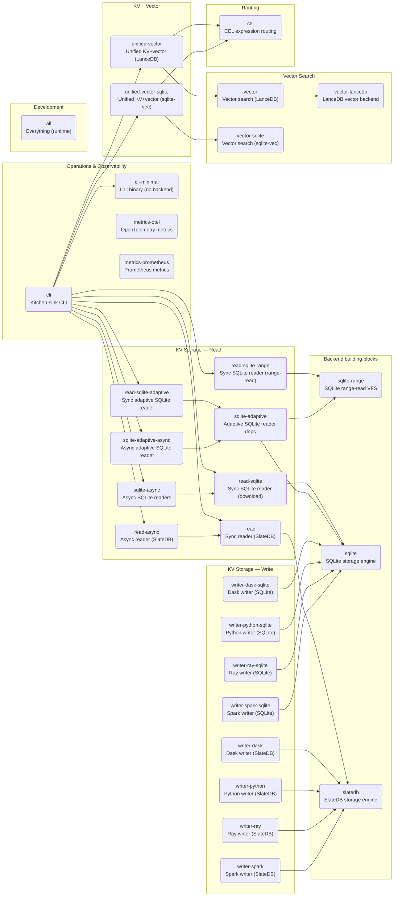

# Extras Matrix

This page maps every user-facing use case to the `pip install` / `uv sync --extra` target you need.  It is auto-generated by `scripts/generate_extras_matrix.py`; run that script after adding or renaming an extra.

## Common install commands

```bash
# Reader only (default SlateDB backend)
uv sync --extra read

# Async reader
uv sync --extra read-async

# Spark writer (requires Java 17)
uv sync --extra writer-spark

# Kitchen-sink CLI (all read backends + vector)
uv sync --extra cli

# Everything (all runtime extras)
uv sync --extra all
```

## Visual map

Arrows point from a base extra to the extras that build on top of it.



## Full table

### Backend building blocks

| Extra | Task | Notes |
|---|---|---|
| `sqlite-range` | SQLite range-read VFS | APSW + obstore for S3 range-reads without full download. |
| `sqlite` | SQLite storage engine | Base dep for SQLite-backed readers and writers. |
| `slatedb` | SlateDB storage engine | Base dep for SlateDB-backed readers and writers. |

### KV Storage — Read

| Extra | Task | Notes |
|---|---|---|
| `sqlite-adaptive` | Adaptive SQLite reader deps | Composes `sqlite` + `sqlite-range` so AdaptiveSqliteReaderFactory can pick per snapshot. |
| `sqlite-async` | Async SQLite readers | Async wrappers for both download and range-read SQLite. |
| `sqlite-adaptive-async` | Async adaptive SQLite reader | Async adaptive policy + aiobotocore. |
| `read-async` | Async reader (SlateDB) | Async S3 manifest store + SlateDB shards via aiobotocore. |
| `read-sqlite` | Sync SQLite reader (download) | Downloads full DB locally before opening. |
| `read-sqlite-range` | Sync SQLite reader (range-read) | Uses APSW VFS to read S3 pages on demand. |
| `read-sqlite-adaptive` | Sync adaptive SQLite reader | Alias for `sqlite-adaptive`. Auto-picks download vs range per snapshot. |
| `read` | Sync reader (SlateDB) | Default sync reader. Pulls in `slatedb`. |

### KV Storage — Write

| Extra | Task | Notes |
|---|---|---|
| `writer-dask-sqlite` | Dask writer (SQLite) | Dask DataFrame input writing SQLite shards. |
| `writer-dask` | Dask writer (SlateDB) | Dask DataFrame input. |
| `writer-python-sqlite` | Python writer (SQLite) | Pure Python writing SQLite shards. |
| `writer-python` | Python writer (SlateDB) | Pure Python, single-process or multiprocessing. |
| `writer-ray-sqlite` | Ray writer (SQLite) | Ray Dataset input writing SQLite shards. |
| `writer-ray` | Ray writer (SlateDB) | Ray Dataset input. |
| `writer-spark-sqlite` | Spark writer (SQLite) | Requires Java 17. PySpark ≥3.3. |
| `writer-spark` | Spark writer (SlateDB) | Requires Java 17. PySpark ≥3.3. |

### Vector Search

| Extra | Task | Notes |
|---|---|---|
| `vector-lancedb` | LanceDB vector backend | HNSW index via LanceDB. |
| `vector` | Vector search (LanceDB) | Alias for `vector-lancedb`. |
| `vector-sqlite` | Vector search (sqlite-vec) | sqlite-vec unified KV+vector in single DB. |

### KV + Vector

| Extra | Task | Notes |
|---|---|---|
| `unified-vector` | Unified KV+vector (LanceDB) | Composite SlateDB + LanceDB sidecar. Enables UnifiedShardedReader. |
| `unified-vector-sqlite` | Unified KV+vector (sqlite-vec) | Single-file sqlite-vec backend. Enables UnifiedShardedReader. |

### Operations & Observability

| Extra | Task | Notes |
|---|---|---|
| `cli-minimal` | CLI binary (no backend) | `shardy` command with click only. Combine with a reader extra. |
| `cli` | Kitchen-sink CLI | All reader backends + vector + CEL bundled. |
| `metrics-otel` | OpenTelemetry metrics | OtelCollector for writer/reader events. |
| `metrics-prometheus` | Prometheus metrics | PrometheusCollector for writer/reader events. |

### Routing

| Extra | Task | Notes |
|---|---|---|
| `cel` | CEL expression routing | Custom sharding rules via cel-expr-python. |

### Development

| Extra | Task | Notes |
|---|---|---|
| `docs` | Documentation dependencies | MkDocs + plugins. |
| `all` | Everything (runtime) | Convenience bundle of all runtime extras. Excludes dev/test/quality/docs. |
| `quality` | Lint & type-check dependencies | ruff, pyright. |
| `test` | Test dependencies | pytest, hypothesis, moto, etc. |

---

*Generated by `scripts/generate_extras_matrix.py`.  Do not edit this file by hand — it will be overwritten on the next run.*
