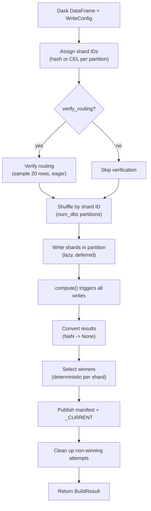

# Build a snapshot with the Dask writer

Use the **Dask writer** to build a sharded snapshot from a Dask `DataFrame` — Spark-free, Java-free.

## When to use

- Records live in a Dask `DataFrame` (Parquet/CSV scan, Dask-SQL output).
- You want distributed scale-out without a JVM.

## When NOT to use

- Single-host workload — use the [Python writer](python.md).
- You have an existing Spark pipeline — use the [Spark writer](spark.md).

## Install

```bash
# SlateDB backend (default)
uv add 'shardyfusion[writer-dask]'

# SQLite backend
uv add 'shardyfusion[writer-dask-sqlite]'
```

`dask[dataframe]>=2024.1` comes with the extra.

## Minimal example

### SlateDB backend (default)

```python
import dask.dataframe as dd
from shardyfusion import WriteConfig
from shardyfusion.writer.dask import write_sharded
from shardyfusion.serde import ValueSpec

ddf = dd.read_parquet("s3://lake/users/")

config = WriteConfig(
    num_dbs=16,
    s3_prefix="s3://my-bucket/snapshots/users",
)

result = write_sharded(
    ddf,
    config,
    key_col="id",
    value_spec=ValueSpec.binary_col("payload"),
)
print(result.manifest_ref.ref)
```

### SQLite backend

```python
from shardyfusion.sqlite_adapter import SqliteFactory

config = WriteConfig(
    num_dbs=16,
    s3_prefix="s3://my-bucket/snapshots/users-sqlite",
    adapter_factory=SqliteFactory(),
)
```

## Data flow



## Configuration

Dask-specific knobs on `write_sharded` (`shardyfusion/writer/dask/writer.py:151`):

| Param | Default | Purpose |
|---|---|---|
| `key_col` | required | DataFrame column used for routing. |
| `value_spec` | required | How to encode rows to bytes. |
| `sort_within_partitions` | `False` | Sort each partition by `key_col` before writing. |
| `verify_routing` | `True` | Re-verify writer-side routing matches reader-side router. |
| `max_writes_per_second` / `max_write_bytes_per_second` | `None` | Token-bucket rate limits. |

The writer repartitions internally via `ddf.shuffle(on=DB_ID_COL, npartitions=num_dbs)` so the per-shard task layout matches `num_dbs`.

## Backend-specific properties

### SlateDB

- Incremental writes through SlateDB adapter; `checkpoint()` flushes memtable.

### SQLite

- Complete `.db` file per shard; one PUT per shard on upload.
- Whole-file rewrite on retry.

## Non-functional properties

- Uses the **ambient Dask scheduler** — distributed, threads, processes, or single-machine.
- One Dask task per shard after the shuffle. Memory per task ~ `partition_size + per-shard buffers`.
- Routing pass and write pass are separate Dask graphs; the shuffle materializes between them.
- **Rate limiting**: per-shard scope. Aggregate rate = `max_writes_per_second x num_dbs`.

## Empty shards

Empty partitions are handled at two levels:

- The partition writer returns an empty result if the input is empty or if no results are collected after grouping.
- Winner selection downstream filters out shards with `row_count=0`.

## Guarantees

- Same as all writers: successful return => manifest + `_CURRENT` published.
- `verify_routing=True` catches routing drift.

## Weaknesses

- **No Spark-style executor preemption recovery.** A worker loss surfaces as a Dask task failure; rely on `config.shard_retry`.
- **Shuffle is not 1:1** — post-shuffle, one partition may still contain multiple shard IDs. The write phase groups within each partition.

## Failure modes & recovery

| Failure | Surface | Recovery |
|---|---|---|
| Routing mismatch | `ShardAssignmentError` | Bug in routing change. Don't silence by disabling `verify_routing`. |
| Worker death | Dask retries; if exhausted, `ShardCoverageError` | Configure Dask retries + `config.shard_retry`. |
| Manifest / `_CURRENT` publish | `PublishManifestError` / `PublishCurrentError` | Transient; rerun. |

## See also

- [KV Storage Overview](../overview.md) — sharding, manifests, two-phase publish, safety
- [Spark writer](spark.md) — when you have Spark
- [Ray writer](ray.md) — when you want Ray actors
- [Read -> Sync SlateDB](../read/sync/slatedb.md)
- [Read -> Sync SQLite](../read/sync/sqlite.md)
