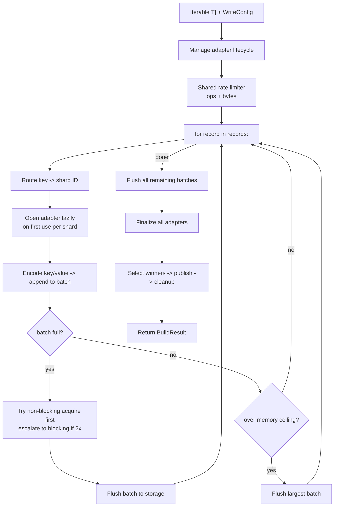
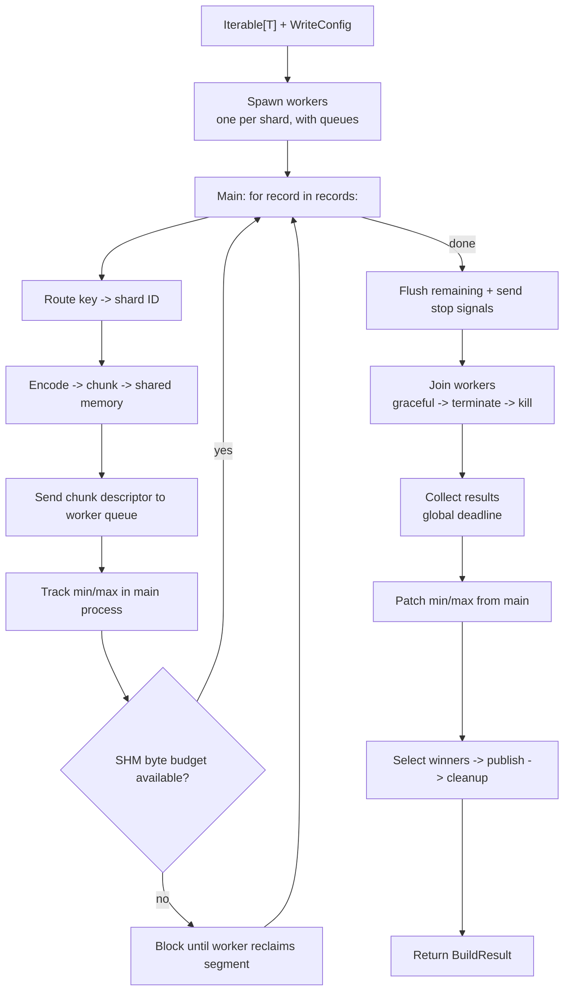

# Build a snapshot with the Python writer

Use the **Python writer** (no Spark, no Java, no cluster) to build a sharded snapshot from any Python iterable. Supports both **single-process** and **parallel** (`multiprocessing.spawn`) modes.

## When to use

- You have a single-process or multi-process Python job that produces records (database extract, in-memory dataset, file scan).
- Dataset fits comfortably in one machine's memory *or* you can stream it as an iterator.
- You want to ship a self-contained pipeline without a Spark cluster or Java runtime.

## When NOT to use

- Dataset is many TB and cannot stream from a single host — use a [distributed writer](index.md).
- You need vector search alongside KV — use the [KV+Vector](../../kv-vector/overview.md) use case.

## Install

```bash
# SlateDB backend (default)
uv add 'shardyfusion[writer-python]'

# SQLite backend
uv add 'shardyfusion[writer-python-sqlite]'
```

## Minimal example

### SlateDB backend (default)

```python
from shardyfusion import WriteConfig, ShardedReader
from shardyfusion.writer.python import write_sharded

records = [{"id": i, "payload": f"row-{i}".encode()} for i in range(10_000)]

config = WriteConfig(
    num_dbs=4,
    s3_prefix="s3://my-bucket/snapshots/users",
)

result = write_sharded(
    records,
    config,
    key_fn=lambda r: r["id"],
    value_fn=lambda r: r["payload"],
)

print(result.manifest_ref.ref)
print(result.run_id)
```

### SQLite backend

Swap `adapter_factory`:

```python
from shardyfusion.sqlite_adapter import SqliteFactory

config = WriteConfig(
    num_dbs=4,
    s3_prefix="s3://my-bucket/snapshots/users-sqlite",
    adapter_factory=SqliteFactory(),
)
```

Everything else is identical.

## Data flow

### Single-process mode



### Parallel mode



## Configuration

Writer signature (`shardyfusion/writer/python/writer.py:77`):

```python
write_sharded(
    records,
    config,
    *,
    key_fn,                                          # required
    value_fn,                                        # required
    columns_fn=None,                                 # for CEL routing context
    vector_fn=None,                                  # for unified KV+vector mode
    parallel=False,                                  # one subprocess per shard
    max_queue_size=100,
    max_parallel_shared_memory_bytes=256 * 1024 * 1024,
    max_parallel_shared_memory_bytes_per_worker=32 * 1024 * 1024,
    max_writes_per_second=None,
    max_write_bytes_per_second=None,
    max_total_batched_items=None,
    max_total_batched_bytes=None,
)
```

Key `WriteConfig` fields:

| Field | Default | Purpose |
|---|---|---|
| `num_dbs` | `None` | Number of shards. Required (>0) for HASH without `max_keys_per_shard`. |
| `s3_prefix` | `""` | `s3://bucket/prefix` — required, must include non-empty key prefix. |
| `key_encoding` | `KeyEncoding.U64BE` | How `key_fn` return value is serialized. |
| `batch_size` | `50_000` | Pairs per write batch into the adapter. |
| `adapter_factory` | `None` | `None` -> `SlateDbFactory()`. Swap to `SqliteFactory()` for SQLite. |
| `sharding` | `ShardingSpec()` | Default: HASH. Override for CEL or `max_keys_per_shard`. |
| `output.local_root` | `$TMPDIR/shardyfusion` | Where shards are staged before upload. |
| `shard_retry` | `None` | Required for shard retries in parallel mode (uses file-spool fallback). |

## Backend-specific properties

### SlateDB

- Streaming-safe: generators work; dataset does not need to fit in memory.
- Append-only LSM: each batch is written incrementally; `checkpoint()` flushes the memtable.

### SQLite

- Each shard is a complete `.db` file; uploaded as one object per shard.
- No incremental publishing: a retry uploads the entire shard again.
- Schema: `kv(key BLOB PRIMARY KEY, value BLOB)`.

## Non-functional properties

- **Single-process** (`parallel=False`): all shard adapters open in the same process. Memory ~ `num_dbs x per-shard-buffer`. Best for <= ~32 shards.
- **Parallel** (`parallel=True`): one `multiprocessing.spawn` subprocess per shard. Records streamed via shared memory in chunks. Caps: 256 MiB global, 32 MiB per worker.
- **Backpressure**: `max_total_batched_items` / `max_total_batched_bytes` (single-process only) flush the largest shard buffer when exceeded.

## Guarantees

- A successful return means the manifest **and** `_CURRENT` are published. Readers opened after this call observe the new snapshot.
- `BuildResult.manifest_ref` is the canonical reference; pin it for reproducible reads.
- Shard URLs in the manifest are the durable winners — losers are scheduled for cleanup.

## Weaknesses

- **No distributed scale-out.** A single host produces all shards.
- **Parallel mode + inferred CEL routing is rejected** at config validation.
- **No checkpoint/resume.** A failure mid-build aborts the run.

## Failure modes & recovery

| Failure | Surface | Recovery |
|---|---|---|
| Bad `WriteConfig` | `ConfigValidationError` | Fix config; nothing was written. |
| Shard write fails (transient) | `ShardWriteError`; retried if `shard_retry` set | Set `config.shard_retry`. |
| Some shards have zero successful attempts | `ShardCoverageError` | Investigate worker logs; rerun. |
| Manifest object PUT fails | `PublishManifestError` | Transient — rerun. |
| `_CURRENT` PUT fails after manifest published | `PublishCurrentError` | Manifest exists but invisible. Rerun publishes new pointer. |

## See also

- [KV Storage Overview](../overview.md) — sharding, manifests, two-phase publish, safety
- [`architecture/writer-core.md`](../../../architecture/writer-core.md) — what `_writer_core` does on every shard attempt
- [`architecture/sharding.md`](../../../architecture/sharding.md) — HASH vs CEL, key encodings
- [Read -> Sync SlateDB](../read/sync/slatedb.md) — `ShardedReader` with SlateDB
- [Read -> Sync SQLite](../read/sync/sqlite.md) — `ShardedReader` with SQLite
