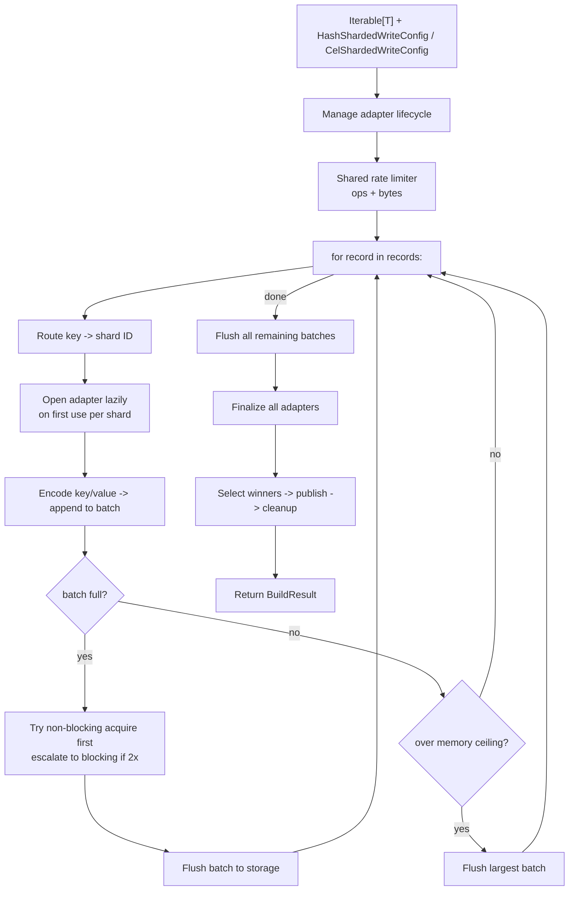
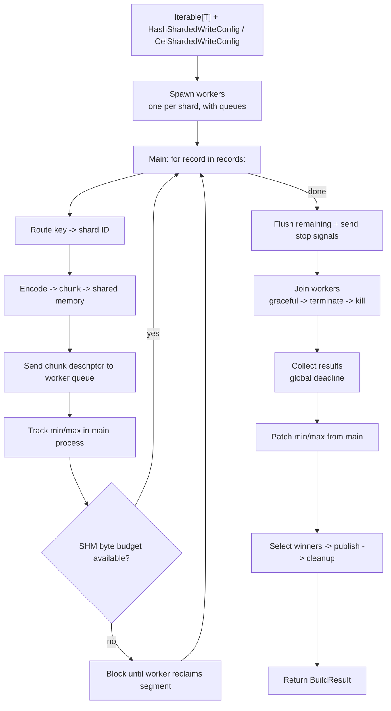

# Build a snapshot with the Python writer

Use the **Python writer** (no Spark, no Java, no cluster) to build a sharded snapshot from any Python iterable. Supports both **single-process** and **parallel** (`multiprocessing.spawn`) modes.

## When to use

- You have a single-process or multi-process Python job that produces records (database extract, in-memory dataset, file scan).
- Dataset fits comfortably in one machine's memory *or* you can stream it as an iterator.
- You want to ship a self-contained pipeline without a Spark cluster or Java runtime.

## When NOT to use

- Dataset is many TB and cannot stream from a single host — use a [distributed writer](index.md).
- You need vector search alongside KV — use the [KV+Vector](../../kv-vector/overview.md) use case.

## Install

```bash
# SlateDB backend (default)
uv add 'shardyfusion[writer-python-slatedb]'

# SQLite backend
uv add 'shardyfusion[writer-python-sqlite]'
```

## Minimal example

### HASH (default)

```python
from shardyfusion import HashShardedWriteConfig, PythonRecordInput, ShardedReader
from shardyfusion.writer.python import write_hash_sharded

records = [{"id": i, "payload": f"row-{i}".encode()} for i in range(10_000)]

config = HashShardedWriteConfig(
    num_dbs=4,
    s3_prefix="s3://my-bucket/snapshots/users",
)

result = write_hash_sharded(
    records,
    config,
    PythonRecordInput(
        key_fn=lambda r: r["id"],
        value_fn=lambda r: r["payload"],
    ),
)

print(result.manifest_ref.ref)
print(result.run_id)
```

### CEL routing

```python
from shardyfusion import CelShardedWriteConfig, PythonRecordInput
from shardyfusion.writer.python import write_cel_sharded

records = [
    {"id": i, "region": "us-east" if i % 2 == 0 else "eu-west", "payload": f"row-{i}".encode()}
    for i in range(10_000)
]

config = CelShardedWriteConfig(
    cel_expr='key % 4u',
    cel_columns={"key": "int"},
    s3_prefix="s3://my-bucket/snapshots/users-cel",
)

result = write_cel_sharded(
    records,
    config,
    PythonRecordInput(
        key_fn=lambda r: r["id"],
        value_fn=lambda r: r["payload"],
        columns_fn=lambda r: {"key": r["id"]},
    ),
)
```

### SQLite backend

Swap `adapter_factory` on either config:

```python
from shardyfusion.sqlite_adapter import SqliteFactory

config = HashShardedWriteConfig(
    num_dbs=4,
    s3_prefix="s3://my-bucket/snapshots/users-sqlite",
    adapter_factory=SqliteFactory(),
)
```

Everything else is identical.

## Data flow

### Single-process mode



### Parallel mode



## Configuration

Writer signatures (`shardyfusion/writer/python/writer.py`):

```python
write_hash_sharded(
    records,
    config: HashShardedWriteConfig,
    input: PythonRecordInput,
    options: PythonWriteOptions | None = None,
)

write_cel_sharded(
    records,
    config: CelShardedWriteConfig,
    input: PythonRecordInput,
    options: PythonWriteOptions | None = None,
)
```

Key `HashShardedWriteConfig` fields:

| Field | Default | Purpose |
|---|---|---|
| `num_dbs` | `None` | Number of shards. Required (>0) unless `max_keys_per_shard` is set. |
| `max_keys_per_shard` | `None` | Alternative to `num_dbs`; computes shard count at write time. |
| `storage.s3_prefix` | `""` | `s3://bucket/prefix` — required, must include non-empty key prefix. |
| `kv.key_encoding` | `KeyEncoding.U64BE` | How `key_fn` return value is serialized. |
| `kv.batch_size` | `50_000` | Pairs per write batch into the adapter. |
| `kv.adapter_factory` | `None` | `None` -> `SlateDbFactory()`. Swap to `SqliteFactory()` for SQLite. |
| `output.local_root` | `$TMPDIR/shardyfusion` | Where shards are staged before upload. |
| `retry.shard_retry` | `None` | Required for shard retries in parallel mode (uses file-spool fallback). |

Key `CelShardedWriteConfig` fields (in addition to the common fields above):

| Field | Default | Purpose |
|---|---|---|
| `cel_expr` | `""` | CEL expression that produces a shard ID or categorical token. Required. |
| `cel_columns` | `{}` | Mapping of CEL variable names to their types (e.g. `{"key": "int"}`). Required. |
| `routing_values` | `None` | Optional categorical values for token-based routing. |
| `infer_routing_values_from_data` | `False` | Discover routing values from input at write time (single-process only). |

`BaseShardedWriteConfig` is the common base class for `HashShardedWriteConfig` and `CelShardedWriteConfig`. You should not instantiate it directly. `PythonWriteOptions` carries `parallel`, queue, shared-memory, and buffering settings. KV rate limits live on `config.rate_limits`.

## Backend-specific properties

### SlateDB

- Streaming-safe: generators work; dataset does not need to fit in memory.
- Append-only LSM: each batch is written incrementally; `seal()` flushes the memtable and persists the shard.

### SlateDB (local)

- Writes to a local ``file://`` object store; bulk uploads all shard files to S3 on ``close()``.
- Per-batch network I/O is eliminated — write throughput is decoupled from S3 latency.
- The reader side is unchanged: use the same ``SlateDbReaderFactory``.

Swap ``adapter_factory`` to use the local-first adapter:

```python
from shardyfusion import LocalSlateDbFactory

config = HashShardedWriteConfig(
    num_dbs=4,
    s3_prefix="s3://my-bucket/snapshots/users-local-slate",
    adapter_factory=LocalSlateDbFactory(),
)
```

### SQLite

- Each shard is a complete `.db` file; uploaded as one object per shard.
- No incremental publishing: a retry uploads the entire shard again.
- Schema: `kv(key BLOB PRIMARY KEY, value BLOB)`.

## Non-functional properties

- **Single-process** (`parallel=False`): all shard adapters open in the same process. Memory ~ `num_dbs x per-shard-buffer`. Best for <= ~32 shards.
- **Parallel** (`parallel=True`): one `multiprocessing.spawn` subprocess per shard. Records streamed via shared memory in chunks. Caps: 256 MiB global, 32 MiB per worker.
- **Backpressure**: `max_total_batched_items` / `max_total_batched_bytes` (single-process only) flush the largest shard buffer when exceeded.

## Guarantees

- A successful return means the manifest **and** `_CURRENT` are published. Readers opened after this call observe the new snapshot.
- `BuildResult.manifest_ref` is the canonical reference; pin it for reproducible reads.
- Shard URLs in the manifest are the durable winners — losers are scheduled for cleanup.

## Weaknesses

- **No distributed scale-out.** A single host produces all shards.
- **Parallel mode + inferred CEL routing is rejected** at config validation.
- **No checkpoint/resume.** A failure mid-build aborts the run.

## Failure modes & recovery

| Failure | Surface | Recovery |
|---|---|---|
| Bad `HashShardedWriteConfig` / `CelShardedWriteConfig` | `ConfigValidationError` | Fix config; nothing was written. |
| Shard write fails (transient) | `ShardWriteError`; retried if `shard_retry` set | Set `config.shard_retry`. |
| Some shards have zero successful attempts | `ShardCoverageError` | Investigate worker logs; rerun. |
| Manifest object PUT fails | `PublishManifestError` | Transient — rerun. |
| `_CURRENT` PUT fails after manifest published | `PublishCurrentError` | Manifest exists but invisible. Rerun publishes new pointer. |

## See also

- [KV Storage Overview](../overview.md) — sharding, manifests, two-phase publish, safety
- [`architecture/writer-core.md`](../../../architecture/writer-core.md) — what `_writer_core` does on every shard attempt
- [`architecture/sharding.md`](../../../architecture/sharding.md) — HASH vs CEL, key encodings
- [Read -> Sync SlateDB](../read/sync/slatedb.md) — `ShardedReader` with SlateDB
- [Read -> Sync SQLite](../read/sync/sqlite.md) — `ShardedReader` with SQLite
