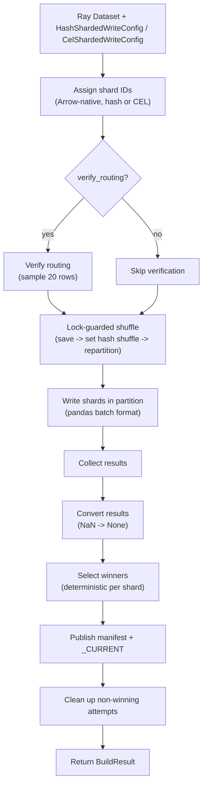

# Build a snapshot with the Ray writer

Use the **Ray writer** to build a sharded snapshot from a Ray `Dataset` — Spark-free, Java-free.

## When to use

- Records live in a Ray Dataset (Ray Data pipeline, ML preprocessing).
- You want Ray's actor-based scheduling.

## When NOT to use

- No Ray cluster / no Ray pipeline — use the [Python writer](python.md).

## Install

```bash
# SlateDB backend (default)
uv add 'shardyfusion[writer-ray-slatedb]'

# SQLite backend
uv add 'shardyfusion[writer-ray-sqlite]'
```

`ray[data]>=2.20` comes with the extra.

## Minimal example

### HASH (default)

```python
import ray
from shardyfusion import ColumnWriteInput, HashShardedWriteConfig
from shardyfusion.writer.ray import write_hash_sharded
from shardyfusion.serde import ValueSpec

ray.init()
ds = ray.data.read_parquet("s3://lake/users/")

config = HashShardedWriteConfig(
    num_dbs=16,
    s3_prefix="s3://my-bucket/snapshots/users",
)

result = write_hash_sharded(
    ds,
    config,
    ColumnWriteInput(
        key_col="id",
        value_spec=ValueSpec.binary_col("payload"),
    ),
)
print(result.manifest_ref.ref)
```

### CEL routing

```python
from shardyfusion import CelShardedWriteConfig, ColumnWriteInput
from shardyfusion.writer.ray import write_cel_sharded
from shardyfusion.serde import ValueSpec

config = CelShardedWriteConfig(
    cel_expr='key % 16u',
    cel_columns={"key": "int"},
    s3_prefix="s3://my-bucket/snapshots/users-cel",
)

result = write_cel_sharded(
    ds,
    config,
    ColumnWriteInput(
        key_col="id",
        value_spec=ValueSpec.binary_col("payload"),
    ),
)
```

### SQLite backend

Swap `adapter_factory` on either config:

```python
from shardyfusion.sqlite_adapter import SqliteFactory

config = HashShardedWriteConfig(
    num_dbs=16,
    s3_prefix="s3://my-bucket/snapshots/users-sqlite",
    adapter_factory=SqliteFactory(),
)
```

## Data flow



## Configuration

Ray writer signature:

```python
write_hash_sharded(ds, config, input: ColumnWriteInput, options: RayWriteOptions | None = None)
write_cel_sharded(ds, config, input: ColumnWriteInput, options: RayWriteOptions | None = None)
```

`ColumnWriteInput` fields:

| Param | Default | Purpose |
|---|---|---|
| `key_col` | required | Column used for routing. |
| `value_spec` | required | Row -> bytes encoder. |

`RayWriteOptions` fields:

| Field | Default | Purpose |
|---|---|---|
| `sort_within_partitions` | `False` | Sort each partition by `key_col`. |
| `verify_routing` | `True` | Re-verify writer/reader routing agreement. |

Internally the writer:

- Forces `DataContext.shuffle_strategy = HASH_SHUFFLE` for the duration of the build (process-wide; guarded by `_SHUFFLE_STRATEGY_LOCK`).
- Repartitions via `ds.repartition(num_dbs, shuffle=True, keys=[DB_ID_COL])`.
- Writes per-partition via `map_batches(..., batch_format="pandas")`.

The writer also adds a temporary `_shard_id` column for shard routing. It is dropped before encoding and never stored. If this name collides with a column in your data, the writer raises `ConfigValidationError`; override it with `config.shard_id_col`.

## Backend-specific properties

### SlateDB

- Incremental writes; `checkpoint()` flushes memtable.

### SQLite

- Complete `.db` file per shard; one PUT per shard.
- Whole-file rewrite on retry.

## Non-functional properties

- Atomic two-phase publish (same as all writers).
- One Ray task per shard after repartition.
- The shuffle-strategy swap is **process-global**: don't run two unrelated Ray Data pipelines in the same process during the build.
- **Rate limiting**: per-shard scope. Aggregate rate = `config.rate_limits.max_writes_per_second x num_dbs`.

## Guarantees

- Successful return => manifest + `_CURRENT` published.
- `verify_routing=True` catches routing drift.

## Weaknesses

- **Process-global Ray Data context mutation** during the build.
- **No exposed scheduler / parallelism knob** beyond `num_dbs`. Controlled by Ray cluster sizing.

## Failure modes & recovery

| Failure | Surface | Recovery |
|---|---|---|
| `shard_id_col` collides with a data column | `ConfigValidationError` | Rename your column or set `config.shard_id_col`. |
| Routing mismatch | `ShardAssignmentError` | Bug in routing change. Don't disable `verify_routing`. |
| Task failure | Ray retries per its own policy; then `ShardCoverageError` | Configure Ray retries + `config.shard_retry`. |
| Manifest / `_CURRENT` publish | `PublishManifestError` / `PublishCurrentError` | Transient; rerun. |

## See also

- [KV Storage Overview](../overview.md) — sharding, manifests, two-phase publish, safety
- [Spark writer](spark.md)
- [Dask writer](dask.md)
- [Read -> Sync SlateDB](../read/sync/slatedb.md)
- [Read -> Sync SQLite](../read/sync/sqlite.md)
