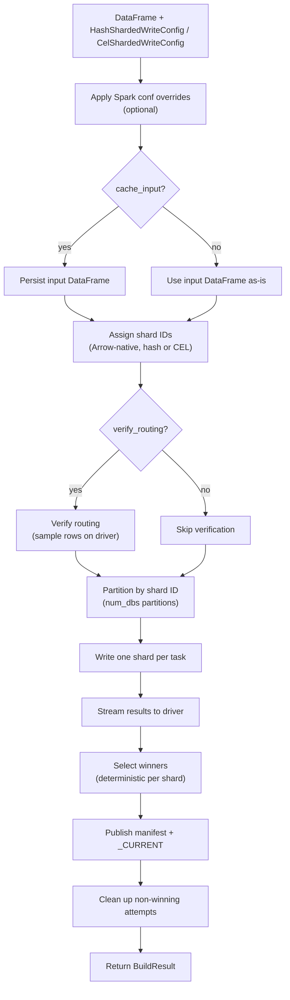

# Build a snapshot with the Spark writer

Use the **Spark writer** to build a sharded snapshot from a PySpark `DataFrame`. Requires Java 17+ and PySpark.

## When to use

- Records already live in a Spark `DataFrame` (lakehouse query, batch ETL output).
- Dataset is too large to stream through a single host.
- You have a Spark cluster (or local Spark) with Java 17+.

## When NOT to use

- No existing Spark pipeline — the [Python writer](python.md) is much simpler.
- No Java runtime available — use [Dask](dask.md) or [Ray](ray.md).

## Install

```bash
# SlateDB backend (default)
uv add 'shardyfusion[writer-spark-slatedb]'

# SQLite backend
uv add 'shardyfusion[writer-spark-sqlite]'
```

`pyspark>=3.3` comes with the extra. The CI matrix exercises Spark 3.5 and Spark 4.

## Minimal example

### HASH (default)

```python
from pyspark.sql import SparkSession
from shardyfusion import ColumnWriteInput, HashShardedWriteConfig
from shardyfusion.writer.spark import write_hash_sharded
from shardyfusion.serde import ValueSpec

spark = SparkSession.builder.appName("sf-build").getOrCreate()
df = spark.read.parquet("s3://lake/users/")

config = HashShardedWriteConfig(
    num_dbs=16,
    s3_prefix="s3://my-bucket/snapshots/users",
)

result = write_hash_sharded(
    df,
    config,
    ColumnWriteInput(
        key_col="id",
        value_spec=ValueSpec.binary_col("payload"),
    ),
)
print(result.manifest_ref.ref)
```

### CEL routing

```python
from shardyfusion import CelShardedWriteConfig, ColumnWriteInput
from shardyfusion.writer.spark import write_cel_sharded
from shardyfusion.serde import ValueSpec

config = CelShardedWriteConfig(
    cel_expr='key % 16u',
    cel_columns={"key": "int"},
    s3_prefix="s3://my-bucket/snapshots/users-cel",
)

result = write_cel_sharded(
    df,
    config,
    ColumnWriteInput(
        key_col="id",
        value_spec=ValueSpec.binary_col("payload"),
    ),
)
```

### SQLite backend

Swap `adapter_factory` on either config:

```python
from shardyfusion.sqlite_adapter import SqliteFactory

config = HashShardedWriteConfig(
    num_dbs=16,
    s3_prefix="s3://my-bucket/snapshots/users-sqlite",
    adapter_factory=SqliteFactory(),
)
```

## Data flow



## Configuration

Spark writer signature:

```python
write_hash_sharded(df, config, input: ColumnWriteInput, options: SparkWriteOptions | None = None)
write_cel_sharded(df, config, input: ColumnWriteInput, options: SparkWriteOptions | None = None)
```

`ColumnWriteInput` fields:

| Param | Default | Purpose |
|---|---|---|
| `key_col` | required | DataFrame column used for routing. |
| `value_spec` | required | How to encode rows to bytes — `binary_col`, `json_cols`, or callable. |

`SparkWriteOptions` fields:

| Field | Default | Purpose |
|---|---|---|
| `sort_within_partitions` | `False` | Sort each partition by `key_col` before writing. |
| `spark_conf_overrides` | `None` | `dict[str, str]` applied for the duration of the build. |
| `cache_input` | `False` | `df.persist(...)` the input. |
| `storage_level` | `None` | StorageLevel for `cache_input`. |
| `verify_routing` | `True` | Re-verify writer-side routing matches reader-side router. |

KV rate limits live on `config.rate_limits`. `HashShardedWriteConfig` and `CelShardedWriteConfig` fields are the same as for the Python writer; SlateDB is the default `kv.adapter_factory`.

The writer also adds a temporary `_shard_id` column for shard routing. It is dropped before encoding and never stored. If this name collides with a column in your data, the writer raises `ConfigValidationError`; override it with `config.shard_id_col`.

## Backend-specific properties

### SlateDB

- Incremental writes through SlateDB adapter; `seal()` flushes the memtable and persists the shard.
- `sort_within_partitions=True` helps SlateDB compaction by writing keys in sorted order.

### SlateDB (local)

- Writes to a local ``file://`` object store per executor; bulk uploads to S3 on ``close()``.
- Same reader (``SlateDbReaderFactory``); swap ``adapter_factory=LocalSlateDbFactory()``.

### SQLite

- Complete `.db` file per shard; one PUT per shard on upload.
- Whole-file rewrite on retry (unlike SlateDB incremental writes).

## Non-functional properties

- **Driver work**: routing planning, manifest assembly, S3 publish — all on the driver.
- **Executor work**: each task opens its adapter, writes batches of `config.batch_size`, calls `seal()`. The shard's `checkpoint_id` is stamped by the writer via `shardyfusion._checkpoint_id.generate_checkpoint_id()`.
- **No Python UDFs**: routing uses Arrow `mapInArrow` to avoid UDF overhead.
- **Rate limiting**: per-partition scope. Aggregate rate = `config.rate_limits.max_writes_per_second x num_dbs`.

## Speculative execution safety

Spark may launch duplicate tasks for slow partitions. This is safe because:

- S3 paths are attempt-isolated: `shards/run_id=.../db=XXXXX/attempt=00/` vs `attempt=01/`.
- Winner selection is deterministic: lowest attempt, then lowest `task_attempt_id`, then URL tiebreaker.
- Non-winning attempt paths are cleaned up after publishing.

## Guarantees

- Same as all writers: successful return => manifest + `_CURRENT` published.
- `verify_routing=True` (default) re-checks the writer-reader sharding contract before publishing.

## Weaknesses

- **Java 17+ required.**
- **Driver bottleneck for very wide manifests.** With thousands of shards, manifest assembly becomes serial driver work.

## Failure modes & recovery

| Failure | Surface | Recovery |
|---|---|---|
| Bad config | `ConfigValidationError` | Fix config; nothing was written. |
| `shard_id_col` collides with a data column | `ConfigValidationError` | Rename your column or set `config.shard_id_col`. |
| Routing mismatch | `ShardAssignmentError` (when `verify_routing=True`) | Bug in routing change; do not silence by disabling verification. |
| Spark task fails | Task retried by Spark; if `config.shard_retry` set, additional shard-level retry | Tune Spark retries + `config.shard_retry`. |
| All attempts of a shard fail | `ShardCoverageError` | Investigate executor logs. |
| Manifest publish fails | `PublishManifestError` | Transient — rerun. |
| `_CURRENT` publish fails | `PublishCurrentError` | Manifest exists; rerun publishes a new pointer. |

## See also

- [KV Storage Overview](../overview.md) — sharding, manifests, two-phase publish, safety
- [`architecture/writer-core.md`](../../../architecture/writer-core.md)
- [`architecture/sharding.md`](../../../architecture/sharding.md)
- [Python writer](python.md) — when you don't need Spark
- [Read -> Sync SlateDB](../read/sync/slatedb.md)
- [Read -> Sync SQLite](../read/sync/sqlite.md)
