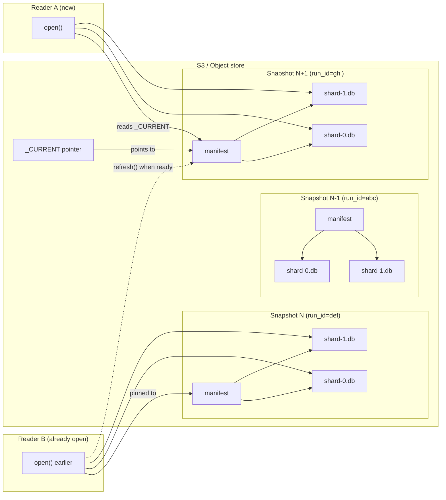
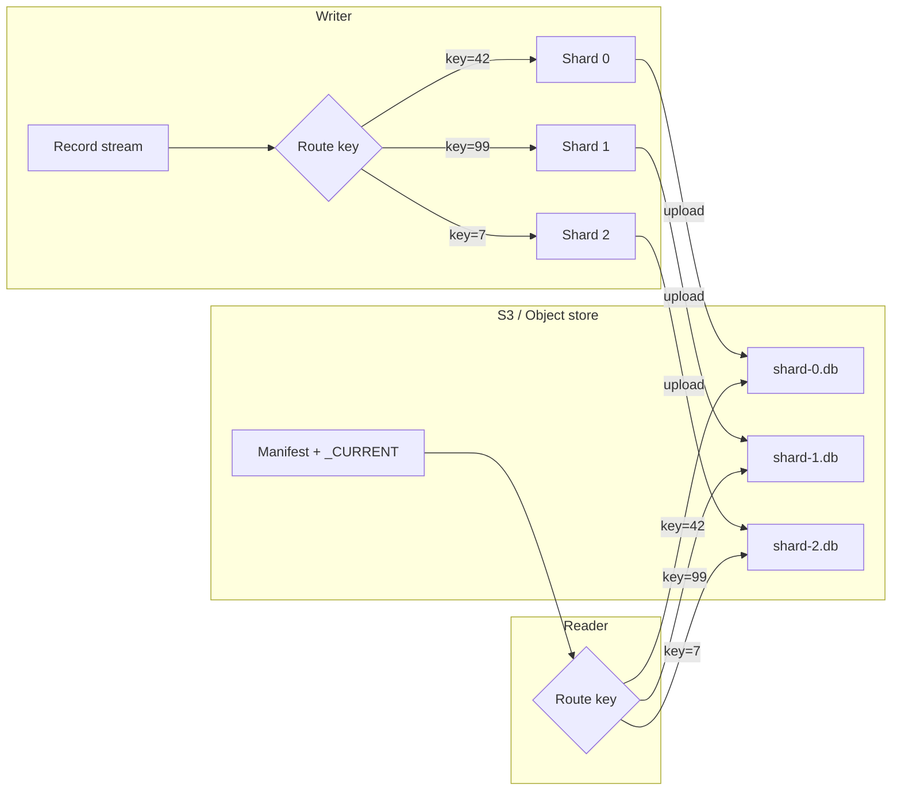
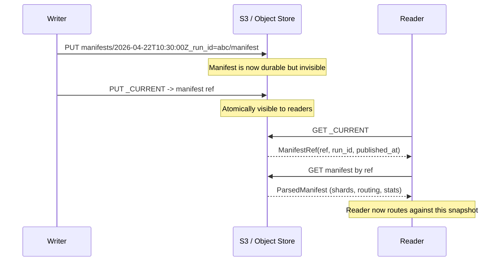
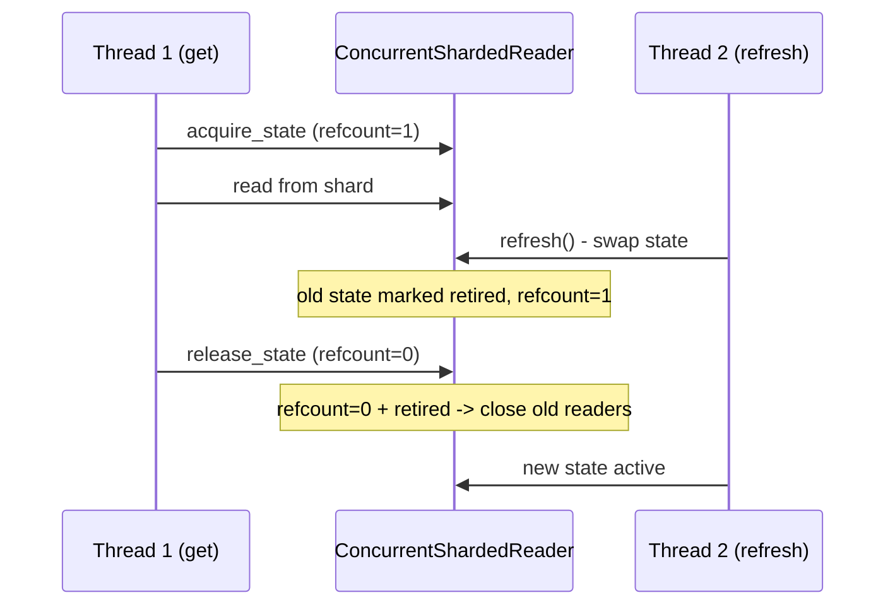
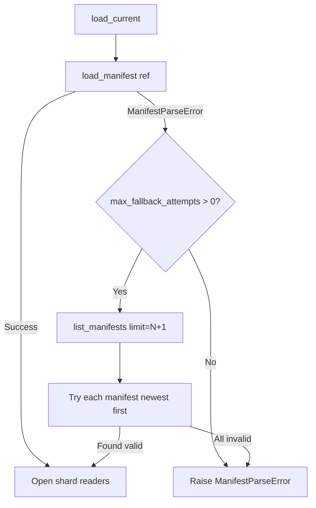

# Sharded KV Storage

shardyfusion builds **immutable sharded snapshots**: each snapshot is a collection of independent database files (shards), plus a manifest that describes them, plus a `_CURRENT` pointer that readers follow. Once a shard is written, it never changes. Readers see a snapshot atomically — there are no partial views.

This page explains how sharding, manifests, publishing, and reading work for **all** KV use cases, regardless of writer flavor (Python, Spark, Dask, Ray) or backend (SlateDB, SQLite). Backend-specific details live in the child pages.

---

## Snapshots and reader migration

The core idea is that you **publish new snapshots regularly** without breaking any existing readers. Each snapshot is an immutable, self-contained set of shards. Old snapshots remain on S3 until you explicitly clean them up. Readers decide when to move to a newer snapshot.



- **Writer** publishes a new snapshot by writing a new manifest object, then updating `_CURRENT` to point at it.
- **Reader A** opened after the new publish: it reads `_CURRENT` and sees the latest snapshot immediately.
- **Reader B** was already running before the publish: it stays pinned to the older manifest it loaded at open time. It only sees the new snapshot after calling `refresh()` (or restarting).
- **Old snapshots** are not deleted when a new one is published. They stay on S3 as the rollback history until `cleanup` is run.

---

## What is a shard?

A **shard** is one physical database file (`db_id` ∈ `[0, num_dbs)`). The writer distributes rows across shards; the reader routes each key to exactly one shard. The mapping from key → shard is deterministic and identical on both sides.



---

## Sharding strategies

Two strategies control how keys map to shards. Both are configured at write time and embedded in the manifest so readers reconstruct the exact same router.

### HASH (default)

```
db_id = xxh3_64(canonical_bytes(key), seed=0) % num_dbs
```

- `canonical_bytes` converts the key to bytes based on `KeyEncoding` (`U64BE`, `U32BE`, `UTF8`, `RAW`).
- `xxh3_64` with `seed=0` is portable and fast. Changing `num_dbs` between runs reshuffles every key.
- Best for uniform distribution when keys are ints, strings, or bytes.

### CEL (Common Expression Language)

A user-provided expression evaluated per row at write time and per key at read time.

| Mode | How it resolves | When to use |
|---|---|---|
| **Direct** | `result % num_dbs` | Custom computed routing (hash-of-something). |
| **Categorical** | Token matched against `routing_values` → precomputed `db_id` | Tenant pinning, geo affinity, hot-key isolation. |
| **Inferred categorical** | Writer scans data to discover sorted distinct tokens | Same as categorical, but token set is unknown ahead of time. |

CEL requires manifest format **v3** because categorical mode stores the `routing_values → db_id` map in the manifest. Readers look up "which shard holds tenant `eu-west`" by exact match, without re-evaluating CEL.

!!! note "Parallel Python writer limitation"
    Inferred categorical CEL is rejected in parallel Python mode because workers must be spawned before iteration. Use single-process mode or declare `routing_values` explicitly.

For full details see [`architecture/sharding.md`](../../architecture/sharding.md) and [`architecture/routing.md`](../../architecture/routing.md).

---

## Manifest: the contract between writer and reader

The manifest is a **single SQLite database file** (serialized via `con.serialize()`) stored as one S3 object. It is immutable once written.

### What the manifest contains

| Section | Contents |
|---|---|
| `WriterInfo` | Writer flavor, version, build timestamp |
| `RequiredBuildMeta` | `run_id`, `num_dbs`, `s3_prefix`, sharding strategy, key encoding, format version |
| `RequiredShardMeta` (per shard) | `db_id`, `db_url`, `row_count`, `byte_size`, `min_key`, `max_key`, `checkpoint_id` |
| `BuildDurations` | Per-phase timing |
| `BuildStats` | Aggregate row/byte counts |
| `custom` | Optional user-defined fields (also used for vector config) |

### Format versions

| Version | Capability |
|---|---|
| 1 | Legacy. Readers accept it; writers do not produce it. |
| 2 | HASH or CEL **without** `routing_values`. Default. |
| 3 | Required when `routing_values` is set (categorical CEL). |

Readers reject unsupported versions with `ManifestParseError`.

### How the manifest is stored on S3

```
s3://bucket/prefix/
  _CURRENT                              ← tiny JSON pointer (mutable)
  manifests/
    2026-04-22T10:30:00.000000Z_run_id=abc123/
      manifest                          ← SQLite manifest (immutable)
    2026-04-22T11:00:00.000000Z_run_id=def456/
      manifest                          ← older manifest
  shards/
    run_id=abc123/
      db=00000/attempt=00/...           ← shard 0 attempt 0
      db=00001/attempt=00/...           ← shard 1 attempt 0
  runs/
    2026-04-22T10:30:00.000000Z_run_id=abc123_.../
      run.yaml                          ← operational metadata
```

The manifest path format is:
```
manifests/<timestamp>_run_id=<run_id>/manifest
```
where timestamp uses `MANIFEST_TIMESTAMP_FMT = "%Y-%m-%dT%H:%M:%S.%fZ"`.

For full implementation details see [`architecture/manifest-and-current.md`](../../architecture/manifest-and-current.md).

---

## Two-phase publish

A writer publishes a snapshot in strict order:

1. **Write manifest object** — immutable, timestamp-prefixed path.
2. **Overwrite `_CURRENT` pointer** — tiny JSON pointing at the manifest from step 1.



### Observable states

| State | Manifest | `_CURRENT` | What readers see |
|---|---|---|---|
| Before publish | old | old | Old snapshot |
| Mid-publish | new written | old | Old snapshot (new manifest invisible) |
| After publish | new | new | New snapshot atomically |

There is **no torn state** where `_CURRENT` points at a partially-written manifest, because the manifest is a single S3 object.

For the design rationale see [ADR-001](../../history/design-decisions/adr-001-two-phase-publish.md).

---

## How readers switch to a new snapshot

Readers load `_CURRENT` once at open time, then pin all lookups to that manifest. To observe a newer publish, call `refresh()`:

```python
changed = reader.refresh()  # True if a newer manifest was loaded
```

### Refresh guarantees

- `refresh()` is the **only** way to see new publishes — `_CURRENT` is not polled automatically.
- If `_CURRENT` is unchanged, `refresh()` returns `False` immediately (no I/O wasted).
- If the new manifest is malformed, `refresh()` returns `False` and keeps the current good state — no error is raised.
- `ConcurrentShardedReader` uses reference counting so in-flight reads complete against the state they started with.



---

## Failure modes and safety

### What if manifest publishing fails?

| Failure | Result | Recovery |
|---|---|---|
| Manifest PUT fails | Nothing published. `PublishManifestError` raised. | Rerun — transient. |
| `_CURRENT` PUT fails after manifest succeeds | Manifest exists but is invisible. `PublishCurrentError` raised. | Rerun publishes a new manifest + pointer; orphaned manifest cleaned up later. |

The two-phase design guarantees that readers never see a dangling pointer.

### What if a manifest is corrupted?

On cold start, if the current manifest is malformed:



Default `max_fallback_attempts=3` means the reader walks backward through manifest history until it finds a valid one. This protects against partial writes, schema migration mistakes, or S3 consistency edge cases.

### What if the writer crashes mid-build?

- Orphaned shard attempt directories remain in `shards/run_id=.../db=.../attempt=.../`.
- They are invisible to readers (only winning attempts appear in the manifest).
- A future successful run's `cleanup_stale_attempts` removes them.
- The run record (under `runs/`) marks the failed run as `failed` for operational inspection.

### What if `_CURRENT` is deleted?

Readers opened after deletion raise `ReaderStateError("CURRENT pointer not found")`. Recovery: republish (rerun the writer) or restore `_CURRENT` from manifest history via CLI rollback.

---

## Properties of the KV workflow

| Property | Guarantee |
|---|---|
| **Immutability** | Shard database files are never modified after upload. |
| **Atomic visibility** | Readers see either the old snapshot or the new snapshot — never a mix. |
| **Deterministic routing** | Same key always routes to the same shard for a given `num_dbs` and sharding strategy. |
| **Backward rollback** | Point `_CURRENT` at any previous manifest to revert atomically. |
| **No partial reads** | A reader pinned to a manifest sees all shards from that manifest — no missing shards. |
| **Self-describing** | The manifest contains everything a reader needs: URLs, routing, key encoding, stats. |

---

## Choosing a writer and backend

See the child pages for specifics:

- **[Build → Python](build/python.md)** — single-process or parallel, no Java, no cluster
- **[Build → Spark](build/spark.md)** — PySpark DataFrame, speculative execution, Java required
- **[Build → Dask](build/dask.md)** — Dask DataFrame, lazy execution, no Java
- **[Build → Ray](build/ray.md)** — Ray Dataset, actor-based scheduling, no Java
- **[Read → Sync SlateDB](read/sync/slatedb.md)** — default low-friction backend
- **[Read → Sync SQLite](read/sync/sqlite.md)** — SQL queries, download-and-cache or range-read
- **[Read → Async SlateDB](read/async/slatedb.md)** — asyncio, aiobotocore
- **[Read → Async SQLite](read/async/sqlite.md)** — asyncio SQLite wrappers
