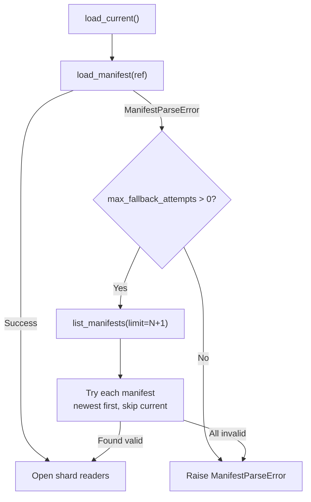

# Read a SlateDB snapshot synchronously

Use **`ShardedReader`** for point-key and multi-key lookups against a published SlateDB snapshot from synchronous code. This is the default, lowest-friction read path.

## When to use

- Synchronous service or batch process.
- You want the default SlateDB backend.

## When NOT to use

- You're in async code — use [async SlateDB](../async/slatedb.md) or [async SQLite](../async/sqlite.md).
- You need SQL queries on shards — use [sync SQLite](sqlite.md).

## Install

```bash
uv add 'shardyfusion[read-slatedb]'
```

## Minimal example

```python
from shardyfusion import ShardedReader

reader = ShardedReader(
    s3_prefix="s3://my-bucket/snapshots/users",
    local_root="/var/cache/shardy/users",
)

value = reader.get(b"user-123")
many = reader.multi_get([b"user-1", b"user-2"])
```

## Configuration

Constructor (`shardyfusion/reader/reader.py:72`):

| Param | Default | Purpose |
|---|---|---|
| `s3_prefix` | required | Snapshot root (`s3://bucket/prefix`). |
| `local_root` | required | Local cache directory for adapter state. |
| `manifest_store` | auto | Custom store (e.g. Postgres). Defaults to S3-backed store. |
| `current_pointer_key` | `"_CURRENT"` | Pointer key in S3. |
| `reader_factory` | `SlateDbReaderFactory()` | SlateDB adapter factory. |
| `credential_provider` | `None` | S3 credentials. |
| `s3_connection_options` | `None` | Endpoint URL, region, retries. |
| `max_workers` | `None` | Thread-pool size for `multi_get` fan-out. |
| `max_fallback_attempts` | `3` | Fallback to previous manifests if current is malformed. |
| `metrics_collector` | `None` | `PrometheusCollector` / `OtelCollector`. |
| `rate_limiter` | `None` | Token-bucket rate limit on `get` / `multi_get`. |

Call `reader.refresh()` to pick up newly published manifests.

## Reader API

All methods are pinned to the manifest currently loaded (use `refresh()` to advance).

### Lookups

```python
# Single key
value: bytes | None = reader.get(b"user-123")

# Many keys — fans out across shards (uses thread pool if max_workers > 0)
results: dict[KeyInput, bytes | None] = reader.multi_get([b"user-1", b"user-2"])

# Routing context for CEL routing (categorical keys)
value = reader.get(b"user-1", routing_context={"region": "us-east-1"})
```

### Routing introspection

```python
# Just the shard id
db_id: int = reader.route_key(b"user-123")

# Full shard metadata
meta = reader.shard_for_key(b"user-123")
print(meta.db_id, meta.db_url, meta.row_count)

# Bulk: keys → shard metadata
key_to_shard = reader.shards_for_keys([b"user-1", b"user-2"])
```

### Direct shard access

Borrow a shard reader handle to run native operations:

```python
with reader.reader_for_key(b"user-123") as handle:
    raw = handle.reader.get(reader.encode_key(b"user-123"))
    # handle.reader is the SlateDB shard reader
```

The handle is **borrowed** — close it (or use `with`) so the reader can release internal counters.

### Snapshot inspection

```python
info = reader.snapshot_info()
shards = reader.shard_details()
health = reader.health(staleness_threshold=timedelta(hours=1))
```

### Refresh & lifecycle

```python
changed: bool = reader.refresh()    # picks up a new _CURRENT atomically
reader.close()                      # releases adapters and threads
```

`refresh()` is the **only** way to observe new publishes — `_CURRENT` is read once at open.

## Concurrent variant

`ConcurrentShardedReader` adds reference counting and an internal pool of reader copies per shard:

| Param | Default | Purpose |
|---|---|---|
| `pool_mode` | `"single"` | `"pool"` opens N reader copies per shard. |
| `pool_size` | `max_workers` | Reader copies per shard in pool mode. |
| `pool_checkout_timeout` | `30s` | Max wait for a free copy. |

The API surface is identical — all methods behave the same.

## Cold-start fallback

If the latest manifest is malformed, the reader falls back to previous manifests:



Default `max_fallback_attempts=3`. Set to `0` to disable and fail immediately.

During `refresh()`, if the new manifest is malformed, the reader silently keeps its current good state and returns `False`.

## Functional properties

- Routing computed locally from manifest — no roundtrip per lookup.
- SlateDB local cache reused across calls.
- `multi_get` deduplicates keys per shard before issuing reads.

## Guarantees

- Reads are pinned to the manifest loaded at open / last `refresh()`. No partial views.
- Routing matches the writer (`SnapshotRouter.from_build_meta`) — same key always lands on the same shard.
- If `_CURRENT` points at a malformed manifest, the reader falls back automatically.

## Weaknesses

- Single-process by default; for fan-out use `ConcurrentShardedReader` or [async SlateDB](../async/slatedb.md).
- `_CURRENT` is read once; manual `refresh()` required to advance.
- Borrowing a shard handle bypasses metric instrumentation on the routed-`get` path.

## Failure modes & recovery

| Failure | Surface | Recovery |
|---|---|---|
| Missing `_CURRENT` | `ReaderStateError("CURRENT pointer not found")` | Verify writer published; check `s3_prefix`. |
| Malformed manifest | `ManifestParseError`; cold-start fallback tries previous (up to 3) | Investigate writer; rollback via [operate CLI](../../../../operate/cli.md). |
| Routing token unknown (CEL) | `UnknownRoutingTokenError` | Routing changed; `refresh()` or rebuild snapshot. |
| S3 transient | wrapped as `S3TransientError` (auto-retried) | Retry; check credentials, throttling. |
| Reader closed | `ReaderStateError` | Open a new reader. |

## See also

- [KV Storage Overview](../../overview.md) — manifests, two-phase publish, refresh semantics
- [`architecture/manifest-and-current.md`](../../../../architecture/manifest-and-current.md)
- [`architecture/routing.md`](../../../../architecture/routing.md)
- [Sync SQLite](sqlite.md) — SQL queries on shards
- [Async SlateDB](../async/slatedb.md) — asyncio equivalent
