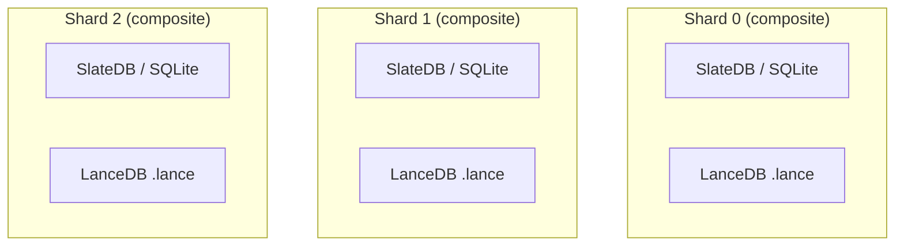
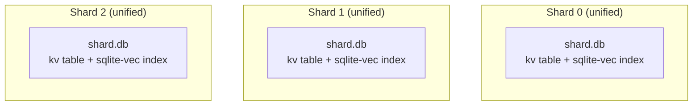
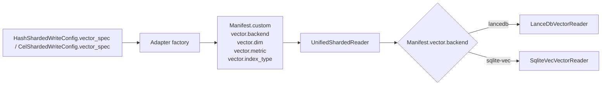

# Sharded KV Storage with Vector Search

This use case adds **vector search** to sharded KV storage. You write both key-value pairs and vector embeddings in the same snapshot, then query by key (point lookup) or by vector (nearest-neighbor search).

This page covers concepts shared by both backend arrangements. Backend and writer specifics live in the child pages.

---

## Two backend arrangements

### Composite: two backends per shard

Each shard contains **two independent databases side by side**:

- **KV backend** — SlateDB or SQLite for point-key lookups.
- **Vector backend** — LanceDB (`.lance` table) for ANN search.

- Two sets of files uploaded per shard.
- `CompositeFactory(kv_factory=..., vector_factory=...)` wires both adapters.
- `UnifiedShardedReader` dispatches `.get()` to the KV backend and `.search()` to the vector backend.

### Unified: single file per shard

Each shard is **one SQLite file** containing both KV rows and a `sqlite-vec` vector index:

- `SqliteVecFactory(vector_spec=...)` creates a single adapter that writes both.
- One upload per shard — simpler operational surface.
- `UnifiedShardedReader` dispatches the same way; the difference is entirely in the adapter.

---

## How vector config travels through the system

1. **Write time**: `VectorSpec(dim, metric, index_type, ...)` is set on `HashShardedWriteConfig` or `CelShardedWriteConfig`. The adapter factory (composite or unified) records `vector.backend` in the manifest.
2. **Read time**: `UnifiedShardedReader` inspects `manifest.vector.backend` and instantiates the matching vector reader automatically.

---

## Shared snapshot properties

KV+vector snapshots use the same manifest + `_CURRENT` pointer model as KV and vector-only snapshots. The manifest is still the reader contract: it records shard locations, routing metadata, and the vector custom fields needed to select the correct vector backend. See [Shared Snapshot Workflow](../shared-snapshot-workflow.md) for the project-wide publish/read flow and [Manifest & `_CURRENT`](../../architecture/manifest-and-current.md) for implementation details.

All the safety properties from the shared workflow apply unchanged:

- **Two-phase publish** — manifest first, then `_CURRENT`.
- **Immutable shards** — once uploaded, never modified.
- **Atomic visibility** — readers see old or new, never a mix.
- **Deterministic routing** — same key/vector routes to the same shard for a given snapshot.
- **Backward rollback** — point `_CURRENT` at any previous manifest.

The addition is that the manifest carries vector metadata in `custom["vector"]` so the reader knows which backend to dispatch to and how to configure its local index.

---

## Backend comparison

| | Composite (LanceDB) | Unified (sqlite-vec) |
|---|---|---|
| **Files per shard** | 2+ (KV + `.lance`) | 1 (`.db`) |
| **Metrics** | `cosine`, `l2`, `dot_product` | `cosine`, `l2` (no `dot_product`) |
| **Index tuning** | HNSW + IVF + PQ/SQ | No tuning surface |
| **Upload cost** | 2× PUTs | 1× PUT |
| **Operational surface** | Higher (two backends) | Lower (one file) |
| **Best for** | Large scale, advanced ANN tuning | Simplicity, single-file distribution |

---

## Child pages

- **[Build → Composite (SlateDB + LanceDB)](build/composite.md)** — two backends per shard
- **[Build → Unified (sqlite-vec)](build/unified.md)** — single file per shard
- **[Read → Sync](read/sync.md)** — `UnifiedShardedReader`
- **[Read → Async](read/async.md)** — `AsyncUnifiedShardedReader`
