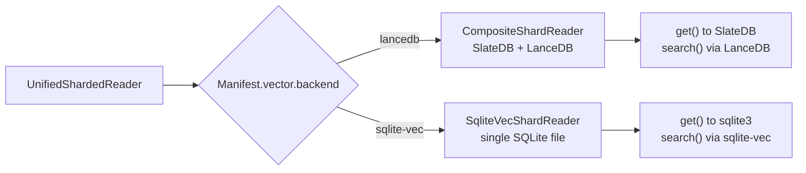

# Read a KV+vector snapshot synchronously

Use **`UnifiedShardedReader`** for both point-key lookups and vector nearest-neighbor search on the same snapshot.

## When to use

- You need both `get(key)` and `search(query_vector, top_k)` on the same dataset.
- Synchronous code.

## When NOT to use

- Vector-only — use [vector sync reader](../../vector/read/sync.md) (`ShardedVectorReader`).
- Async code — use [async KV+Vector reader](async.md) (`AsyncUnifiedShardedReader`).

## Install

```bash
# For composite (LanceDB) snapshots
uv add 'shardyfusion[unified-vector,read]'

# For unified (sqlite-vec) snapshots
uv add 'shardyfusion[unified-vector-sqlite,read]'
```

## Minimal example

```python
from shardyfusion import UnifiedShardedReader
import numpy as np

reader = UnifiedShardedReader(
    s3_prefix="s3://my-bucket/snapshots/items",
    local_root="/tmp/unified",
)

# KV lookup
val = reader.get(b"item-123")

# Vector search
query = np.random.randn(384).astype(np.float32)
results = reader.search(query, top_k=10)

for res in results:
    print(res.id, res.score, res.payload)

reader.close()
```

## Configuration

`UnifiedShardedReader` extends `ShardedReader` with vector search. Constructor is the same as `ShardedReader` — the vector backend is auto-detected from the manifest's `vector.backend` field.

| Param | Default | Purpose |
|---|---|---|
| `s3_prefix` | required | Snapshot root. |
| `local_root` | required | Local cache directory. |
| `max_workers` | `None` | Thread-pool for `multi_get` and multi-shard vector search. |
| `max_fallback_attempts` | `3` | Fallback to previous manifests. |

## Reader API

### KV lookups (inherited from ShardedReader)

```python
value = reader.get(b"item-123")
many = reader.multi_get([b"item-1", b"item-2"])
db_id = reader.route_key(b"item-123")
```

### Vector search

```python
results = reader.search(
    query_vector,
    top_k=10,
    shard_ids=None,
    num_probes=None,
    routing_context=None,
)
```

### Snapshot inspection

```python
info = reader.snapshot_info()
shards = reader.shard_details()
health = reader.health()
```

### Refresh & lifecycle

```python
changed = reader.refresh()
reader.close()
```

## How dispatch works



The reader inspects `manifest.vector.backend` and instantiates the matching composite or unified shard reader per shard.

## Functional properties

- KV and vector data share the same shard layout and routing.
- Lazy shard loading: both KV adapters and vector indices are opened on first access.
- Vector search uses the same scatter-gather merge as `ShardedVectorReader`.

## Guarantees

- Same as `ShardedReader`: reads pinned to manifest, no partial views, deterministic routing.
- `search()` sees the same snapshot as `get()` — no stale vector index vs fresh KV data.

## Weaknesses

- `UnifiedShardedReader` is loaded via top-level `__getattr__` (lazy import). If the required extras are not installed, you get an `ImportError` at first use.
- No `ConcurrentUnifiedShardedReader` variant yet.

## Failure modes & recovery

| Failure | Surface | Recovery |
|---|---|---|
| Missing vector extra | `ImportError` at reader construction | Install the correct extra (`unified-vector` or `unified-vector-sqlite`). |
| Backend mismatch | `ConfigValidationError` | Manifest was built with a different backend; rebuild or use the right reader. |
| Same as KV readers | `ReaderStateError`, `ManifestParseError`, etc. | See [sync SlateDB](../../kv-storage/read/sync/slatedb.md#failure-modes-recovery). |

## See also

- [KV+Vector Overview](../overview.md) — composite vs unified concepts
- [Build → Composite](../build/composite.md)
- [Build → Unified](../build/unified.md)
- [Async KV+Vector reader](async.md)
- [`architecture/adapters.md`](../../../architecture/adapters.md)
