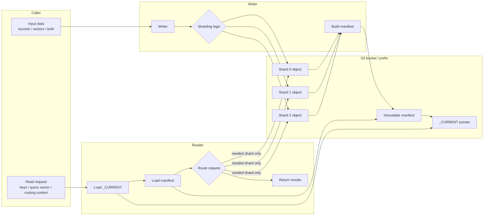
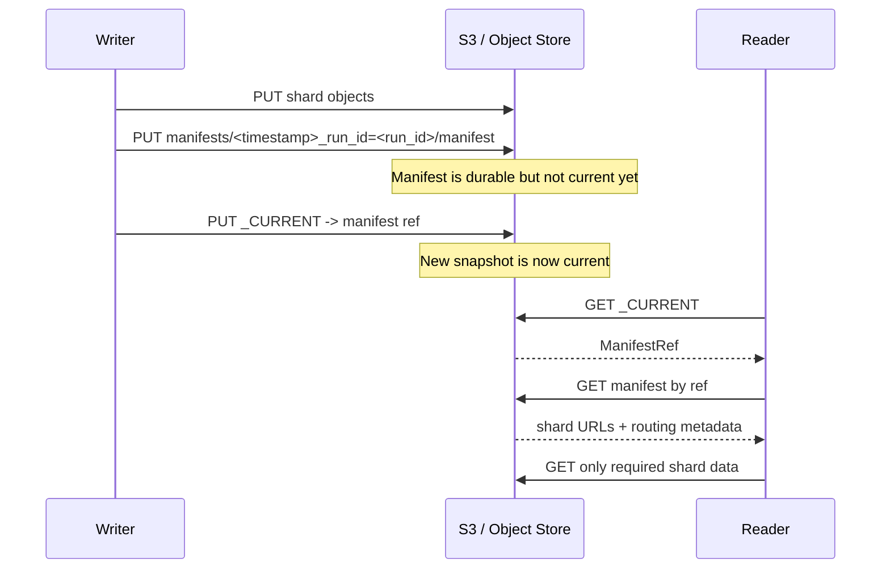
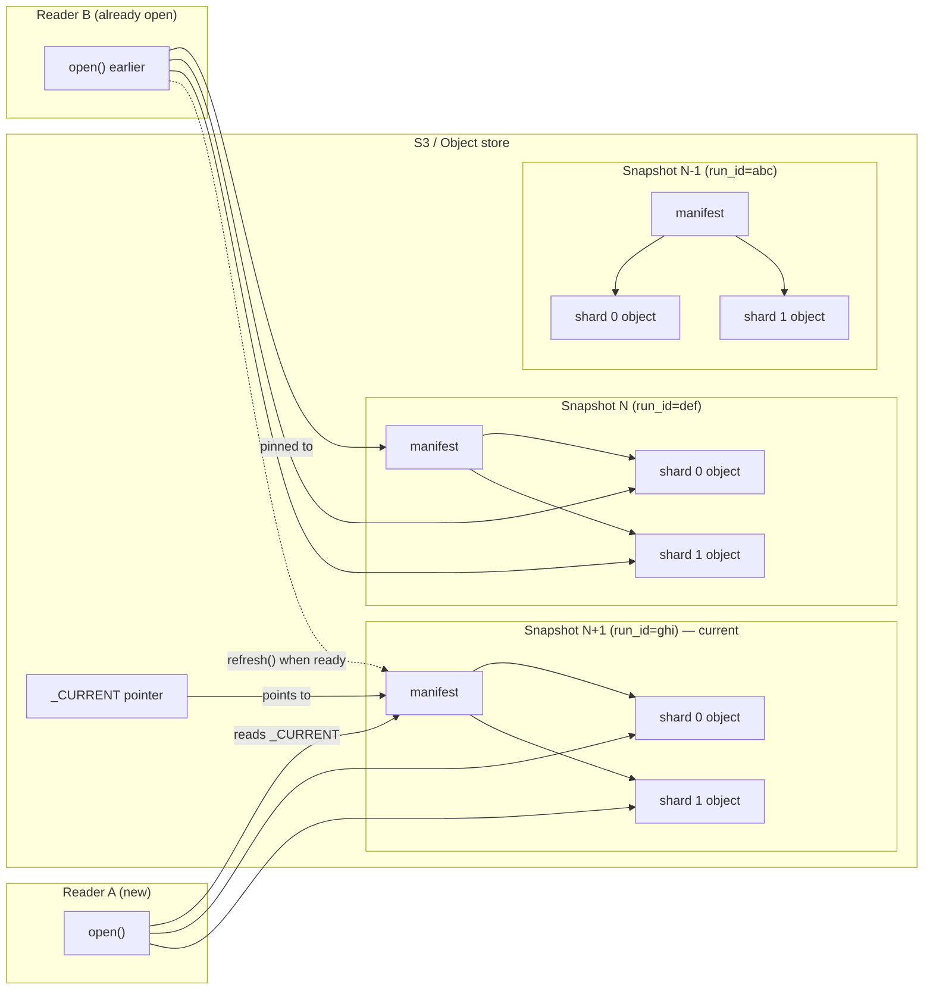

# Shared Snapshot Workflow

Every shardyfusion use case follows the same high-level data workflow:

1. a writer receives records, vectors, or records with vectors
2. sharding logic assigns each item to one shard
3. the writer uploads immutable shard objects to an S3 bucket/prefix
4. the writer publishes a manifest, then updates `_CURRENT`
5. readers load the manifest and fetch only the shard data needed for each request

Use this page when you want the project-wide model. If you already know whether you need KV, vector-only, or KV+vector, you can jump straight to that use-case overview; each one still stands on its own.

---

## End-to-end flow

The concrete routing decision differs by use case:

| Use case | What gets routed | Reader behavior |
|---|---|---|
| KV | lookup keys | route each key to exactly one shard |
| Vector-only | query vector and optional routing context | search all shards or a routed subset, then merge top-k results |
| KV+vector | lookup keys and vectors | dispatch point lookups to KV data and searches to vector data from the same snapshot |

The shared contract is the manifest. It records shard locations, routing metadata, build metadata, and backend-specific custom fields such as vector index configuration.

---

## Two-phase publish

Publishing has two visible phases:

1. **Write manifest object** — immutable and timestamped under `manifests/`.
2. **Update `_CURRENT` pointer** — small mutable object pointing at the manifest.

Readers observe one of three states:

| State | Manifest | `_CURRENT` | What readers see |
|---|---|---|---|
| Before publish | old | old | Old snapshot |
| Mid-publish | new written | old | Old snapshot; new manifest is invisible |
| After publish | new | new | New snapshot atomically |

There is no mixed snapshot where some shards come from the old manifest and some from the new one. Readers pin their state to one manifest at a time.

---

## Failure tolerance

| Failure point | Result | Recovery |
|---|---|---|
| Shard write fails | No manifest is published for that attempt. Readers keep using the old snapshot. | Rerun the writer. Stale attempts can be cleaned up later. |
| Manifest write fails | `_CURRENT` is unchanged. Readers keep using the old snapshot. | Rerun the writer. |
| `_CURRENT` update fails after manifest write | The manifest exists but is invisible to normal readers. | Rerun the writer or later clean up the orphaned manifest. |
| Current manifest is malformed at reader startup | Reader can try previous manifests, up to its fallback limit. | Fix or roll back `_CURRENT`; see [History & rollback](../operate/history-rollback.md). |

The important boundary is that `_CURRENT` is updated only after the manifest object exists. Readers never get a pointer to a manifest that was only half-written.

---

## Snapshot history and reader migration

Each publish creates a new immutable snapshot. Old snapshots stay in the bucket until cleanup removes them, which gives you rollback history and lets existing readers migrate on their own schedule.

- New readers load `_CURRENT` and use the newest manifest.
- Already-open readers stay pinned to the manifest they loaded.
- `refresh()` moves a reader to the current manifest when the application is ready.
- Rollback is the same mechanism in reverse: point `_CURRENT` at an older manifest.

---

## Concrete use cases

- [Sharded KV storage](kv-storage/overview.md) adds key encoding, HASH/CEL routing, and KV reader choices.
- [Sharded KV storage with vector search](kv-vector/overview.md) adds vector metadata and a unified reader surface for point lookup plus ANN search.
- [Sharded vector search](vector/overview.md) adds vector sharding strategies and scatter-gather result merging.

For implementation details, see [Manifest & `_CURRENT`](../architecture/manifest-and-current.md), [Manifest stores](../architecture/manifest-stores.md), and [History & rollback](../operate/history-rollback.md).
