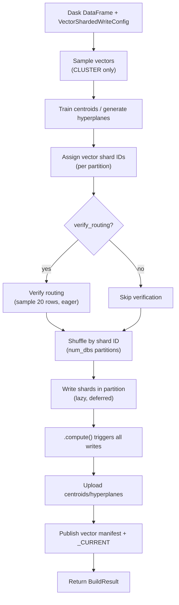

# Build a vector snapshot with the Dask writer

Use the **Dask vector writer** to build a sharded vector index from a Dask `DataFrame` — Spark-free, Java-free.

## When to use

- Vector embeddings live in a Dask `DataFrame` (Parquet/CSV scan, Dask-SQL output).
- You want distributed scale-out without a JVM.

## When NOT to use

- Single-host workload — the [Python vector writer](lancedb.md) or [sqlite-vec writer](sqlite-vec.md) is simpler.
- You have an existing Spark pipeline — use the [Spark vector writer](spark.md).

## Install

Vector writes require **two extras**.

```bash
# LanceDB backend
uv sync --extra writer-dask-vector-lancedb

# sqlite-vec backend
uv sync --extra writer-dask-vector-sqlite
```

`dask[dataframe]>=2024.1` comes with the writer extra.

## Minimal example

### CLUSTER sharding (default)

```python
import dask.dataframe as dd
from shardyfusion import VectorColumnInput
from shardyfusion.vector.config import (
    VectorIndexConfig,
    VectorShardedWriteConfig,
    VectorShardingConfig,
)
from shardyfusion.vector.types import DistanceMetric, VectorShardingStrategy
from shardyfusion.writer.dask.vector_writer import write_sharded

ddf = dd.read_parquet("s3://lake/embeddings/")

config = VectorShardedWriteConfig(
    index_config=VectorIndexConfig(dim=384, metric=DistanceMetric.COSINE),
    sharding=VectorShardingConfig(
        num_dbs=16,
        strategy=VectorShardingStrategy.CLUSTER,
        train_centroids=True,
    ),
    s3_prefix="s3://my-bucket/vectors/embeddings",
)

result = write_sharded(
    ddf,
    config,
    VectorColumnInput(vector_col="embedding", id_col="doc_id"),
)
print(result.manifest_ref.ref)
```

### sqlite-vec backend swap

```python
from shardyfusion import UnifiedVectorWriteConfig, VectorColumnInput
from shardyfusion.sqlite_vec_adapter import SqliteVecFactory
from shardyfusion.vector.config import (
    VectorIndexConfig,
    VectorShardedWriteConfig,
    VectorShardingConfig,
)
from shardyfusion.vector.types import DistanceMetric, VectorShardingStrategy

vector_spec = UnifiedVectorWriteConfig(dim=384, metric="cosine")

config = VectorShardedWriteConfig(
    index_config=VectorIndexConfig(dim=384, metric=DistanceMetric.COSINE),
    sharding=VectorShardingConfig(
        num_dbs=16,
        strategy=VectorShardingStrategy.CLUSTER,
        train_centroids=True,
    ),
    s3_prefix="s3://my-bucket/vectors/embeddings-sqlite",
    adapter_factory=SqliteVecFactory(vector_spec=vector_spec),
)

result = write_sharded(
    ddf,
    config,
    VectorColumnInput(vector_col="embedding", id_col="doc_id"),
)
```

### CEL routing

```python
from shardyfusion import VectorColumnInput
from shardyfusion.vector.config import (
    VectorIndexConfig,
    VectorShardedWriteConfig,
    VectorShardingConfig,
)
from shardyfusion.vector.types import DistanceMetric, VectorShardingStrategy

config = VectorShardedWriteConfig(
    index_config=VectorIndexConfig(dim=384, metric=DistanceMetric.COSINE),
    sharding=VectorShardingConfig(
        num_dbs=4,
        strategy=VectorShardingStrategy.CEL,
        cel_expr='tenant_id == "acme" ? 0u : tenant_id == "corp" ? 1u : 2u',
        cel_columns={"tenant_id": "str"},
    ),
    s3_prefix="s3://my-bucket/vectors/tenant-sharded",
)

result = write_sharded(
    ddf,
    config,
    VectorColumnInput(
        vector_col="embedding",
        id_col="doc_id",
        routing_context_cols={"tenant_id": "tenant_id"},
    ),
)
```

## Data flow



## Configuration

Dask vector writer signature:

```python
write_sharded(ddf, config, input: VectorColumnInput, options: VectorWriteOptions | None = None)
```

`VectorColumnInput` fields:

| Param | Default | Purpose |
|---|---|---|
| `vector_col` | required | DataFrame column containing the vector. |
| `id_col` | required | DataFrame column used as the vector ID. |
| `payload_cols` | `None` | Optional metadata columns. |
| `shard_id_col` | `None` | Column with explicit shard IDs (EXPLICIT strategy only). |
| `routing_context_cols` | `None` | Column mapping for CEL expression evaluation. |

`VectorWriteOptions` fields:

| Field | Default | Purpose |
|---|---|---|
| `verify_routing` | `True` | Spot-check that Dask-assigned shard IDs match `assign_vector_shard()`. |

The writer repartitions internally via `ddf.shuffle(on=VECTOR_DB_ID_COL, npartitions=num_dbs)` so the per-shard task layout matches `num_dbs`.

## Backend-specific properties

### LanceDB (default)

- Each shard builds an HNSW/IVF index locally, then uploads as a Lance dataset.

### sqlite-vec

- Each shard is a single `.sqlite` file with a sqlite-vec virtual table.
- Set `adapter_factory=SqliteVecFactory(vector_spec=...)` on the config.

## Non-functional properties

- Uses the **ambient Dask scheduler** — distributed, threads, processes, or single-machine.
- One Dask task per shard after the shuffle. Memory per task ~ `partition_size + per-shard buffers`.
- Routing pass and write pass are separate Dask graphs; the shuffle materializes between them.
- **Rate limiting**: per-shard scope. Aggregate rate = `config.rate_limits.max_writes_per_second x num_dbs`.

## Empty shards

Empty partitions are handled at two levels:

- The partition writer returns an empty result if the input is empty or if no results are collected after grouping.
- Winner selection downstream filters out shards with `row_count=0`.

## Guarantees

- Successful return ⇒ vector manifest + `_CURRENT` published.
- `verify_routing=True` catches routing drift.

## Weaknesses

- **No Spark-style executor preemption recovery.** A worker loss surfaces as a Dask task failure; rely on `config.shard_retry`.
- **Shuffle is not 1:1** — post-shuffle, one partition may still contain multiple shard IDs. The write phase groups within each partition.

## Failure modes & recovery

| Failure | Surface | Recovery |
|---|---|---|
| `num_dbs` missing or ≤ 0 | `ConfigValidationError` | Provide a positive `num_dbs`. |
| Routing mismatch | `ShardAssignmentError` | Bug in routing change. Don't silence `verify_routing`. |
| Worker death | Dask retries; if exhausted, `ShardCoverageError` | Configure Dask retries. |
| Manifest / `_CURRENT` publish | `PublishManifestError` / `PublishCurrentError` | Transient; rerun. |

## See also

- [Vector Overview](../overview.md) — routing strategies, scatter-gather flow
- [Spark vector writer](spark.md)
- [Ray vector writer](ray.md)
- [Read → Sync](../read/sync.md) — `ShardedVectorReader`
- [Read → Async](../read/async.md) — `AsyncShardedVectorReader"
