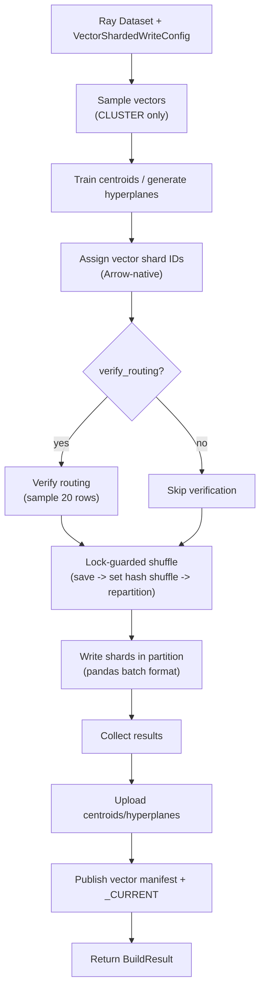

# Build a vector snapshot with the Ray writer

Use the **Ray vector writer** to build a sharded vector index from a Ray `Dataset` — Spark-free, Java-free.

## When to use

- Vector embeddings live in a Ray Dataset (Ray Data pipeline, ML preprocessing).
- You want Ray's actor-based scheduling.

## When NOT to use

- No Ray cluster / no Ray pipeline — the [Python vector writer](lancedb.md) or [sqlite-vec writer](sqlite-vec.md) is simpler.

## Install

Vector writes require **two extras**.

```bash
# LanceDB backend
uv sync --extra writer-ray-vector-lancedb

# sqlite-vec backend
uv sync --extra writer-ray-vector-sqlite
```

`ray[data]>=2.20` comes with the writer extra.

## Minimal example

### CLUSTER sharding (default)

```python
import ray
from shardyfusion import VectorColumnInput
from shardyfusion.vector.config import (
    VectorIndexConfig,
    VectorShardedWriteConfig,
    VectorShardingConfig,
)
from shardyfusion.vector.types import DistanceMetric, VectorShardingStrategy
from shardyfusion.writer.ray.vector_writer import write_sharded

ray.init()
ds = ray.data.read_parquet("s3://lake/embeddings/")

config = VectorShardedWriteConfig(
    index_config=VectorIndexConfig(dim=384, metric=DistanceMetric.COSINE),
    sharding=VectorShardingConfig(
        num_dbs=16,
        strategy=VectorShardingStrategy.CLUSTER,
        train_centroids=True,
    ),
    s3_prefix="s3://my-bucket/vectors/embeddings",
)

result = write_sharded(
    ds,
    config,
    VectorColumnInput(vector_col="embedding", id_col="doc_id"),
)
print(result.manifest_ref.ref)
```

### sqlite-vec backend swap

```python
from shardyfusion import UnifiedVectorWriteConfig, VectorColumnInput
from shardyfusion.sqlite_vec_adapter import SqliteVecFactory
from shardyfusion.vector.config import (
    VectorIndexConfig,
    VectorShardedWriteConfig,
    VectorShardingConfig,
)
from shardyfusion.vector.types import DistanceMetric, VectorShardingStrategy

vector_spec = UnifiedVectorWriteConfig(dim=384, metric="cosine")

config = VectorShardedWriteConfig(
    index_config=VectorIndexConfig(dim=384, metric=DistanceMetric.COSINE),
    sharding=VectorShardingConfig(
        num_dbs=16,
        strategy=VectorShardingStrategy.CLUSTER,
        train_centroids=True,
    ),
    s3_prefix="s3://my-bucket/vectors/embeddings-sqlite",
    adapter_factory=SqliteVecFactory(vector_spec=vector_spec),
)

result = write_sharded(
    ds,
    config,
    VectorColumnInput(vector_col="embedding", id_col="doc_id"),
)
```

### CEL routing

```python
from shardyfusion import VectorColumnInput
from shardyfusion.vector.config import (
    VectorIndexConfig,
    VectorShardedWriteConfig,
    VectorShardingConfig,
)
from shardyfusion.vector.types import DistanceMetric, VectorShardingStrategy

config = VectorShardedWriteConfig(
    index_config=VectorIndexConfig(dim=384, metric=DistanceMetric.COSINE),
    sharding=VectorShardingConfig(
        num_dbs=4,
        strategy=VectorShardingStrategy.CEL,
        cel_expr='tenant_id == "acme" ? 0u : tenant_id == "corp" ? 1u : 2u',
        cel_columns={"tenant_id": "str"},
    ),
    s3_prefix="s3://my-bucket/vectors/tenant-sharded",
)

result = write_sharded(
    ds,
    config,
    VectorColumnInput(
        vector_col="embedding",
        id_col="doc_id",
        routing_context_cols={"tenant_id": "tenant_id"},
    ),
)
```

## Data flow



## Configuration

Ray vector writer signature:

```python
write_sharded(ds, config, input: VectorColumnInput, options: VectorWriteOptions | None = None)
```

`VectorColumnInput` fields:

| Param | Default | Purpose |
|---|---|---|
| `vector_col` | required | Dataset column containing the vector. |
| `id_col` | required | Dataset column used as the vector ID. |
| `payload_cols` | `None` | Optional metadata columns. |
| `shard_id_col` | `None` | User **input** column with explicit shard IDs (EXPLICIT strategy only). |
| `routing_context_cols` | `None` | Column mapping for CEL expression evaluation. |

The writer also uses a temporary `_vector_db_id` column internally for shard routing. It is dropped before write and never stored. If this name collides with a column in your data, the writer raises `ConfigValidationError`; override it with `config.shard_id_col`.

`VectorWriteOptions` fields:

| Field | Default | Purpose |
|---|---|---|
| `verify_routing` | `True` | Spot-check that Ray-assigned shard IDs match `assign_vector_shard()`. |

Internally the writer:

- Forces `DataContext.shuffle_strategy = HASH_SHUFFLE` for the duration of the build (process-wide; guarded by `_SHUFFLE_STRATEGY_LOCK`).
- Repartitions via `ds.repartition(num_dbs, shuffle=True, keys=[VECTOR_DB_ID_COL])`.
- Writes per-partition via `map_batches(..., batch_format="pandas")`.

## Backend-specific properties

### LanceDB (default)

- Each shard builds an HNSW/IVF index locally, then uploads as a Lance dataset.

### sqlite-vec

- Each shard is a single `.sqlite` file with a sqlite-vec virtual table.
- Set `adapter_factory=SqliteVecFactory(vector_spec=...)` on the config.

## Non-functional properties

- Atomic two-phase publish (same as all writers).
- One Ray task per shard after repartition.
- The shuffle-strategy swap is **process-global**: don't run two unrelated Ray Data pipelines in the same process during the build.
- **Rate limiting**: per-shard scope. Aggregate rate = `config.rate_limits.max_writes_per_second x num_dbs`.

## Guarantees

- Successful return ⇒ vector manifest + `_CURRENT` published.
- `verify_routing=True` catches routing drift.

## Weaknesses

- **Process-global Ray Data context mutation** during the build.
- **No exposed scheduler / parallelism knob** beyond `num_dbs`. Controlled by Ray cluster sizing.

## Failure modes & recovery

| Failure | Surface | Recovery |
|---|---|---|
| `num_dbs` missing or ≤ 0 | `ConfigValidationError` | Provide a positive `num_dbs`. |
| `shard_id_col` collides with a data column | `ConfigValidationError` | Rename your column or set `config.shard_id_col`. |
| Routing mismatch | `ShardAssignmentError` | Bug in routing change. Don't silence `verify_routing`. |
| Task failure | Ray retries per its own policy; then `ShardCoverageError` | Configure Ray retries. |
| Manifest / `_CURRENT` publish | `PublishManifestError` / `PublishCurrentError` | Transient; rerun. |

## See also

- [Vector Overview](../overview.md) — routing strategies, scatter-gather flow
- [Spark vector writer](spark.md)
- [Dask vector writer](dask.md)
- [Read → Sync](../read/sync.md) — `ShardedVectorReader`
- [Read → Async](../read/async.md) — `AsyncShardedVectorReader"
