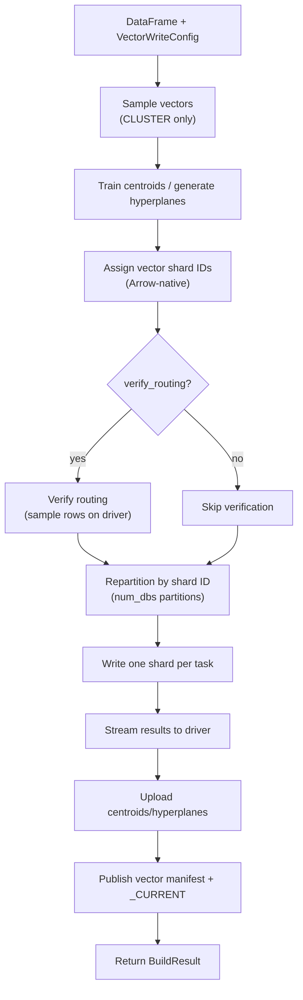

# Build a vector snapshot with the Spark writer

Use the **Spark vector writer** to build a sharded vector index from a PySpark `DataFrame`. Requires Java 17+ and PySpark.

## When to use

- Vector embeddings already live in a Spark `DataFrame` (feature store, ETL output, inference batch).
- Dataset is too large to stream through a single host.
- You have a Spark cluster (or local Spark) with Java 17+.

## When NOT to use

- No existing Spark pipeline — the [Python vector writer](lancedb.md) or [sqlite-vec writer](sqlite-vec.md) is simpler.
- No Java runtime — use the [Dask vector writer](dask.md) or [Ray vector writer](ray.md).

## Install

Vector writes require **two extras**: the writer extra for your engine plus the vector backend extra.

```bash
# LanceDB backend
uv sync --extra writer-spark-vector-lancedb

# sqlite-vec backend
uv sync --extra writer-spark-vector-sqlite
```

`pyspark>=3.3`, `pandas>=2.2`, and `pyarrow>=15.0` come with the writer extra.

## Minimal example

### CLUSTER sharding (default)

```python
from pyspark.sql import SparkSession
from shardyfusion import VectorSpec
from shardyfusion.vector.config import VectorWriteConfig, VectorSpecSharding
from shardyfusion.writer.spark import write_vector_sharded

spark = SparkSession.builder.appName("sf-vector-build").getOrCreate()
df = spark.read.parquet("s3://lake/embeddings/")

vector_spec = VectorSpec(
    dim=384,
    metric="cosine",
    sharding=VectorSpecSharding(strategy="cluster", train_centroids=True),
)

config = VectorWriteConfig.from_vector_spec(
    vector_spec=vector_spec,
    num_dbs=16,
    s3_prefix="s3://my-bucket/vectors/embeddings",
)

result = write_vector_sharded(
    df,
    config,
    vector_col="embedding",
    id_col="doc_id",
)
print(result.manifest_ref.ref)
```

### sqlite-vec backend swap

```python
from shardyfusion import VectorSpec
from shardyfusion.sqlite_vec_adapter import SqliteVecFactory
from shardyfusion.vector.config import VectorWriteConfig, VectorSpecSharding

vector_spec = VectorSpec(dim=384, metric="cosine")

config = VectorWriteConfig.from_vector_spec(
    vector_spec=vector_spec,
    num_dbs=16,
    s3_prefix="s3://my-bucket/vectors/embeddings-sqlite",
    adapter_factory=SqliteVecFactory(vector_spec=vector_spec),
)

result = write_vector_sharded(df, config, vector_col="embedding", id_col="doc_id")
```

### CEL routing

```python
from shardyfusion import VectorSpec
from shardyfusion.vector.config import VectorWriteConfig, VectorSpecSharding

vector_spec = VectorSpec(
    dim=384,
    metric="cosine",
    sharding=VectorSpecSharding(
        strategy="cel",
        cel_expr='tenant_id == "acme" ? 0u : tenant_id == "corp" ? 1u : 2u',
        cel_columns={"tenant_id": "str"},
    ),
)

config = VectorWriteConfig.from_vector_spec(
    vector_spec=vector_spec,
    num_dbs=4,
    s3_prefix="s3://my-bucket/vectors/tenant-sharded",
)

result = write_vector_sharded(
    df,
    config,
    vector_col="embedding",
    id_col="doc_id",
    routing_context_cols={"tenant_id": "tenant_id"},
)
```

## Data flow



## Configuration

Spark-specific knobs on `write_vector_sharded` (`shardyfusion/writer/spark/writer.py`):

| Param | Default | Purpose |
|---|---|---|
| `vector_col` | required | DataFrame column containing the vector (`list[float]` or `array<float>`). |
| `id_col` | required | DataFrame column used as the vector ID. |
| `payload_cols` | `None` | Optional metadata columns to store alongside each vector. |
| `shard_id_col` | `None` | Column with explicit shard IDs (EXPLICIT strategy only). |
| `routing_context_cols` | `None` | Column mapping for CEL expression evaluation (CEL strategy only). |
| `verify_routing` | `True` | Spot-check that Spark-assigned shard IDs match `assign_vector_shard()`. |
| `max_writes_per_second` | `None` | Token-bucket rate limit per partition. |

`VectorWriteConfig` fields (see `vector/config.py`):

| Field | Default | Purpose |
|---|---|---|
| `num_dbs` | required | Number of shard databases. |
| `s3_prefix` | required | S3 location for shards and manifests. |
| `index_config` | `VectorIndexConfig(dim=0)` | Dim, metric, index type, params. |
| `sharding` | `VectorShardingSpec` | CLUSTER/LSH/EXPLICIT/CEL strategy and params. |
| `adapter_factory` | `None` → LanceDB | Vector index writer factory. |
| `batch_size` | `10_000` | Vectors per write batch. |
| `max_writes_per_second` | `None` | Rate limit. |

Use `VectorWriteConfig.from_vector_spec()` as a convenience factory when you already have a `VectorSpec`.

## Backend-specific properties

### LanceDB (default)

- Each shard builds an HNSW/IVF index locally, then uploads as a Lance dataset.
- `VectorSpec.index_params` (e.g. `M`, `ef_construction`) is forwarded to LanceDB.

### sqlite-vec

- Each shard is a single `.sqlite` file with a sqlite-vec virtual table.
- Set `adapter_factory=SqliteVecFactory(vector_spec=...)` on the config.

## Non-functional properties

- **Driver work**: sampling, centroid training, manifest assembly, S3 publish.
- **Executor work**: each task opens its vector adapter, writes batches of `config.batch_size`, calls `checkpoint()`.
- **No Python UDFs**: routing uses Arrow `mapInArrow` to avoid UDF overhead.
- **Rate limiting**: per-partition scope. Aggregate rate = `max_writes_per_second x num_dbs`.
- **CLUSTER sampling**: a 10% sample (or full set if small) is collected on the driver for centroid training.

## Speculative execution safety

Spark may launch duplicate tasks. This is safe because:

- S3 paths are attempt-isolated: `shards/run_id=.../db=XXXXX/attempt=00/` vs `attempt=01/`.
- Winner selection is deterministic per shard.
- Non-winning attempts are cleaned up after publishing.

## Guarantees

- Successful return ⇒ vector manifest + `_CURRENT` published.
- `verify_routing=True` (default) re-checks the writer-reader routing contract.
- All vector shards are immutable after upload.

## Weaknesses

- **Java 17+ required.**
- **Driver collects samples for CLUSTER sharding** — large sample sizes can pressure driver memory.
- **No `dot_product` with sqlite-vec** — use LanceDB if you need that metric.

## Failure modes & recovery

| Failure | Surface | Recovery |
|---|---|---|
| `num_dbs` missing or ≤ 0 | `ConfigValidationError` | Provide a positive `num_dbs`. |
| Dim mismatch | `ConfigValidationError` | Ensure all vectors match `VectorSpec.dim`. |
| Routing mismatch | `ShardAssignmentError` (when `verify_routing=True`) | Bug in routing change; do not silence. |
| Spark task fails | Task retried by Spark; then `ShardCoverageError` if exhausted | Tune Spark retries. |
| Manifest publish fails | `PublishManifestError` | Transient — rerun. |
| `_CURRENT` publish fails | `PublishCurrentError` | Manifest exists; rerun publishes a new pointer. |

## See also

- [Vector Overview](../overview.md) — routing strategies, scatter-gather flow
- [LanceDB vector build](lancedb.md) — Python single-process writer
- [sqlite-vec vector build](sqlite-vec.md) — Python single-process writer
- [Read → Sync](../read/sync.md) — `ShardedVectorReader`
- [Read → Async](../read/async.md) — `AsyncShardedVectorReader"
