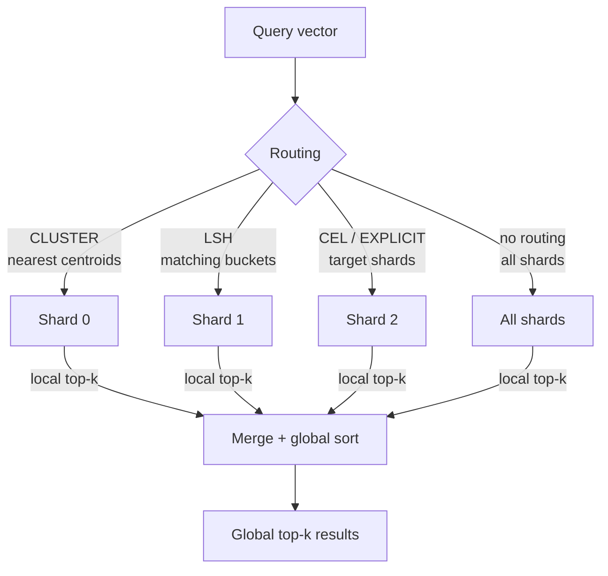
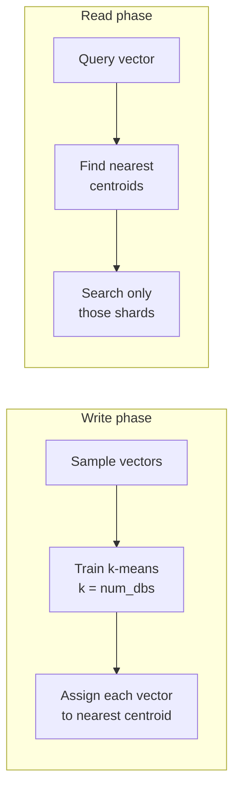

# Sharded Vector Search

This use case is **vector-only**: no KV data, no point-key lookups. You write vector embeddings into sharded indices and query by approximate nearest-neighbor (ANN) search.

This page covers concepts shared by both backends. Backend and reader specifics live in the child pages.

---

## Query flow: scatter-gather

A vector search fans out across all (or routed) shards, collects local top-k results, and merges them into a global top-k:

1. **Routing** — some strategies skip shards that cannot contain relevant vectors.
2. **Fan-out** — each target shard runs a local ANN search.
3. **Local top-k** — each shard returns its `top_k` nearest neighbors.
4. **Global merge** — results are merged and re-sorted by distance to produce the final top-k.

The merge logic lives in `shardyfusion/vector/_merge.py` and is reused by all vector reader variants.

---

## Vector sharding strategies

Four strategies control how vectors are assigned to shards at write time and which shards are queried at read time.

| Strategy | Write-time routing | Read-time routing | Best for |
|---|---|---|---|
| **CLUSTER** (default) | K-means centroids trained on sample; vector assigned to nearest centroid shard | Query routed to `n` nearest centroid shards | Maximizing recall on naturally grouped data |
| **LSH** | Random hyperplanes hash vectors into buckets | Query hashed to same bucket; optional multi-probe | Massive ingestion throughput; streaming data |
| **CEL** | CEL expression on metadata (e.g. `tenant_id == "acme"`) | Exact-match routing on `routing_context` | Strict tenant isolation |
| **EXPLICIT** | Caller provides `shard_id` per vector | Caller provides `shard_ids` at query time | External directory or custom logic |

### CLUSTER details

- Requires a sampling pass over the data to train centroids (unless `train_centroids=False`).
- Centroids are stored as `.npy` files in S3 and referenced in the manifest.
- `nprobe` controls how many centroid shards are queried (default = 1).

### LSH details

- Hyperplanes are generated deterministically from a seed.
- No training phase — hashing is virtually free.
- Multi-probe search can query nearby buckets to improve recall.

---

## Backend comparison

| | LanceDB | sqlite-vec |
|---|---|---|
| **File format** | `.lance` directory per shard | `.sqlite` file per shard |
| **Index types** | HNSW, IVF, PQ, SQ | Flat (brute-force within shard) |
| **Metrics** | `cosine`, `l2`, `dot_product` | `cosine`, `l2` |
| **Scale** | Large-scale, high-dim (768d–3072d) | Small-to-medium, fits in memory |
| **Tuning surface** | `M`, `ef_construction`, `nprobes`, quantization | None |
| **Dependencies** | `lancedb` | `sqlite-vec` extension |

---

## Shared snapshot properties

Vector-only snapshots use the same manifest + `_CURRENT` pointer model as KV and KV+vector snapshots. The manifest is still the reader contract: it records vector shard locations, routing metadata, and vector-specific custom fields. See [Shared Snapshot Workflow](../shared-snapshot-workflow.md) for the project-wide publish/read flow and [Manifest & `_CURRENT`](../../architecture/manifest-and-current.md) for implementation details.

All the safety properties from the shared workflow apply:

- **Two-phase publish** — manifest first, then `_CURRENT`.
- **Immutable shards** — indices are never modified after upload.
- **Atomic visibility** — readers see old or new snapshot entirely.
- **Backward rollback** — point `_CURRENT` at any previous manifest.

The manifest carries vector-specific metadata in `custom["vector"]` (centroids, hyperplanes, index config) so readers can reconstruct the routing and search parameters.

---

## Child pages

- **[Build → LanceDB](build/lancedb.md)** — HNSW/IVF vector index (Python single-process)
- **[Build → sqlite-vec](build/sqlite-vec.md)** — single-file SQLite vector index (Python single-process)
- **[Build → Spark](build/spark.md)** — distributed vector writer for PySpark DataFrames
- **[Build → Dask](build/dask.md)** — distributed vector writer for Dask DataFrames
- **[Build → Ray](build/ray.md)** — distributed vector writer for Ray Datasets
- **[Read → Sync](read/sync.md)** — `ShardedVectorReader`
- **[Read → Async](read/async.md)** — `AsyncShardedVectorReader`
