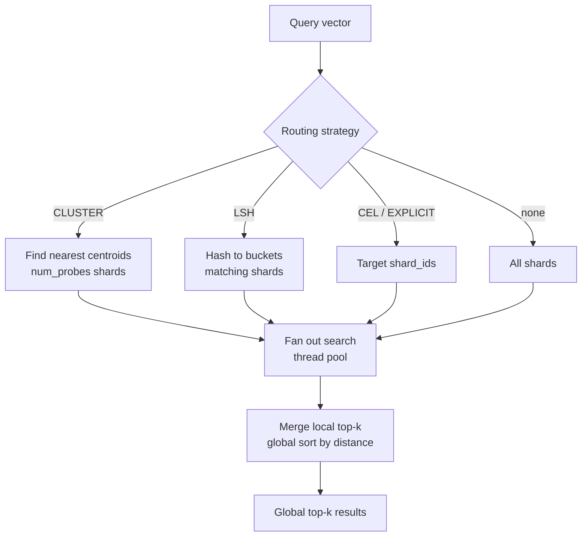

# Read a vector snapshot synchronously

Use **`ShardedVectorReader`** for approximate nearest-neighbor (ANN) search across a sharded vector snapshot.

## When to use

- Pure vector workload — no KV lookups needed.
- Synchronous code.

## When NOT to use

- You also need KV lookups — use [KV+Vector sync reader](../../kv-vector/read/sync.md) (`UnifiedShardedReader`).
- You're in async code — use [async vector reader](async.md) (`AsyncShardedVectorReader`).

## Install

```bash
# LanceDB backend
uv add 'shardyfusion[vector-lancedb]'

# sqlite-vec backend
uv add 'shardyfusion[vector-sqlite]'
```

## Minimal example

```python
from shardyfusion.vector.reader import ShardedVectorReader
import numpy as np

reader = ShardedVectorReader(
    s3_prefix="s3://my-bucket/snapshots/embeddings",
    local_root="/tmp/vectors",
)

query = np.random.randn(384).astype(np.float32)
response = reader.search(query, top_k=10)

print("search latency (ms):", round(response.latency_ms, 2))
for res in response.results:
    print(res.id, res.score, res.payload)

reader.close()
```

## Configuration

`ShardedVectorReader` (`shardyfusion/vector/reader.py`):

| Param | Default | Purpose |
|---|---|---|
| `s3_prefix` | required | Snapshot root. |
| `local_root` | required | Local cache directory. |
| `manifest_store` | auto | Custom async or sync store. |
| `max_workers` | `None` | Thread-pool size for multi-shard fan-out. |
| `max_fallback_attempts` | `3` | Fallback to previous manifests. |
| `rate_limiter` | `None` | Token-bucket rate limit on `search`. |

## Reader API

```python
# ANN search
results = reader.search(
    query_vector,
    top_k=10,
    shard_ids=None,           # restrict to specific shards
    num_probes=None,          # CLUSTER routing: how many centroid shards to query
    routing_context=None,     # CEL routing context
)

# Routing introspection (sync)
db_id = reader.route_vector(query_vector)   # for CLUSTER/LSH strategies

# Snapshot inspection
info = reader.snapshot_info()
shards = reader.shard_details()
health = reader.health()

# Refresh / lifecycle
changed = reader.refresh()
reader.close()
```

## Query flow



The merge logic is in `shardyfusion/vector/_merge.py` and is shared across all vector reader variants.

## Functional properties

- Lazy shard loading: indices are downloaded on first search.
- LRU eviction for shard indices.
- `search` fans out across target shards using a thread pool.

## Guarantees

- Reads pinned to manifest at open / last `refresh()`.
- Routing matches writer (same centroids, hyperplanes, or CEL expression).
- Same fallback behavior as KV readers: up to `max_fallback_attempts` previous manifests.

## Weaknesses

- `ShardedVectorReader` is **not re-exported** at top level — import from `shardyfusion.vector`.
- `CLUSTER` sharding requires sampling pass over data at write time.
- No built-in query filtering (filter must happen post-search in application code).

## Failure modes & recovery

| Failure | Surface | Recovery |
|---|---|---|
| Missing `_CURRENT` | `ReaderStateError` | Verify writer published; check `s3_prefix`. |
| Malformed manifest | `ManifestParseError`; fallback to previous manifests | Investigate writer. |
| Shard index not found | `DbAdapterError` | Check S3 connectivity; `refresh()`. |
| Dim mismatch | `ConfigValidationError` | Fix query vector dimension. |

## See also

- [Vector Overview](../overview.md) — routing strategies, scatter-gather flow
- [Build → LanceDB](../build/lancedb.md)
- [Build → sqlite-vec](../build/sqlite-vec.md)
- [Async vector reader](async.md)
