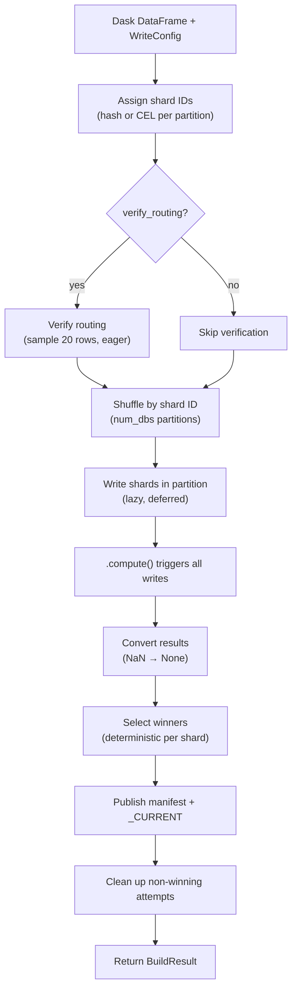

# Dask Writer Deep Dive

The Dask writer (`shardyfusion.writer.dask.write_sharded`) is a Dask DataFrame-based writer that distributes shard writes across Dask workers. It requires no Java and uses Dask's lazy execution model — sharding and shuffle are deferred until `.compute()` triggers the full pipeline.

**Key characteristics:**

- **Input:** Dask `DataFrame`
- **Java required:** No
- **Speculative execution:** Not supported (attempt is always 0)
- **Sharding:** Per-partition routing via pandas
- **Parallelism:** Dask scheduler-level (distributed or threaded)
- **Execution model:** Lazy — `.compute()` triggers all work

## Data Flow



## How are rows assigned to shards?

The Dask writer assigns shard IDs by applying the routing function to each pandas partition:

**Hash sharding:**

- Each partition applies the routing function via pandas `.apply()` to compute the shard ID per row.
- Uses the same hash implementation as all other writers.
- This is lazy — the column is only computed when a downstream operation triggers execution.

**CEL sharding:**

- Each partition compiles the CEL expression, builds per-row routing contexts, and evaluates the expression per row.
- Supports full row context — non-key columns specified in `cel_columns` are available in CEL expressions.

## How are rows distributed across workers?

After shard assignment, the Dask DataFrame is shuffled to collocate rows by shard ID, creating exactly `num_dbs` output partitions.

**Key behavior:** Shuffle collocates rows but does not guarantee exactly one shard per partition. Post-shuffle, one partition may still contain multiple shard IDs. The write phase handles this by grouping within each partition.

## How are shards written to storage?

Each Dask partition is processed as follows:

1. **Empty partition check:** If the input pandas DataFrame is empty, an empty result is returned immediately — no S3 I/O.
2. **Group by shard ID:** The partition is split by shard.
3. **Per-shard write:** Each group is written independently:
    - `attempt` is always 0 (Dask does not support speculative execution).
    - Rows are iterated, encoding keys and values.
    - **numpy scalar conversion:** Keys extracted from pandas are numpy types — they must be converted to native Python types before encoding or routing.
    - Batches are flushed when full.

## What happens with empty shards?

Empty partitions are handled at two levels:

- The partition writer returns an empty result if the input is empty or if no results are collected after grouping.
- Winner selection downstream filters out shards with `row_count=0` — only shards that received data appear in the manifest.
- The reader pads missing shard IDs with null reader instances.

## How are write results collected?

`.compute()` triggers all deferred writes and returns a pandas DataFrame of results.

**NaN handling:** pandas represents mixed int+None columns as `float64`, so numeric fields may be `float('nan')` instead of `None`. The result conversion checks for NaN and converts floats back to int where needed.

## Rate Limiting

Rate limiting in the Dask writer operates at **per-shard scope**:

- Each shard write creates its own token bucket instances.
- Uses blocking acquire.
- **Aggregate rate across all shards** = `max_writes_per_second x num_dbs`.

| Config Parameter | Bucket Type | Scope |
|---|---|---|
| `max_writes_per_second` | ops/sec | Per shard |
| `max_write_bytes_per_second` | bytes/sec | Per shard |

## How does routing verification work?

The verification step samples rows eagerly before the write phase:

1. Samples 20 rows from across all partitions.
2. For each sampled row, extracts the key and Dask-computed shard ID, then compares against the Python routing function.
3. **Supports multi-column CEL:** Builds routing context from non-key columns for CEL routing verification. numpy scalars are converted before routing.
4. Raises `ShardAssignmentError` if any mismatches are found (reports up to 5 details).

**Timing note:** Sampling is an eager operation — it can fail early before the write phase, unlike sharding and shuffle which are lazy.

## Single-Shard Writer

`write_single_db()` is a specialized path for `num_dbs=1`:

- Optionally persists the input DataFrame.
- Global sort, then repartition into the target number of partitions.
- Streams partitions with optional prefetch — the next partition is fetched while the current one is being written.
- A single shared token bucket controls the write rate.

## Error Handling & Fault Tolerance

### Shard-Level Retry

When `WriteConfig.shard_retry` is set to a `RetryConfig`, individual shard writes are retried on transient failures (`ShardWriteError`, `retryable=True`). Each retry writes to a new S3 path (`attempt=00`, `attempt=01`, ...) with fresh rate limiters. Non-retryable errors propagate immediately without retry. The same setting also enables whole-database retry for `write_single_db()`. When `shard_retry` is `None` (default), behavior is unchanged — a single attempt with no retry.

```python
from shardyfusion import WriteConfig, RetryConfig

config = WriteConfig(
    num_dbs=8,
    s3_prefix="s3://bucket/prefix",
    shard_retry=RetryConfig(max_retries=2, initial_backoff=timedelta(seconds=1.0)),
)
```

### No Speculative Execution

Dask does not speculatively re-execute tasks. Unlike Spark, fault tolerance comes from `shard_retry` (per-shard retry with backoff), not speculative execution. Without `shard_retry`, `attempt` is always 0.

### Exception Wrapping

Non-shardyfusion exceptions from adapter operations are wrapped as `ShardWriteError` (`retryable=True`) with context (run_id, db_id, attempt, db_url, rows_written, traceback). Shardyfusion error subclasses pass through unwrapped.

### Partition Failure = Full Write Failure

If a shard write exhausts all retry attempts (or fails with a non-retryable error), the exception propagates and the `.compute()` call fails. There is no partial result recovery.

### Sharding Validation

- `ShardAssignmentError` raised by routing verification if sampled shard IDs don't match Python routing.
- `ShardCoverageError` from winner selection if unexpected shard IDs are found.

### Two-Phase Publish

Same as all writers — retry CURRENT pointer up to 3 times on failure with exponential backoff (1s, 2s, 4s).

### Lazy vs Eager Failure Timing

Sharding and shuffle are lazy — errors surface only at `.compute()` time. Verification (sampling) is eager and can fail early before the write phase begins.

## Gotchas

| Gotcha | Detail |
|---|---|
| **pandas NaN for None** | Mixed int+None columns become `float64` in pandas. Result conversion handles NaN → None and float → int. |
| **numpy scalar types** | Keys from pandas DataFrames are numpy types (e.g., `numpy.int64`). Must convert to native Python before encoding or routing. |
| **attempt always 0** | Dask has no retry/speculation model at the shardyfusion level. A failed partition write fails the entire pipeline. |
| **Result metadata required** | Dask's `map_partitions` needs metadata to infer the output schema. Without it, Dask cannot construct the task graph. |
| **Lazy execution timing** | Sharding bugs may not surface until `.compute()`. Only verification runs eagerly before the write phase. |
| **Shuffle is not 1:1** | Shuffle collocates rows but doesn't guarantee exactly one shard per partition. The write phase groups by shard ID within each partition. |
