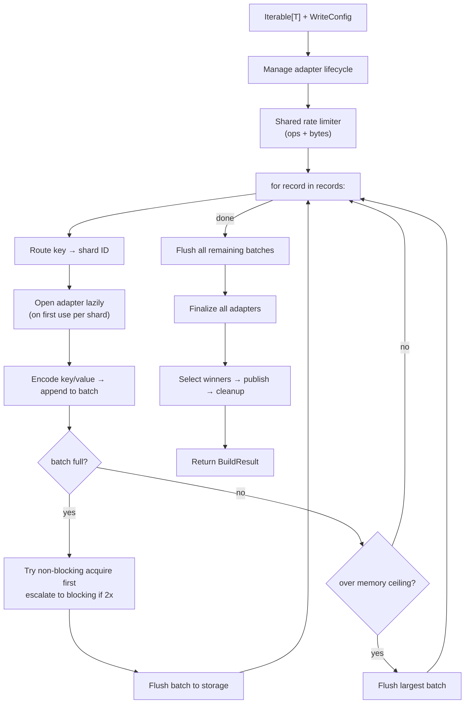
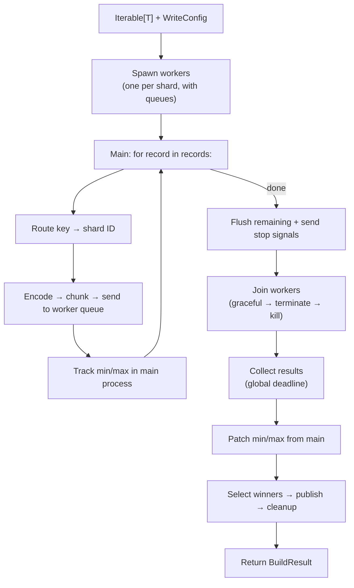

# Python Writer Deep Dive

The Python writer (`shardyfusion.writer.python.write_sharded`) is a pure-Python iterator-based writer with no framework dependencies. It supports two execution modes: single-process (all adapters open simultaneously) and parallel (one worker per shard via `multiprocessing.spawn`).

**Key characteristics:**

- **Input:** `Iterable[T]` with `key_fn`/`value_fn` callables
- **Java required:** No
- **Framework dependencies:** None
- **Execution modes:** Single-process or parallel (`multiprocessing.spawn`)
- **Rate limiting:** Unique non-blocking-first strategy in single-process mode
- **Memory management:** Global memory ceiling to prevent OOM with many shards

## Data Flow

The Python writer has two distinct execution paths:

### Single-Process Mode



### Parallel Mode



## How does single-process mode work?

Single-process mode opens all shard adapters in a single process using a context manager stack:

- **Lazy adapter opening:** Adapters are opened on first use — a shard that receives no rows never opens an adapter.
- **Context manager stack:** Each adapter is registered for cleanup, ensuring LIFO-order teardown even on exceptions.
- **Per-record routing:** The routing function is called inline for each record, directing it to the correct shard.
- **Tracking:** Dict-based tracking per shard — adapters, batches, row counts, byte sizes, min/max keys.

## How does parallel mode work?

Parallel mode uses `multiprocessing.spawn` with one worker per shard:

- **Spawn context:** `multiprocessing.get_context("spawn")` is hardcoded — all objects passed to workers must be picklable (fork is not used).
- **Queue-based communication:** One queue per shard (with configurable max size for backpressure), plus a shared result queue for worker results.
- **Main process responsibilities:** Routes records, encodes key/value pairs, chunks them (chunk size = batch_size/10), and sends chunks to the appropriate worker queue. Also tracks min/max keys (workers do not see the full dataset).
- **Worker process:** Each worker consumes chunks from its queue and writes to a single shard adapter.

## Batch Flushing Strategy

The single-process mode has a unique non-blocking-first rate limiting strategy:

```
batch full?
├── try non-blocking acquire — pure arithmetic, no sleep
│   ├── success → flush batch + acquire bytes bucket
│   └── denied → check batch size
│       ├── batch >= 2x batch_size → blocking acquire (backpressure)
│       └── batch < 2x batch_size → skip flush, continue accumulating
```

This design prevents unnecessary blocking: if the rate limiter denies a flush but the batch isn't excessively large, the writer continues accumulating more records. Only when the batch doubles to 2x the configured `batch_size` does it escalate to a blocking call, providing backpressure.

## Global Memory Ceiling

Unique to the Python single-process writer, `max_total_batched_items` and `max_total_batched_bytes` prevent OOM when buffering across many shards:

When the total items or bytes across all shard batches exceeds the ceiling, an eviction loop flushes the largest batch (by bytes, then item count) until the total drops below the limit. This prevents scenarios where many open shards each accumulate small batches that collectively exhaust memory.

## What happens with empty shards?

**Single-process:** Adapters are never opened for shards with no rows. After iteration, the full shard ID range is checked to ensure coverage in results.

**Parallel:** Workers with zero rows report `row_count=0`. The main process marks their `db_url=None`.

## How is CEL shard count discovered?

CEL sharding in the Python writer has a unique constraint:

- **Single-process:** `num_dbs` is unknown until iteration completes. After all records are routed, the observed shard IDs are validated as consecutive 0-based integers and `num_dbs` is derived from `max(db_id) + 1`.
- **Parallel:** CEL discovery is not supported because workers must be spawned before iteration (requires knowing `num_dbs` upfront). The config must specify `num_dbs > 0` for parallel CEL writes.

## Worker Lifecycle

### Sentinel-Based EOF

The main process signals workers to stop by sending `None` on their queue. Even on main-process exceptions, sentinels are sent to all workers in the exception handler to prevent orphaned workers.

### Join Escalation

Worker shutdown has a three-level escalation:

```
join(60s) — graceful wait
├── worker exited → done
└── still alive → terminate (SIGTERM)
    └── join(5s)
        ├── worker exited → done
        └── still alive → kill (SIGKILL)
```

### Result Collection

Results are collected from the result queue with a global deadline of `10s x num_dbs`. This avoids per-result timeouts that could accumulate beyond the intended total. If the deadline expires (e.g., a worker crashed before posting its result), an error is raised.

## Error Handling & Fault Tolerance

### Single-Process Mode

No retry mechanism. If any adapter operation fails, the exception propagates up through the context manager stack. The stack closes all already-opened adapters in LIFO order. Partially-written shards remain on S3 until cleanup.

### Parallel Mode — Worker Failure

- Worker exceptions are caught, logged, wrapped, and re-raised — causing the worker process to exit with non-zero code.
- Main process detects worker failure via exit codes after joining, raises an error listing failed `(db_id, exit_code)` pairs.
- On main-process exception during routing, stop signals are sent to all worker queues so workers exit cleanly. The finally block handles worker join/terminate.

### No Partial Recovery

If any worker fails (parallel) or any adapter operation fails (single-process), the entire write fails. No mechanism to retry individual shards.

### Two-Phase Publish and Cleanup

Same as all writers — retry CURRENT pointer up to 3 times, cleanup is best-effort.

## Gotchas

| Gotcha | Detail |
|---|---|
| **`multiprocessing.spawn` serialization** | All objects passed to workers must be picklable. This includes config, factory, and `key_fn`/`value_fn`. Lambda functions are not picklable — use named functions. |
| **Workers get independent rate limiters** | Each worker creates its own token bucket. There is no global cross-worker coordination — aggregate rate = `rate x num_dbs`. |
| **Min/max tracked in main** | The main process tracks min/max keys and patches them into worker results. Workers do not have visibility into keys from other shards. |
| **`columns_fn` for CEL routing context** | The `columns_fn` parameter provides additional column values for CEL routing context (analogous to `cel_columns` in framework writers). |
| **No verification step** | Unlike Spark/Dask/Ray, the Python writer has no routing verification — it uses the routing function directly, so there's no framework-vs-Python divergence to verify. |
| **CEL + parallel incompatible for discovery** | Parallel mode requires `num_dbs > 0` upfront. CEL discovery (deriving `num_dbs` from data) only works in single-process mode. |
| **Global memory ceiling** | Only available in single-process mode. Parallel mode relies on queue backpressure (configurable `max_queue_size`) instead. |
