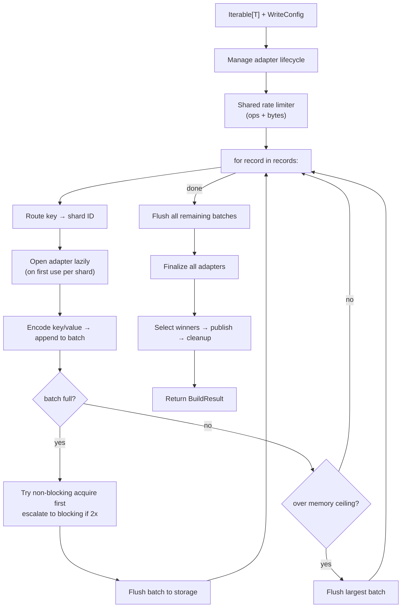
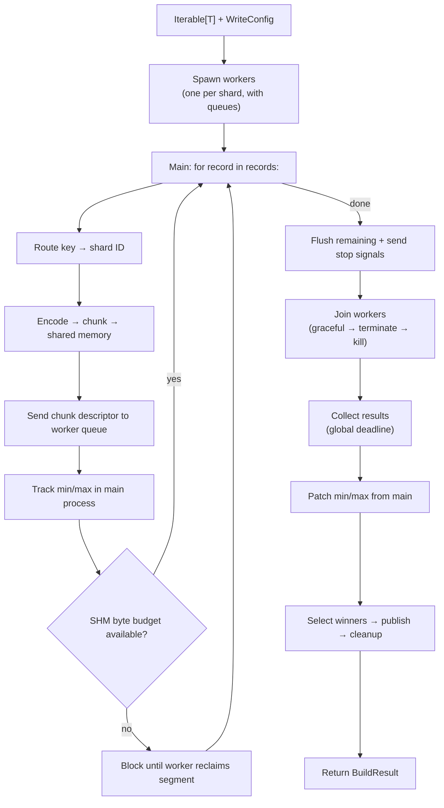

# Python Writer Deep Dive

The Python writer (`shardyfusion.writer.python.write_sharded`) is a pure-Python iterator-based writer with no framework dependencies. It supports two execution modes: single-process (all adapters open simultaneously) and parallel (one worker per shard via `multiprocessing.spawn`).

**Key characteristics:**

- **Input:** `Iterable[T]` with `key_fn`/`value_fn` callables
- **Java required:** No
- **Framework dependencies:** None
- **Execution modes:** Single-process or parallel (`multiprocessing.spawn`)
- **Rate limiting:** Unique non-blocking-first strategy in single-process mode
- **Memory management:** Global memory ceiling in single-process mode; parallel mode uses shared memory by default and durable local spool files when retry is enabled

## Data Flow

The Python writer has two distinct execution paths:

### Single-Process Mode



### Parallel Mode



## How does single-process mode work?

Single-process mode opens all shard adapters in a single process using a context manager stack:

- **Lazy adapter opening:** Adapters are opened on first use — a shard that receives no rows never opens an adapter.
- **Context manager stack:** Each adapter is registered for cleanup, ensuring LIFO-order teardown even on exceptions.
- **Per-record routing:** The routing function is called inline for each record, directing it to the correct shard.
- **Tracking:** Dict-based tracking per shard — adapters, batches, row counts, byte sizes, min/max keys.

## How does parallel mode work?

Parallel mode uses `multiprocessing.spawn` with one worker per shard:

- **Spawn context:** `multiprocessing.get_context("spawn")` is hardcoded — objects that cross the worker boundary (config, factory, queues, result payloads) must be picklable.
- **Default transport:** Without `shard_retry`, the main process serializes each chunk into `multiprocessing.shared_memory.SharedMemory` and sends only a descriptor on the per-shard queue.
- **Retry-enabled transport:** With `WriteConfig.shard_retry`, the parent appends each shard chunk to a durable local spool file and sends `(path, offset, size, row_count)` metadata over the queue. If a worker fails, the parent respawns it and replays that shard from the spool file into a new `attempt=NN` output path.
- **Queue-based control plane:** One queue per shard carries chunk descriptors and stop signals, plus shared reclaim/result queues for coordination.
- **Main process responsibilities:** Routes records, encodes key/value pairs, chunks them (target chunk size = `batch_size/10`, capped by a private per-segment byte limit), tracks min/max keys, and either manages shared-memory budgets or durable spool files depending on retry mode.
- **Worker process:** Each worker consumes descriptors from its queue, reconstructs batches locally, writes to a single shard adapter, and reports the final attempt result back to the parent.

## Batch Flushing Strategy

The single-process mode has a unique non-blocking-first rate limiting strategy:

```
batch full?
├── try non-blocking acquire — pure arithmetic, no sleep
│   ├── success → flush batch + acquire bytes bucket
│   └── denied → check batch size
│       ├── batch >= 2x batch_size → blocking acquire (backpressure)
│       └── batch < 2x batch_size → skip flush, continue accumulating
```

This design prevents unnecessary blocking: if the rate limiter denies a flush but the batch isn't excessively large, the writer continues accumulating more records. Only when the batch doubles to 2x the configured `batch_size` does it escalate to a blocking call, providing backpressure.

## Memory Ceilings

Single-process mode exposes `max_total_batched_items` and `max_total_batched_bytes` to prevent OOM when buffering across many shards:

When the total items or bytes across all shard batches exceeds the ceiling, an eviction loop flushes the largest batch (by bytes, then item count) until the total drops below the limit. This prevents scenarios where many open shards each accumulate small batches that collectively exhaust memory.

Parallel mode uses shared-memory segments for payload transfer, so it has separate byte budgets:

- `max_parallel_shared_memory_bytes`: cap on total outstanding shared-memory payload bytes across all workers.
- `max_parallel_shared_memory_bytes_per_worker`: cap on outstanding shared-memory payload bytes for one worker.

When either limit would be exceeded, the parent blocks before allocating another segment. Backpressure is released only when workers acknowledge consumed segments and the parent reclaims them.

## What happens with empty shards?

**Single-process:** Adapters are never opened for shards with no rows. After iteration, the full shard ID range is checked to ensure coverage in results.

**Parallel:** Workers with zero rows report `row_count=0`. The main process marks their `db_url=None`.

## How is CEL routing metadata discovered?

CEL sharding in the Python writer has a unique constraint:

- **Single-process direct mode:** `num_dbs` is unknown until iteration completes. After all records are routed, the observed shard IDs are validated as consecutive 0-based integers and `num_dbs` is derived from `max(db_id) + 1`.
- **Single-process inferred categorical mode:** the writer evaluates the CEL token for each record, collects sorted distinct routing tokens, stores them as `routing_values`, and uses their position as the dense internal shard ID.
- **Parallel:** CEL discovery is not supported because workers must be spawned before iteration. In practice, Python parallel mode does not support direct-mode shard-count discovery or inferred categorical routing.

## Worker Lifecycle

### Sentinel-Based EOF

The main process signals workers to stop by sending `None` on their queue. Even on main-process exceptions, sentinels are sent to all workers in the exception handler to prevent orphaned workers.

### Join Escalation

Worker shutdown has a three-level escalation:

```
join(60s) — graceful wait
├── worker exited → done
└── still alive → terminate (SIGTERM)
    └── join(5s)
        ├── worker exited → done
        └── still alive → kill (SIGKILL)
```

### Result Collection

Results are collected from the result queue with a global deadline of `10s x num_dbs`. This avoids per-result timeouts that could accumulate beyond the intended total. If the deadline expires (e.g., a worker crashed before posting its result), an error is raised.

## Error Handling & Fault Tolerance

### Single-Process Mode

No retry mechanism. If any adapter operation fails, the exception propagates up
through the context manager stack. The stack closes all already-opened adapters
in LIFO order. Partially-written shards remain on S3 until inline or deferred
cleanup removes them.

### Parallel Mode — Worker Failure

- Worker exceptions are caught, logged, wrapped, and re-raised — causing the worker process to exit with non-zero code.
- Main process detects worker failure via exit codes after joining, raises an error listing failed `(db_id, exit_code)` pairs.
- On main-process exception during routing, stop signals are sent to all worker queues so workers exit cleanly. The finally block handles worker join/terminate.

### Retry Behavior

- **Single-process:** No built-in shard retry. Failures propagate to the caller, which can retry the whole write.
- **Parallel without `shard_retry`:** Same as before: any worker failure aborts the write.
- **Parallel with `shard_retry`:** Retryable worker or adapter failures are retried per shard with exponential backoff. Each retry uses a fresh `attempt=NN` path. Because success is learned asynchronously from the worker, a crash after `checkpoint()` but before result delivery can leave an orphaned earlier attempt; winner selection and loser cleanup still make the published snapshot deterministic.

### Two-Phase Publish and Cleanup

Same as all writers — retry CURRENT pointer up to 3 times, cleanup is
best-effort.

### Run Record Lifecycle

Each Python writer invocation also maintains one driver-owned run record under
`output.run_registry_prefix` (default `runs`). The record is created as
`running`, updated with `manifest_ref` once publish succeeds, and then marked
`succeeded` or `failed`. `BuildResult.run_record_ref` returns the record
location. Readers do not consume this record; it is for operational inspection
and future deferred cleanup workflows.

## Gotchas

| Gotcha | Detail |
|---|---|
| **`multiprocessing.spawn` serialization** | Objects that cross the worker boundary must be picklable. This includes config and adapter factory. `key_fn`, `value_fn`, and `columns_fn` stay in the parent process. |
| **Workers get independent rate limiters** | Each worker creates its own token bucket. There is no global cross-worker coordination — aggregate rate = `rate x num_dbs`. |
| **Min/max tracked in main** | The main process tracks min/max keys and patches them into worker results. Workers do not have visibility into keys from other shards. |
| **`columns_fn` for CEL routing context** | The `columns_fn` parameter provides additional column values for CEL routing context (analogous to `cel_columns` in framework writers). |
| **No verification step** | Unlike Spark/Dask/Ray, the Python writer has no routing verification — it uses the routing function directly, so there's no framework-vs-Python divergence to verify. |
| **CEL + parallel incompatible for discovery** | Python parallel mode cannot discover direct-mode shard counts or inferred categorical routing values at runtime. Explicit `routing_values` still work because the shard set is already known. |
| **Parallel SHM budgets** | `max_queue_size` bounds descriptor backlog, not payload bytes. `max_parallel_shared_memory_bytes` and `max_parallel_shared_memory_bytes_per_worker` only apply to the default shared-memory transport; retry-enabled parallel mode uses local spool files instead. |
