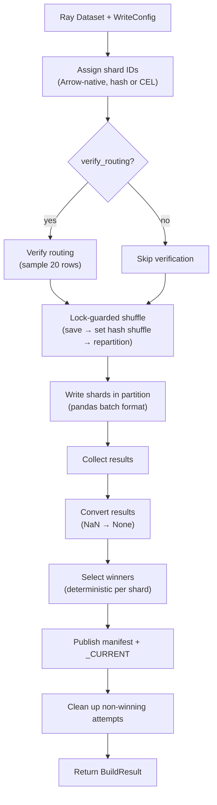

# Ray Writer Deep Dive

The Ray writer (`shardyfusion.writer.ray.write_sharded`) is a Ray Data-based writer that distributes shard writes across Ray workers. It requires no Java and uses Arrow-native sharding for zero-copy shard assignment, switching to pandas only for the write phase.

**Key characteristics:**

- **Input:** Ray `Dataset`
- **Java required:** No
- **Speculative execution:** Not supported (attempt is always 0)
- **Sharding:** Arrow-native batch processing (zero-copy)
- **Parallelism:** Ray worker-level
- **Shuffle:** Hash shuffle with process-global lock guard

## Data Flow

## How are rows assigned to shards?

The Ray writer assigns shard IDs using Arrow batch processing, avoiding the Arrow-to-pandas-to-Arrow round-trip:

**Hash sharding:**

- Batches are processed as Arrow tables directly (zero-copy).
- For each batch, the key column is extracted, shard IDs are computed per row, and the result is appended as an `int64` column.
- Uses the same hash implementation as all other writers.

**CEL sharding:**

- Also operates on Arrow batches with zero-copy mode.
- Evaluates the CEL expression directly on Arrow batches — the same approach as the Spark writer.
- Supports full row context via `cel_columns`.

## How are rows distributed across workers?

The Ray writer repartitions by shard ID using hash shuffle, but must guard against concurrent calls:

The shuffle strategy is a process-global setting. Without a lock, concurrent `write_sharded()` calls in the same driver process could corrupt each other's shuffle strategy. A lock + `try/finally` pattern ensures the previous strategy is always restored.

The import of the shuffle strategy enum uses a fallback to handle older Ray versions that don't have it.

## How are shards written to storage?

Each Ray batch is processed as follows:

1. **Empty batch check:** If the input pandas DataFrame is empty, an empty result is returned immediately.
2. **Group by shard ID:** Same pattern as Dask — groups by shard.
3. **Per-shard write:** Each group is written independently:
    - Uses `os.makedirs()` (not pathlib) to create local directories.
    - `attempt` is always 0, rows are iterated with numpy scalar conversion, batches are flushed when full.

**Batch format choice:**

- **Sharding phase:** Arrow format with zero-copy — Arrow-native for maximum performance.
- **Write phase:** pandas format without zero-copy — pandas needed for row iteration and groupby; zero-copy disabled because the write phase modifies data.

## What happens with empty shards?

Same as Dask — empty batches return empty DataFrames, winner selection filters out zero-row shards, and the reader pads missing shard IDs with null reader instances.

## How are write results collected?

Result collection triggers the full pipeline execution and returns a pandas DataFrame. The result conversion handles the same NaN-to-None conversion as Dask (pandas `float64` artifact from mixed int+None columns).

## Rate Limiting

Rate limiting operates at **per-shard scope**, identical to Dask:

| Config Parameter | Bucket Type | Scope |
|---|---|---|
| `max_writes_per_second` | ops/sec | Per shard |
| `max_write_bytes_per_second` | bytes/sec | Per shard |

**Aggregate rate across all shards** = `max_writes_per_second x num_dbs`.

## How does routing verification work?

The verification step samples rows before the write phase:

1. Takes 20 rows, returned as a list of dicts (not a DataFrame).
2. For each sampled row, extracts the key and Ray-computed shard ID, then compares against the Python routing function.
3. Supports multi-column CEL with routing context from non-key columns.
4. Raises `ShardAssignmentError` on mismatches.

## Single-Shard Writer

`write_single_db()` is a specialized path for `num_dbs=1`:

- Optionally materializes the input Dataset.
- Global sort by key — Ray handles the distributed sort.
- Streams sorted batches with Ray's native prefetching (no separate thread pool needed, unlike Dask).
- A single shared token bucket controls the write rate.

## Error Handling & Fault Tolerance

### No Speculative Execution

Like Dask, Ray does not speculatively re-execute tasks at the shardyfusion level. `attempt` is always 0. Ray Data may retry failed tasks internally, but shardyfusion does not rely on or expose this.

### Exception Wrapping

Same pattern as Dask — non-shardyfusion exceptions are wrapped with context and traceback.

### Batch Failure = Full Write Failure

A single batch failure during result collection aborts the pipeline. No partial result recovery.

### Shuffle Strategy Safety

The process-global lock protects against concurrent `write_sharded()` calls corrupting the shuffle strategy. The `try/finally` block ensures the previous strategy is always restored even if repartition fails.

### Two-Phase Publish and Cleanup

Same as all writers — retry CURRENT pointer up to 3 times, cleanup is best-effort.

## Gotchas

| Gotcha | Detail |
|---|---|
| **Process-global shuffle strategy** | The shuffle strategy is modified during repartition. A lock prevents corruption from concurrent `write_sharded()` calls. |
| **`os.makedirs` not pathlib** | The Ray writer uses `os.makedirs()` for local directory creation, not `pathlib.Path.mkdir()`. |
| **`RAY_ENABLE_UV_RUN_RUNTIME_ENV=0`** | Required for direct pytest. Ray >= 2.47 auto-detects `uv run` in the process tree and overrides worker Python. |
| **Shuffle strategy import fallback** | A try/except handles older Ray versions without the shuffle strategy enum. Falls back to `None`. |
| **Zero-copy batch modes** | Zero-copy for sharding (Arrow-to-Arrow, read-only), disabled for writing (pandas, data modification). Using zero-copy for the write phase would cause errors when modifying batches. |
| **NaN handling** | Same as Dask — result conversion handles pandas NaN artifacts to None. |
| **Ray does not run on py3.14** | Same limitation as Dask and CEL. |
