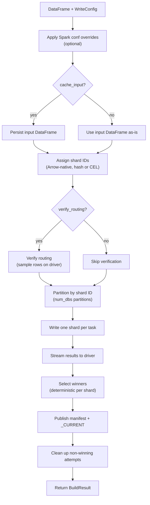

# Spark Writer Deep Dive

The Spark writer (`shardyfusion.writer.spark.write_sharded`) is a PySpark DataFrame-based writer that distributes shard writes across Spark executors. It requires Java 17 and PySpark, supports Spark's speculative execution model, and uses Arrow-native processing for zero-overhead shard assignment on executors.

**Key characteristics:**

- **Input:** PySpark `DataFrame`
- **Java required:** Yes (Java 17, temurin recommended)
- **Speculative execution:** Fully supported — attempt-isolated paths prevent corruption
- **Sharding:** Arrow-native on executors (no JVM-side hashing)
- **Parallelism:** Spark executor-level (one task per shard partition)

## Data Flow

## How are rows assigned to shards?

Shard IDs are assigned using Arrow-native processing on executors, which processes Arrow batches directly without converting to pandas.

**Hash sharding:**

- A closure captures the key column name and shard count as Python locals (not Spark broadcast variables) to avoid serialization issues with non-picklable objects.
- For each Arrow batch, the closure extracts the key column, computes the shard ID per row, and appends the result as an `int32` column.
- The hash function is Python-only (`xxhash.xxh3_64_intdigest`), **not** a JVM hash — all writers use the same implementation.

**CEL sharding:**

- The CEL expression is compiled on the driver for validation, then re-compiled in the map closure on each executor (CEL compiled objects are not serializable).
- Operates directly on Arrow batches, supporting access to non-key columns specified in `cel_columns`.
- The shard ID range is validated after assignment via a filter check when `num_dbs > 0`.

## How are rows distributed across workers?

After shard assignment, the DataFrame is converted to an RDD and repartitioned into exactly `num_dbs` partitions using an identity partitioner — shard 0 goes to partition 0, shard 1 to partition 1, etc.

**Key guarantee:** After partitioning, partition index equals `db_id`.

Optional sorting within partitions is applied **before** RDD conversion when `sort_within_partitions=True`, preserving sort order within each shard.

## How are shards written to storage?

Each Spark task writes exactly one shard:

1. **Speculation metadata:** Spark's task context provides the attempt number, stage ID, and task attempt ID — used to build attempt-isolated S3 paths and for winner selection.
2. **Empty shard detection:** The first row is peeked. If the partition is empty, a placeholder result is returned without opening a database or performing S3 I/O.
3. **Batch loop:** Rows are encoded, accumulated into batches of `batch_size`, and flushed via the adapter.
4. **Finalization:** After all rows, the adapter is flushed and checkpointed, and the result is yielded.

## What happens with empty shards?

Empty shards (partitions with no rows) are detected by peeking at the first row. If empty, a placeholder result is returned without opening a database or performing S3 I/O.

Empty shards produce a result with `row_count=0` and `db_url=None`. They appear in the manifest as sparse entries — the reader pads missing shard IDs with null reader instances.

## How are write results collected?

Results are streamed lazily from executors to the driver (not collected into driver memory all at once). The winner selection logic processes results as they arrive, picking the deterministic winner per shard.

Winner selection sort key: `(attempt, task_attempt_id, db_url)` — lowest attempt wins, then lowest task_attempt_id, then URL as stable tiebreaker.

## Rate Limiting

Rate limiting in the Spark writer operates at **per-partition scope**:

- Each executor task creates its own token bucket instances (one for ops/sec, one for bytes/sec).
- The buckets are created inside the partition writer, so each shard gets independent limiting.
- Uses blocking acquire — the Spark task thread sleeps until tokens are available.
- **Aggregate rate across all shards** = `max_writes_per_second x num_dbs`.

| Config Parameter | Bucket Type | Scope |
|---|---|---|
| `max_writes_per_second` | ops/sec | Per partition (per shard) |
| `max_write_bytes_per_second` | bytes/sec | Per partition (per shard) |

## How does routing verification work?

The routing verification step is a runtime safety net:

1. Samples 20 rows (configurable via `sample_size`) on the driver.
2. For each sampled row, compares the Spark-assigned shard ID against the Python routing function.
3. Raises `ShardAssignmentError` if any mismatches are found.

**Limitation:** For CEL expressions using multiple columns (`cel_columns`), verification is skipped because the driver cannot construct the full `routing_context` needed for read-time routing.

## Single-Shard Writer

`write_single_db()` is a specialized path for `num_dbs=1`:

- Uses `coalesce()` (**not** `repartition()`) after sorting — `coalesce` preserves the sorted order within each partition by merging partitions without shuffling, while `repartition` would re-shuffle and destroy sort order.
- Streams sorted partitions to the driver with one partition prefetched.
- A single shared token bucket controls the write rate (not per-partition).
- Wrapped in config override and cache context managers.

## Error Handling & Fault Tolerance

### Speculative Execution

Spark may launch duplicate tasks for slow partitions. Each produces a result with a different attempt number. This is safe because:

- S3 paths are attempt-isolated: `shards/run_id=.../db=XXXXX/attempt=00/` vs `attempt=01/`
- Winner selection is deterministic: lowest attempt, then lowest task_attempt_id, then db_url tiebreaker
- Non-winning attempt paths are cleaned up after publishing

### Task Retries

When a task fails, Spark retries it (up to `spark.task.maxFailures`, default 4). Each retry gets a new attempt number. The writer wraps all exceptions with context (db_id, attempt, db_url, rows_written) and includes the traceback.

### Partition-Level Failure Propagation

An exception in a partition writer propagates to the driver via the result stream. There is no per-partition retry at the shardyfusion level — Spark's task retry mechanism handles this.

### Two-Phase Publish

If the manifest uploads but the `_CURRENT` pointer fails, it retries up to 3 times with exponential backoff (1s, 2s, 4s). The manifest is already on S3 and safe. If all retries fail, `PublishManifestError` is raised.

### Cleanup

Non-winning attempt paths are deleted after publish, but failures are logged and skipped — never raised.

### Context Manager Safety

- Spark config overrides are restored in reverse order, continuing even if individual restores fail.
- DataFrame caching falls back to the uncached DataFrame if persist fails; unpersist uses non-blocking mode.

## Gotchas

| Gotcha | Detail |
|---|---|
| **Speculation and attempts** | Multiple attempts can exist; winner is deterministic (lowest attempt). Design all shard writes to be idempotent. |
| **Closure serialization** | Closures capture key column and shard count as Python locals, not Spark broadcast variables. Non-picklable objects in closures will fail. |
| **CEL recompilation on executors** | CEL compiled objects are not serializable. The expression is validated on the driver, then re-compiled on each executor. |
| **Cache fallback is silent** | If DataFrame persist fails, it logs a warning and continues with the uncached DataFrame — no exception raised. |
| **Config restore order** | Spark configs are restored in reverse order on exit. If a restore fails, it logs the error and continues to the next config. |
| **`coalesce` vs `repartition` in single-db** | `write_single_db()` uses `coalesce()` to merge sorted partitions without shuffling. `repartition()` would destroy sort order. |
| **Java 17 required** | Java 21 is not supported with Spark 3.5 due to Arrow JVM module access issues. |
| **`SPARK_LOCAL_IP=127.0.0.1`** | Required in tox and devcontainer to avoid hostname resolution issues. |
